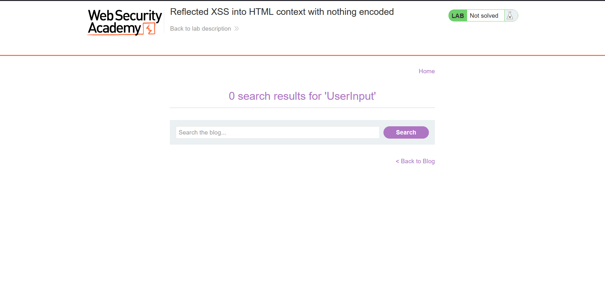
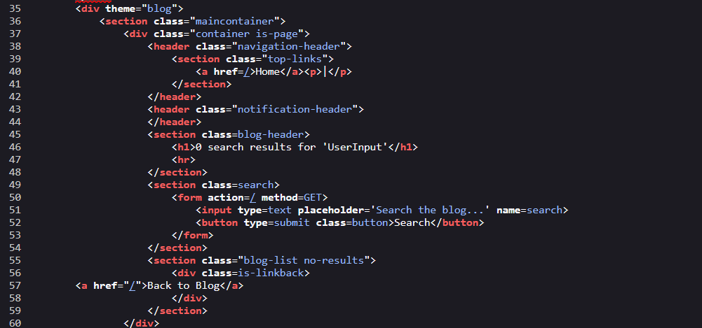
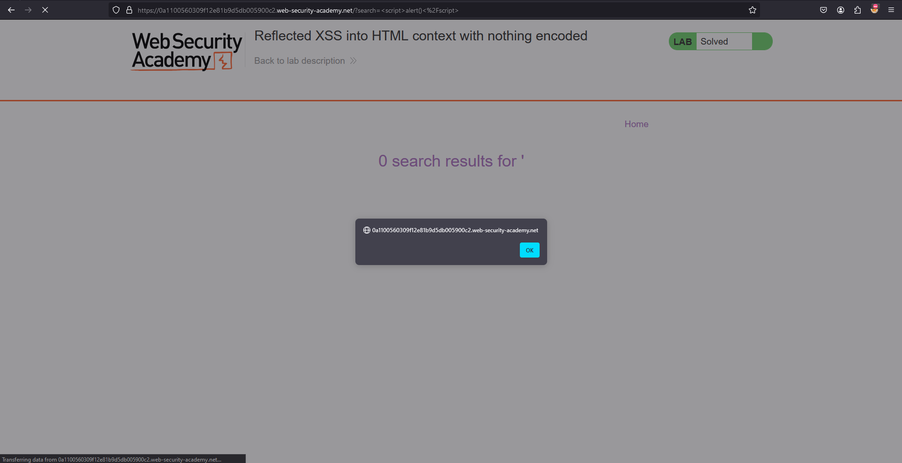
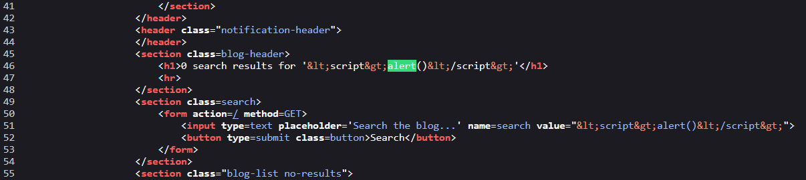
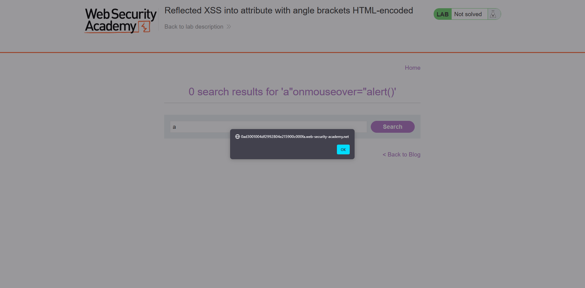
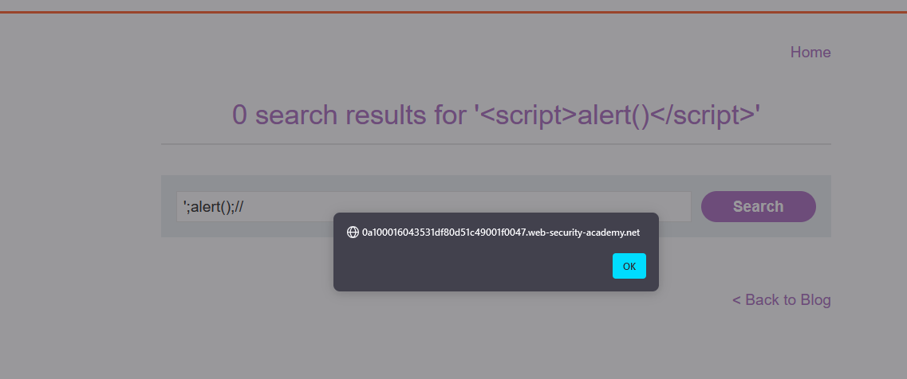

# XSS

## Cross-Site Scripting Reflected 
Cross-Site Scripting Phản Chiếu (XSS) xảy ra khi một ứng dụng nhận dữ liệu từ một yêu cầu HTTP và bao gồm dữ liệu đó trong phản hồi mà không thực hiện việc làm sạch hoặc mã hóa đúng cách, dẫn đến các lỗ hổng bảo mật.


### Lab: Reflected XSS into HTML context with nothing encoded

Thử nhập vào ô tìm kiếm. Bản chất của lỗ hổng XSS là phải có input từ người dùng vì vậy ta kiểm tra những đầu vào có thể nhập hoặc đưa thông tin vào.


`Ctrl + U` để xem mã HTML


Input từ người dùng được đưa vào trong thẻ `h1`. Ta có thể truyền vào `script` để kiểm tra lỗ hổng XSS.
**payload** `<script>alert()</script>`

✅ SOLVED!

### Lab: Reflected XSS into attribute with angle brackets HTML-encoded

Cũng như bài trên, thử với payload `<script>alert()</script>` rồi xem mã nguồn.

Ở đây ta thấy dấu `<`, `>` bị encode thành `&lt`, `&gt`.  
``` 
<input ... value="&lt;script&gt;alert()&lt;/script&gt;">
```
Ta có thể thực hiện chèn `"` cùng với **payload**: `a"onmouseover="alert()`
``` 
<input ... value="a"onmouseover="alert()">
```

✅ SOLVED!

**⚠️Note**:
> Có thể sử dụng các event khác ngoài `onmouseover` như `onclick`, `onmousedown`, ...

### Lab: Reflected XSS into a JavaScript string with angle brackets HTML encoded

Thử với payload `<script>alert()</script>` rồi xem mã nguồn.


Ta thấy dấu `<`, `>` vẫn bị encode. Ngoài ra chuỗi payload đó còn được chèn vào trong thẻ `script`. Suy ra không dùng được `>`,`<`. Vậy thì ta sẽ đưa câu lệnh javascript vào trong đó luôn.
**payload**: `';alert();//`.  `'` để đóng chuỗi, `//` để comment phần đằng sau tránh làm hỏng syntax.

✅ SOLVED!