# Access control
## Labs

### Unprotected admin functionality
**Yêu cầu**: Lab có trang quản trị không được bảo vệ. Nhiệm vụ: truy cập `admin panel`, xóa người dùng `carlos` rồi hoàn thành lab.

**Thực hiện**
- Với bài lab đầu tiên mình thực hiện Fuzz url để xem có url ẩn nào không ???
- Fuzz `ffuf -u https://0a6f00fb0455498482a79d9000130007.web-security-academy.net/FUZZ -w /usr/share/`
- Ở đây ta thấy file `robots.txt`.
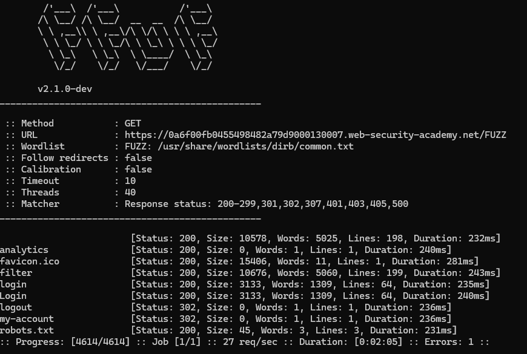
- Truy cập vào `/administrator-panel` và hoàn thành.

**Tổng kết**
File `robots.txt` có nhiệm vụ hướng dẫn crawler cho phép hoặc chặn truy cập vào các phần của website. Nó có thể sẽ tiết lộ một số thư mục ẩn. Dựa vào đây chúng ta có thể dễ dàng có thêm các thông tin.
___
 
### Unprotected admin functionality with unpredictable URL
**Yêu cầu**: Lab có `admin panel` không được bảo vệ nhưng nằm ở vị trí khó đoán. Nhiệm vụ: tìm vị trí `admin panel`, truy cập và xóa người dùng `carlos` để hoàn thành lab.

**Thực hiện**
- Tiến hành view-source để xem cơ chế xử lí.
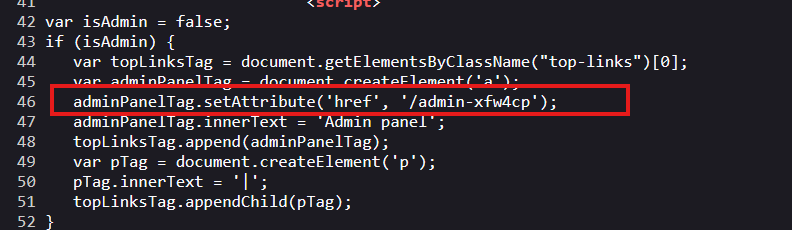
- Ta thấy có url dẫn đến trang admin panel. Truy cập và hoàn thành bài lab.

**Tổng kết**
Các trang quản lí có thể được tiết lộ thông qua mã nguồn phía FE => nên kiểm tra cẩn thận.
___

### Lab: User role controlled by request parameter
**Yêu cầu**: Lab có `admin panel` tại `/admin`, xác định quyền admin bằng cookie có thể giả mạo. Nhiệm vụ: giả mạo cookie để truy cập `admin panel`, xóa người dùng `carlos` và hoàn thành lab. Đăng nhập: `wiener:peter`.

**Thực hiện**
- Tiến hành đăng nhập và thao tác các chức năng cơ bản. Fuzz url thì có được `/admin` là trang xử lí tuy nhiên khi truy cập vào thì bị chặn lại do `wiener` không đủ quyền.
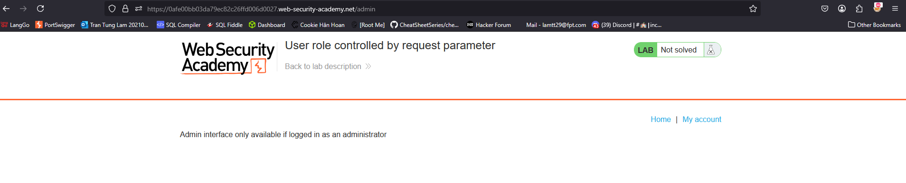
- Khi kiểm tra cookie ta thấy có giá trị `Admin:false` -> tiến hành đổi lại giá trị thành `true`.
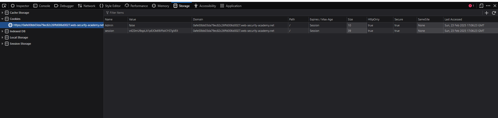
- Truy cập lại và hoàn thành bài lab.

**Tổng kết**
Trong trường hợp cấu hình lỗi cần để ý kĩ các giá trị trong gói tin HTTP để nhận định liệu có giá trị quản lí truy cập nào được tiết lộ không ? Trong bài này là `Cookie`.
___

### Lab: User role can be modified in user profile
**Yêu cầu**: Lab có `admin panel` tại `/admin`, chỉ truy cập được với người dùng có `roleid = 2`. Nhiệm vụ: chỉnh sửa `roleid` để truy cập `admin panel`, xóa người dùng `carlos` và hoàn thành lab. Đăng nhập: `wiener:peter`.

**Thực hiện**
- Bài này giống bài trên. Tuy nhiên tham số được ẩn đi hơn. Bắt gói tin `POST /my-account/change-email` ở đây ta thấy khi thay đổi email thì hiện ra `roleid` của người đó. Vì thế có thể thử thay đổi trường này.
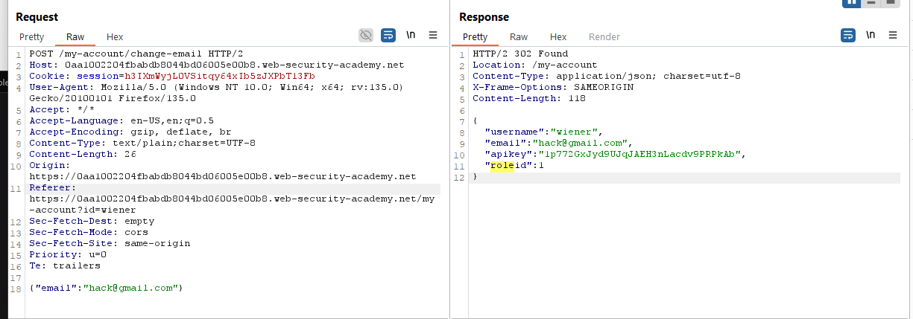
- Thay đổi `roleid` thông qua gói tin burp.

- Có vẻ là đã được! Thử truy cập admin xem và wow `roleid:2` có thể truy cập được.

**Tổng kết**
Việc để lộ thông tin roleid thông qua gói tin Response có thể dẫn tới leo quyền. Ở trường hợp này lỗ hổng được tạo ra do người dùng có thể thay đổi `roleid` tùy ý.
___
 
### Lab: User ID controlled by request parameter 
**Yêu cầu**: Lab có lỗ hổng `horizontal privilege escalation` trên trang tài khoản. Nhiệm vụ: khai thác lỗ hổng để lấy `API key` của người dùng `carlos`, rồi nộp làm giải pháp. Đăng nhập: `wiener:peter`.

**Thực hiện**
- Có lỗi IDOR. Từ `Wiener` mà có thể trích xuất thông tin `API key` của `Carlos`.
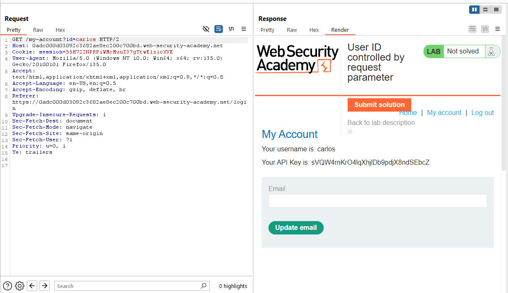

**Tổng kết**
Lỗ hổng không kiểm soát tốt quyền truy cập dẫn tới việc có thể truy xuất thông tin nhạy cảm người khác và từ đó leo quyền lên.
___
 
### Lab: User ID controlled by request parameter, with unpredictable user IDs 
**Yêu cầu**: Lab có lỗ hổng `horizontal privilege escalation` trên trang tài khoản, nhưng xác định người dùng bằng `GUID`. Nhiệm vụ: tìm `GUID` của `carlos`, lấy `API key` của hắn và nộp làm giải pháp. Đăng nhập: `wiener:peter`.

**Thực hiện**
- Nhận xét sơ qua thì bài lab này có trang `my-account` được request bởi GUID chứ không còn là tên như lab trên nữa. 
- Lướt các blog để kiếm thêm thông tin. Ở đây tài khoản của Carlos đăng bài blog và blog lại được định danh thông qua id của chủ sở hữu.
- `GET /blogs?userId=63212d57-fd8e-4e17-b934-88996247eb33` => `Carlos` có id:`63212d57-fd8e-4e17-b934-88996247eb33`
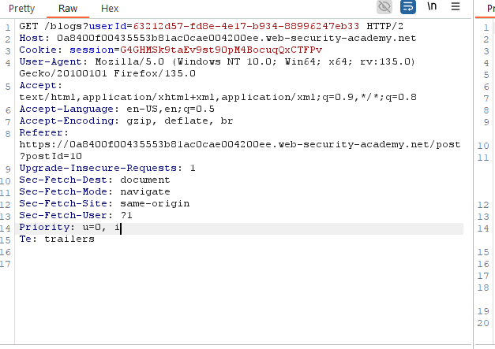
- `GET /my-account?id=63212d57-fd8e-4e17-b934-88996247eb33` và lấy thông tin API key thôi.
**Tổng kết**
Quản lí người dùng bằng GUID nếu không cẩn thận có thể để lộ thông tin ở qua các tính năng bài blog sở hữu, cmt, hay xem trang cá nhân.
___
 
### Lab: User ID controlled by request parameter with data leakage in redirect 
**Yêu cầu**: Lab có lỗ hổng kiểm soát truy cập, làm lộ thông tin nhạy cảm trong **body của redirect response**. Nhiệm vụ: khai thác lỗ hổng để lấy `API key` của `carlos` và nộp làm giải pháp. Đăng nhập: `wiener:peter`.

**Thực hiện**
- Truy vấn `id=carlos`. Gói tin redirect (302) có trả về thông tin của carlos.
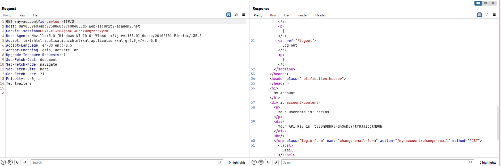
- Vậy là hoàn thành.

**Tổng kết**
Nói chung thì việc mà để lộ thông tin qua gói tin là điều rất dễ xảy ra. Cho nên cần chú ý kĩ các gói tin.
___

### Lab: User ID controlled by request parameter with password disclosure
**Yêu cầu**: Lab có trang tài khoản hiển thị mật khẩu hiện tại trong ô input bị che dấu. Nhiệm vụ là lấy mật khẩu của `administrator`, đăng nhập, xóa người dùng `carlos` và hoàn thành lab. Đăng nhập: `wiener:peter`.

**Thực hiện**
- Thay đổi id thành `administrator` trong truy vấn. Ta sẽ thầy được trường password được ẩn bằng thuộc tính `hidden` trong form.
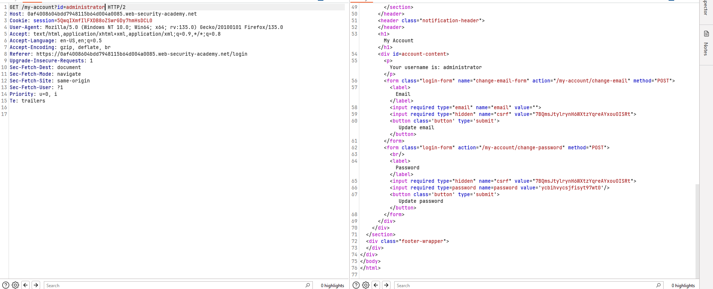
- Lấy được password rồi hoàn thành nốt lab.

**Tổng kết**
- Khi thiết kế tính năng thay đổi password, dev đã để password hiện tại ẩn trong form nên khi thay đổi người dùng không cần nhập lại pass -> Tuy nhiên đấy chính là vấn đề. Việc không yêu cầu nhập lại pass mà gắn pass trực tiếp vào form dẫn đến việc lộ lọt thông tin ( ở đây là password ).
___
 
### Lab: Insecure direct object references
**Yêu cầu**: Lab lưu trữ nhật ký chat của người dùng trực tiếp trên *file system* và truy xuất qua *static URL*. Nhiệm vụ: tìm mật khẩu của `carlos`, đăng nhập vào tài khoản của hắn và hoàn thành lab.

**Thực hiện**
- Lướt một hồi tôi để ý đến chức năng livechat. Khi ấn `view transcript` thì server gửi truy vấn dowload file `2.txt`. Điều này đặt ra giả thiết là tại sao lại là 2 chứ không phải 1 ?
- Và đây là kết quả sau khi thay đổi 
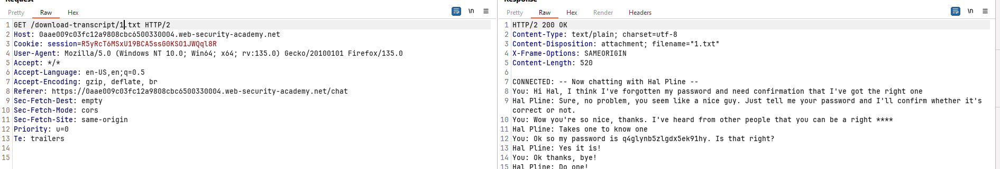

**Tổng kết**
Việc không kiểm soát tốt quyền truy cập vào các tài nguyên trực tiếp trên hệ thống file có thể dẫn đến lộ lọt thông tin nhạy cảm. Trong trường hợp này, việc sử dụng URL tĩnh để truy xuất các file chat transcript đã tạo ra lỗ hổng bảo mật, cho phép kẻ tấn công dễ dàng đoán và truy cập vào các file khác nhau.
___
 
### Lab: URL-based access control can be circumvented
**Yêu cầu**: Lab có `admin panel` không yêu cầu xác thực tại `/admin`, nhưng bị chặn truy cập từ bên ngoài. Nhiệm vụ: lợi dụng header `X-Original-URL` để bypass hạn chế, truy cập `admin panel`, xóa người dùng `carlos` và hoàn thành lab.

**Thực hiện**
- Thử truy cập `/admin`, thấy bị chặn với response đơn giản, có thể do firewall hoặc proxy chặn.  
- Đổi URL thành `/` và thêm header `X-Original-URL: /invalid`  
  → Nếu nhận được `"not found"`, chứng tỏ backend xử lý `X-Original-URL`.  
- Thay header `X-Original-URL: /admin` → truy cập được `admin panel`.  

- xóa `carlos`, chỉnh request thành:  
  `GET /?username=carlos`
  `X-Original-URL: /admin/delete`
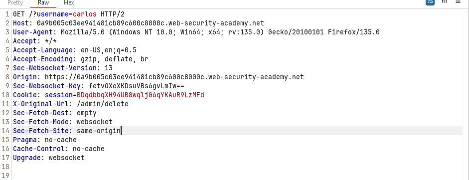

**Tổng kết**
//TODO
___
 
### Method-based access control can be circumvented
**Yêu cầu**: Lab kiểm soát truy cập dựa một phần vào `HTTP method`. Nhiệm vụ: đăng nhập bằng `wiener:peter`, khai thác lỗ hổng để nâng cấp quyền thành `administrator`, rồi hoàn thành lab.

**Thực hiện**
- Bài lab này chỉ kiểm tra method `POST` với `/admin-roles` còn `GET` thì lại không bị chặn.
- Viết `GET /admin-roles?username=wiener&action=upgrade`
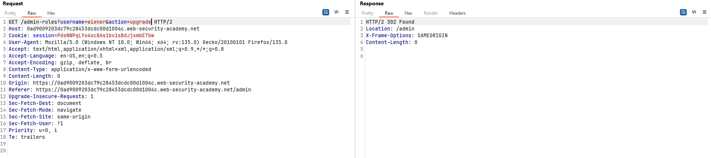 
- Dựa vào đây là có thể hoàn thành được rồi.

**Tổng kết**
Tùy thuộc vào methop HTTP mà server xử lí khác nhau. Ở trường hợp này dev đã bỏ xót kiểm soát với `GET` nên ta dễ dàng bypass.
___
 
### Lab: Multi-step process with no access control on one step 
**Yêu cầu**: Lab có `admin panel` với quy trình nhiều bước để thay đổi vai trò người dùng, nhưng có lỗ hổng. Nhiệm vụ: đăng nhập bằng `administrator:admin` để tìm hiểu cơ chế, sau đó dùng `wiener:peter` để khai thác lỗ hổng, nâng cấp quyền thành `administrator` và hoàn thành lab.

**Thực hiện**
- Ở bài lab này có 2 bước:
    1. Load ra form để chọn upgrade và downgrade
    2. Sau khi chọn xong thì lại có trang xác nhận
=> Thử nghiệm ở bước 1 thì detect

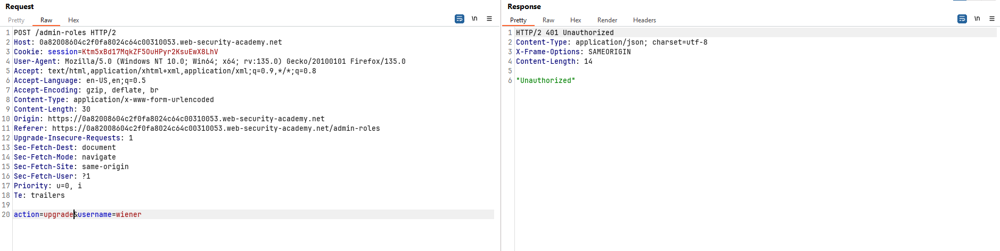
- Tuy nhiên nếu chúng ta gửi gói tin sau khi confirm như dưới đây thì đã vượt mặt được hệ thống

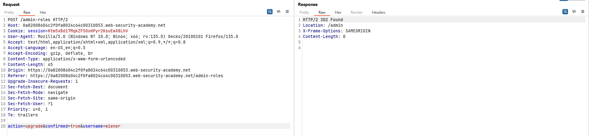

**Tổng kết**
Ở các bước phải luôn có cơ chế kiểm tra và xác thực. Giống như một cái chuỗi xích, nếu một mắt xích yếu thì sẽ ảnh hưởng lên toàn bộ chuỗi.
___
 
### Lab: Referer-based access control 
**Yêu cầu**: Lab kiểm soát quyền truy cập `admin panel` dựa vào `Referer header`. Nhiệm vụ: đăng nhập bằng `administrator:admin` để tìm hiểu cơ chế, sau đó dùng `wiener:peter` để khai thác lỗ hổng, chỉnh `Referer header` nhằm nâng cấp quyền thành `administrator` và hoàn thành lab.

**Thực hiện**
- Hướng suy nghĩ không khác gì các bài lab trên. Ta cần tìm kiểm điểm mà ở đó hệ thống bỏ xót.
- Ở trường hợp này hệ thống kiểm tra `endpoint` : `/admin-roles` theo header `Referer`. Theo suy nghĩ dev thì khi người dùng vào được `/admin` thì sẽ có thể tác động lên `admin-roles`. Tuy nhiên việc kiểm tra chỉ bằng cách check header `Referer` có phải chuỗi `subdomain.web-security-academy.net/admin` hay không.
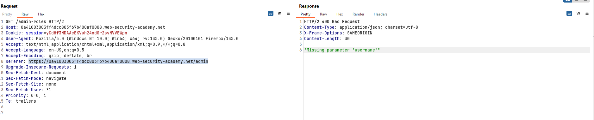
- Bổ sung params `/admin-roles?username=wiener&action=upgrade` và hoàn thành lab.
**Tổng kết**
Kiểm soát truy cập dựa trên `Referer header` là cơ chế yếu, dễ bị bypass. Nếu chỉ kiểm tra `Referer` thay vì xác thực quyền thực sự, kẻ tấn công có thể giả mạo `Referer header` để truy cập trái phép vào các trang nhạy cảm như `/admin/deleteUser`.
