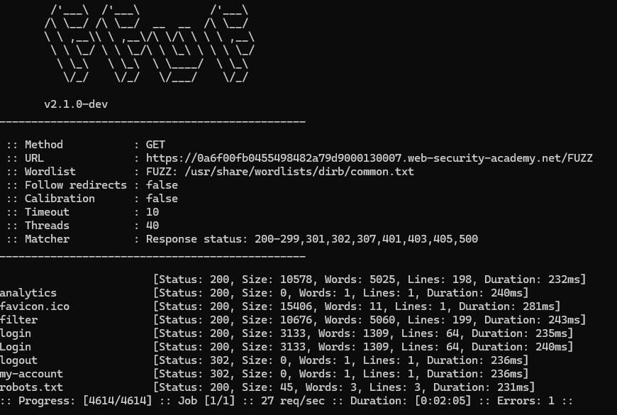

# Access control
## Labs

### Unprotected admin functionality
**Yêu cầu**: Lab có trang quản trị không được bảo vệ. Nhiệm vụ: truy cập `admin panel`, xóa người dùng `carlos` rồi hoàn thành lab.

**Thực hiện**
- Với bài lab đầu tiên mình thực hiện Fuzz url để xem có url ẩn nào không ???
- Fuzz `ffuf -u https://0a6f00fb0455498482a79d9000130007.web-security-academy.net/FUZZ -w /usr/share/`
- Ở đây ta thấy file `robots.txt`.

- Truy cập vào `/administrator-panel` và hoàn thành.

**Tổng kết**
File `robots.txt` có nhiệm vụ hướng dẫn crawler cho phép hoặc chặn truy cập vào các phần của website. Nó có thể sẽ tiết lộ một số thư mục ẩn. Dựa vào đây chúng ta có thể dễ dàng có thêm các thông tin.
___
 
### Unprotected admin functionality with unpredictable URL
**Yêu cầu**: Lab có `admin panel` không được bảo vệ nhưng nằm ở vị trí khó đoán. Nhiệm vụ: tìm vị trí `admin panel`, truy cập và xóa người dùng `carlos` để hoàn thành lab.

**Thực hiện**
- Tiến hành view-source để xem cơ chế xử lí.

- Ta thấy có url dẫn đến trang admin panel. Truy cập và hoàn thành bài lab.

**Tổng kết**
Các trang quản lí có thể được tiết lộ thông qua mã nguồn phía FE => nên kiểm tra cẩn thận.
___

### Lab: User role controlled by request parameter
**Yêu cầu**: Lab có `admin panel` tại `/admin`, xác định quyền admin bằng cookie có thể giả mạo. Nhiệm vụ: giả mạo cookie để truy cập `admin panel`, xóa người dùng `carlos` và hoàn thành lab. Đăng nhập: `wiener:peter`.

**Thực hiện**
- Tiến hành đăng nhập và thao tác các chức năng cơ bản. Fuzz url thì có được `/admin` là trang xử lí tuy nhiên khi truy cập vào thì bị chặn lại do `wiener` không đủ quyền.

- Khi kiểm tra cookie ta thấy có giá trị `Admin:false` -> tiến hành đổi lại giá trị thành `true`.

- Truy cập lại và hoàn thành bài lab.

**Tổng kết**
Trong trường hợp cấu hình lỗi cần để ý kĩ các giá trị trong gói tin HTTP để nhận định liệu có giá trị quản lí truy cập nào được tiết lộ không ? Trong bài này là `Cookie`.
___

### Lab: User role can be modified in user profile
**Yêu cầu**: Lab có `admin panel` tại `/admin`, chỉ truy cập được với người dùng có `roleid = 2`. Nhiệm vụ: chỉnh sửa `roleid` để truy cập `admin panel`, xóa người dùng `carlos` và hoàn thành lab. Đăng nhập: `wiener:peter`.

**Thực hiện**
- Bài này giống bài trên. Tuy nhiên tham số được ẩn đi hơn. Bắt gói tin `POST /my-account/change-email` ở đây ta thấy khi thay đổi email thì hiện ra `roleid` của người đó. Vì thế có thể thử thay đổi trường này.

- Thay đổi `roleid` thông qua gói tin burp.

- Có vẻ là đã được! Thử truy cập admin xem và wow `roleid:2` có thể truy cập được.

**Tổng kết**
Việc để lộ thông tin roleid thông qua gói tin Response có thể dẫn tới leo quyền. Ở trường hợp này lỗ hổng được tạo ra do người dùng có thể thay đổi `roleid` tùy ý.
___
 
### Lab: User ID controlled by request parameter 
**Yêu cầu**: Lab có lỗ hổng `horizontal privilege escalation` trên trang tài khoản. Nhiệm vụ: khai thác lỗ hổng để lấy `API key` của người dùng `carlos`, rồi nộp làm giải pháp. Đăng nhập: `wiener:peter`.

**Thực hiện**
- Có lỗi IDOR. Từ `Wiener` mà có thể trích xuất thông tin `API key` của `Carlos`.

**Tổng kết**
Lỗ hổng không kiểm soát tốt quyền truy cập dẫn tới việc có thể truy xuất thông tin nhạy cảm người khác và từ đó leo quyền lên.
___
 
### Lab: User ID controlled by request parameter, with unpredictable user IDs 
**Yêu cầu**: Lab có lỗ hổng `horizontal privilege escalation` trên trang tài khoản, nhưng xác định người dùng bằng `GUID`. Nhiệm vụ: tìm `GUID` của `carlos`, lấy `API key` của hắn và nộp làm giải pháp. Đăng nhập: `wiener:peter`.

**Thực hiện**
- Nhận xét sơ qua thì bài lab này có trang `my-account` được request bởi GUID chứ không còn là tên như lab trên nữa. 
- Lướt các blog để kiếm thêm thông tin. Ở đây tài khoản của Carlos đăng bài blog và blog lại được định danh thông qua id của chủ sở hữu.
- `GET /blogs?userId=63212d57-fd8e-4e17-b934-88996247eb33` => `Carlos` có id:`63212d57-fd8e-4e17-b934-88996247eb33`

- `GET /my-account?id=63212d57-fd8e-4e17-b934-88996247eb33` và lấy thông tin API key thôi.
**Tổng kết**
Quản lí người dùng bằng GUID nếu không cẩn thận có thể để lộ thông tin ở qua các tính năng bài blog sở hữu, cmt, hay xem trang cá nhân.
___
 
### User ID controlled by request parameter with password disclosure
**Yêu cầu**
**Thực hiện**
**Tổng kết**
___
 
### Insecure direct object references
**Yêu cầu**
**Thực hiện**
**Tổng kết**
___
 
### URL-based access control can be circumvented
**Yêu cầu**
**Thực hiện**
**Tổng kết**
___
 
### Method-based access control can be circumvented
**Yêu cầu**
**Thực hiện**
**Tổng kết**
___
 
### Multi-step process with no access control on one step
**Yêu cầu**
**Thực hiện**
**Tổng kết**
___
 
### Referer-based access control
**Yêu cầu**
**Thực hiện**
**Tổng kết**

