# Authentication

## Vulnerabilities in password-based login

    Các bài lab trong nội dung này đều được cấp sẵn wordlist username và password do PortSwigger. 
    Vì thế chúng ta sẽ sử dụng chính cái list này để hoàn thành lab.

### Lab: Username enumeration via different responses
**Yêu cầu**: Lab có lỗ hổng `username enumeration` và `password brute-force`. Nhiệm vụ: khai thác lỗ hổng để xác định username hợp lệ, sau đó brute-force mật khẩu từ danh sách cho trước, đăng nhập vào tài khoản và hoàn thành lab.

**Thực hiện**
- Việc đầu tiên chúng ta cần làm là làm sao để tìm kiếm được `username` hợp lệ (`username enumeration`). Chúng ta sẽ dựa vào response HTTP để suy đoán.
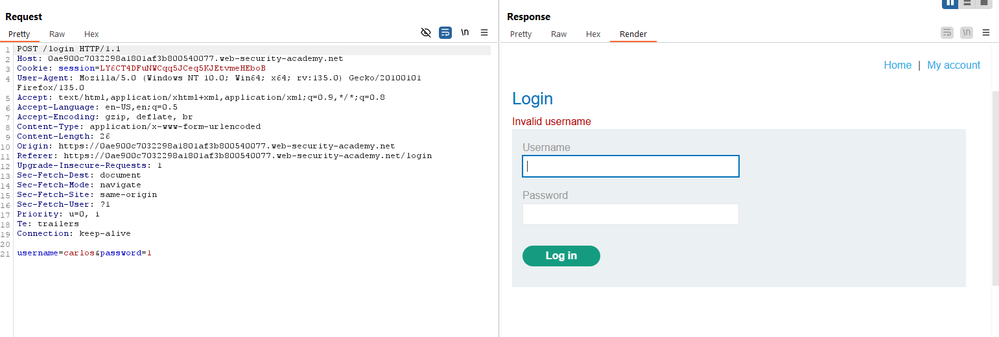

- Nếu `username` sai thì server trả về `Invalid username` -> Nếu mà đúng thì chắc hẳn sẽ có kiểu thông báo khác. Dùng `Intruder` để kiểm tra giả thiết.
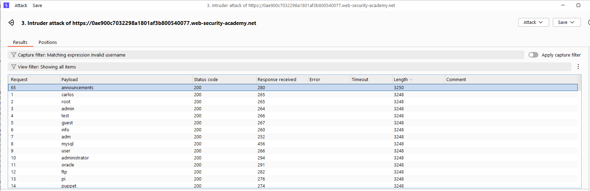

- Sau khi chạy tôi phát hiện ra `username:announcements` thì sẽ hiện như sau:
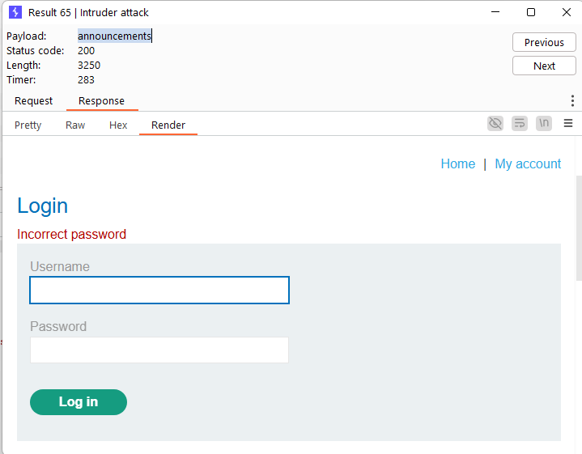

- Vậy thì chúng đã có `username` việc còn lại là brute-force `password`:
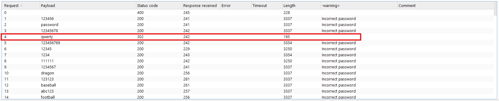

**Notes**
Chúng ta có thể tận dụng Intrusder của Burp để làm hoặc có thể sử dụng script Python để làm. Ở bài lab này mọi thứ chỉ dừng lại ở case đơn giản. Tuy nhiên việc `username enumeration` là khá hay xảy ra vì tôi đã từng thấy nó ở một vài trang web trước đây.
___

### Lab: Username enumeration via subtly different responses
**Yêu cầu**: Lab có lỗ hổng `username enumeration` và `password brute-force` nhưng được bảo vệ một cách tinh vi. Nhiệm vụ: tìm cách phát hiện username hợp lệ, brute-force mật khẩu từ danh sách cho trước, đăng nhập vào tài khoản và hoàn thành lab.

**Thực hiện**
- Bài lab này có ý tưởng giống bài lab trên tuy nhiên cách mà HTTP phản hồi có chú khác biệt nhỏ. Việc chúng ta là tìm ra sự khác biệt đó và thực hiện `username enumeration`.
- Vẫn như bài trước ta sẽ bắt gói tin Burp rồi dùng Intruder để gửi nhiều gói tin với `username` khác nhau và theo dõi phản hồi.
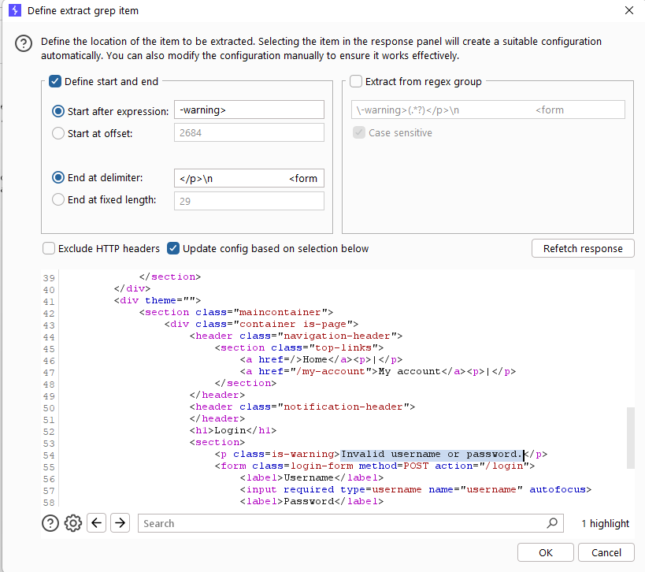
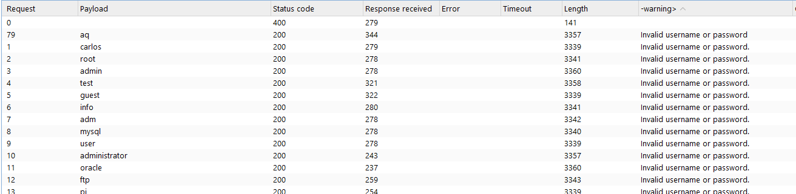

- Sự khác biệt ở đây là dấu `.`. Nếu đúng sẽ không có dấu chấm `Invalid username or password` và sai thì `Invalid username or password.`. Tiếp theo thì chúng ta sẽ dò password.
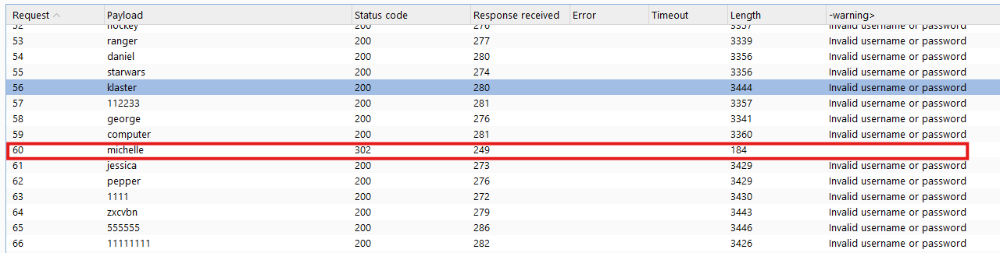

**Lưu ý**
Đôi khi do không cẩn thận trong việc đưa ra cảnh báo 1 cách thống nhất mà thông tin về `username` có thể bị lộ. Trong trường hợp này bản thân dev có thể đã lường trường việc khác nhau giữa HTTP response trả về nên đã để warning giống nhau. Tuy nhiên lại sơ sẩy quên mất dấu `.`.
___

### Lab: Username enumeration via response timing
**Yêu cầu**: Lab có lỗ hổng `username enumeration` dựa trên thời gian phản hồi của ứng dụng. Nhiệm vụ: khai thác sự khác biệt trong thời gian phản hồi để xác định username hợp lệ, sau đó brute-force mật khẩu từ danh sách cho trước, đăng nhập vào tài khoản và hoàn thành lab. Đăng nhập với thông tin `wiener:peter` để kiểm tra cơ chế xác thực.

**Thực hiện**
- Bài lab này tôi nghĩ là nó không dễ. Việc đầu tiên cần làm là kiểm tra cơ chế xác thực của server thông qua tài khoản cho sẵn `wiener:peter`
- Vì bài lab là `timing` vì thế ta cần để ý tới thời gian phản hồi. Thử với các trường hợp tôi có bảng sau

| Case                     | Response time  |
|--------------------------|----------------|
| user & pass correct      | ~200ms-280ms   |
| user correct, pass wrong | ~200ms-280ms   |
| user wrong, pass wrong   | ~200ms-280ms   |

- Từ bảng số liệu trên tôi vẫn chưa đưa ra được phán đoán chính xác. Vì thế hãy thử với password dài và ngắn xem thời gian phản hồi sao.

| Case (user đúng)         | Response time  |
|--------------------------|----------------|
| pass dài                 | phụ thuộc vào độ dài password |
| pass ngắn                | ~200ms-280ms   |
| user wrong, pass (dài, ngắn) wrong | ~200ms-280ms   |

- Ta có thể suy ra cơ chế xác thực như sau:
    1. Kiểm tra `username`: Nếu sai thì sẽ phản hồi lại luôn ( ~220 ms)
    2. Kiếm tra `password`: Nếu `username` đúng thì `password` sẽ được kiểm tra. Và chính vì độ dài của `password` sẽ làm tăng thời gian phản hồi

- Ngoài ra trong quá trình xác định cơ chế xác thực hệ thống có xảy ra tình trạng như sau. Điều này là do server có cơ chế xác thực IP.
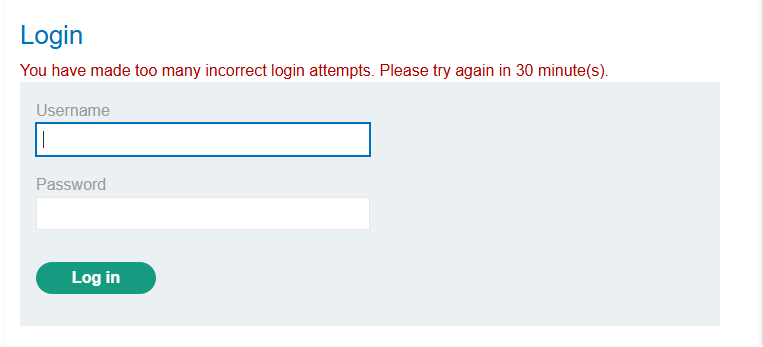

- Theo gợi ý của Lab chúng ta dễ dàng bypass cơ chế xác thực IP này thông qua HTTP header. Cụ thể là `X-Forwarded-For`.
> 🧪 Hint
To add to the challenge, the lab also implements a form of IP-based brute-force protection. However, this can be easily bypassed by manipulating HTTP request headers.

- Giờ thì chúng ta có thể thực hiện tấn công rồi. Việc đầu tiên là xác định được username chính xác.
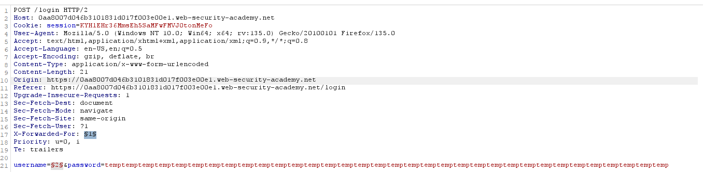
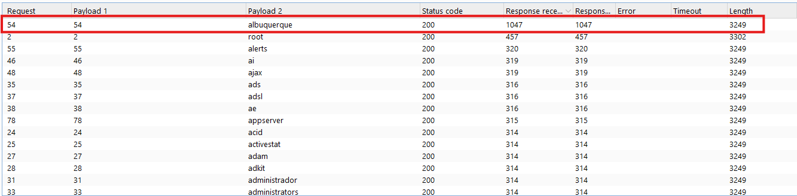

- Chúng ta có `username: albuquerque` giờ thì tìm nốt password là xong. Brute-force như các bài lab trên.
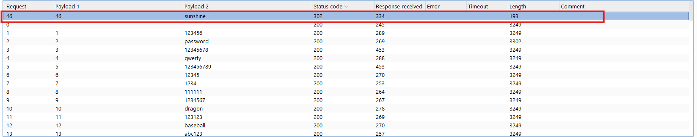

**Lưu ý**
Bài lab này có yếu tố liên quan đến `X-Forwarded-For`, một header HTTP dùng để xác định IP gốc của client khi request đi qua proxy hoặc VPN. Nếu server tin tưởng giá trị trong header này mà không kiểm tra, attacker có thể giả mạo IP để bypass hệ thống kiểm soát truy cập hoặc giới hạn brute-force theo IP. Ngoài ra bài này ta có thể sử dụng chế độ `Cluster boom` của Intruder để bypass mà không cần chú ý đến timming vì nếu thành công sẽ trả về mã `302` còn lại thì không.
___

### Lab: Broken brute-force protection, IP block
**Yêu cầu**: Lab có lỗ hổng do `logic flaw` trong cơ chế bảo vệ chống `password brute-force`. Nhiệm vụ: khai thác lỗ hổng để brute-force mật khẩu của `carlos`, sau đó đăng nhập vào tài khoản của hắn và hoàn thành lab. Đăng nhập với thông tin `wiener:peter` để kiểm tra cơ chế xác thực.

**Thực hiện**
- Bài này chỉ việc brute-force password của `carlos`. Vì thế bước đầu tiên là thử bypass cơ chế IP block của server. Ta thử thì cứ sau 5 lần nhập sai mật khẩu thì sẽ bị lock thời gian. Thử thêm `X-Forwarded-For` thì cũng không được.
- Hóa ra cơ chế bài này là sau 4 lần nhập sai, nếu lần thứ 5 nhập đúng thì ta lại tiếp tục nhập được 5 lần tiếp.
- Script python:

```
import requests
passwords = open('password.txt').read().splitlines()
url = "https://0aac00310383b56a8140118f00f60024.web-security-academy.net/login"
cookie = {'session': '6NFEpsqGyUG5JTaou8PLC5DNDLtZNaxJ'}
counter = 0
def sendRequest(url, password):
    print(f'[+] Trying password: {password}')
    carlosLoginData = {
        'username': 'carlos',
        'password': password
    }

    loginRequestText = requests.post(url, cookies=cookie, data=carlosLoginData).text

    if 'Incorrect password' not in loginRequestText:
        print(f'[+] Found password: {password}')
        return True
    else:
        return False

for password in passwords:
    if(counter == 2):
        tmp = requests.post(url, cookies=cookie, data={'username': 'wiener', 'password': 'peter'})
        counter = 0
        

    if(sendRequest(url, password)):
        break
    counter += 1
```
**Notes**
Bài lab này về ý tưởng làm thì đơn giản, tuy nhiên cần biết một chút code để có thể giải bài này dễ dàng hơn. Ngoài ra còn có thể dùng điều kiện `Race Conditions` để bypass cơ chế block IP này.
___

### Lab: Username enumeration via account lock
**Yêu cầu**: Lab có lỗ hổng `username enumeration` và sử dụng cơ chế `account locking`, nhưng có lỗi logic trong cơ chế này. Nhiệm vụ: khai thác lỗ hổng để xác định username hợp lệ, lợi dụng lỗi logic để brute-force mật khẩu từ danh sách cho trước, đăng nhập vào tài khoản và hoàn thành lab.

**Thực hiện**
___

### Lab: Broken brute-force protection, multiple credentials per request
**Yêu cầu**: Lab có lỗ hổng do `logic flaw` trong cơ chế bảo vệ chống `brute-force`. Nhiệm vụ: khai thác lỗi này để brute-force mật khẩu của `carlos`, sau đó đăng nhập vào tài khoản của hắn và hoàn thành lab.

___

