# Business logic vulnerabilities

## Excessive trust in client-side controls

>Một sai lầm phổ biến là cho rằng người dùng chỉ tương tác qua giao diện web và kiểm soát phía client có thể ngăn chặn đầu vào độc hại.  
>
>Tuy nhiên, kẻ tấn công có thể sử dụng công cụ như *Burp Proxy* để chỉnh sửa dữ liệu trước khi nó đến server, khiến mọi kiểm soát phía client trở nên vô nghĩa.  
>
>Nếu không có *xác thực và kiểm tra dữ liệu phía server*, ứng dụng có thể dễ dàng bị khai thác, gây hậu quả nghiêm trọng cho cả *chức năng kinh doanh* và *bảo mật hệ thống*.

___

### Lab: Excessive trust in client-side controls
**Yêu cầu**
This lab doesn't adequately validate user input. You can exploit a logic flaw in its purchasing workflow to buy items for an unintended price. To solve the lab, buy a "Lightweight l33t leather jacket".

You can log in to your own account using the following credentials: `wiener:peter`

**Thực hiện**
- Đăng nhập vào tài khoản, và thao tác mua áo gia.
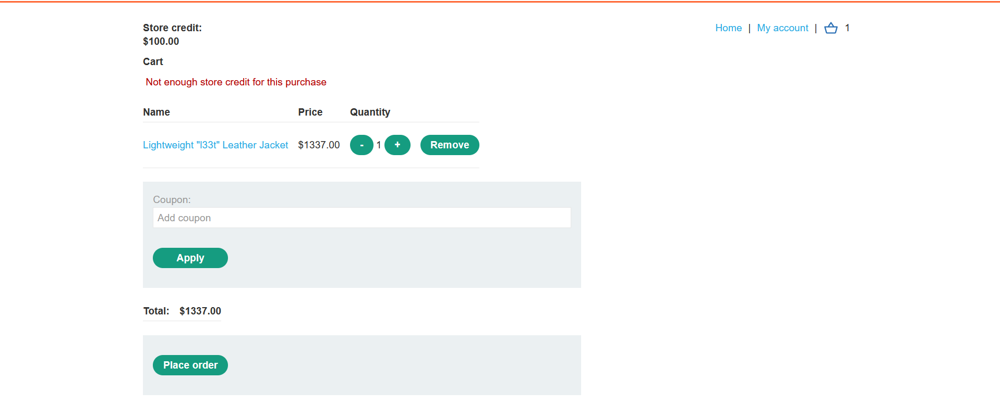

- Quan sát trên Burp. Thấy có gói tin đáng ngờ. Trong phần data gói tin này có `price=133700`. 
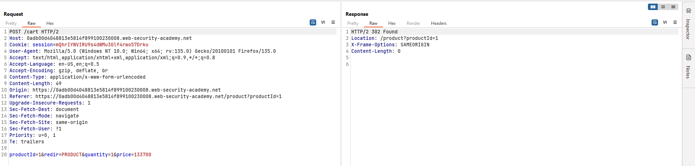

- Rất có thể price này được phía client xử lí và gen ra. Ta tìm mã nguồn nơi mà sinh ra `price`. Từ ảnh ta kết luận được price được gen ra từ phía client -> Ta có thể thao túng và thay đổi được giá.
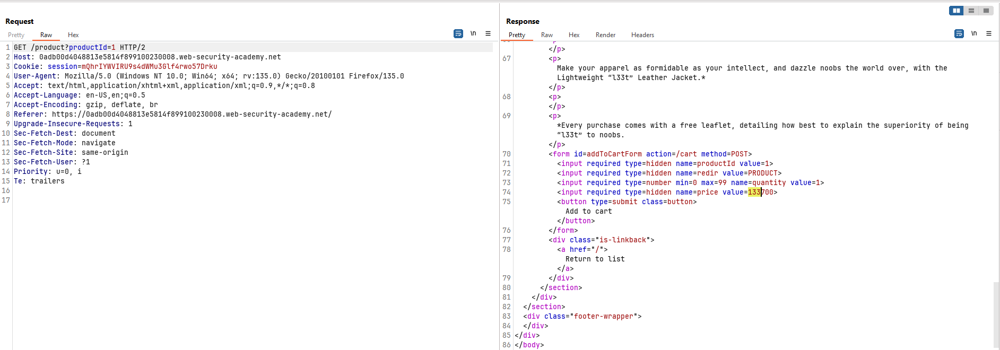

- Thêm lại sản phẩm giá 100\$.
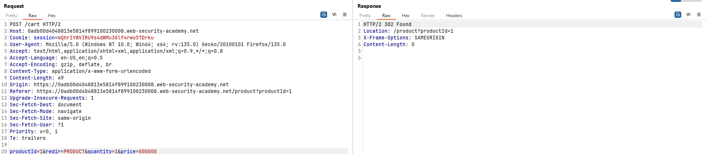

- Thực hiện thanh toán và hoàn thành lab.


**Notes**
Nếu cơ chế sinh ra các giá trị từ phía client, ta rất có thể sẽ thao túng được các giá trị đó.

___

## Failing to handle unconventional input

>Ứng dụng cần đảm bảo dữ liệu đầu vào tuân theo các quy tắc kinh doanh. Tuy nhiên, nếu không có kiểm tra hợp lệ phía server, kẻ tấn công có thể khai thác lỗ hổng bằng cách nhập giá trị không mong đợi.  
>
>Ví dụ, nếu chức năng chuyển tiền không ngăn chặn giá trị âm, kẻ tấn công có thể gửi `-1000` để rút tiền từ tài khoản nạn nhân thay vì gửi tiền.
>
>Những lỗi này thường bị bỏ sót do kiểm soát phía client, nhưng có thể phát hiện bằng cách thử nghiệm với các giá trị bất thường như:  
>- *Số cực lớn hoặc cực nhỏ*  
>- *Chuỗi đầu vào quá dài*
>- *Dữ liệu kiểu không mong đợi*  
>
>Sử dụng công cụ như *Burp Proxy* để gửi các giá trị bất thường có thể giúp phát hiện các điểm yếu trong kiểm tra đầu vào và khai thác lỗi logic của ứng dụng.

___

### Lab: High-level logic vulnerability
**Yêu cầu**
This lab doesn't adequately validate user input. You can exploit a logic flaw in its purchasing workflow to buy items for an unintended price. To solve the lab, buy a "Lightweight l33t leather jacket".

You can log in to your own account using the following credentials: `wiener:peter`

**Thực hiện**
- Đăng nhập và thực hiện thêm sản phẩm và mua sắm.
- Thử tăng giảm số lượng hàng hóa và quan sát gói tin trong Burp.
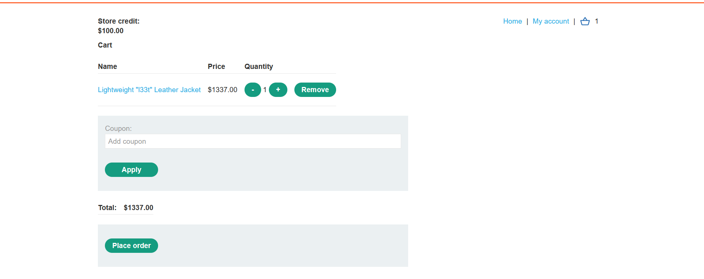
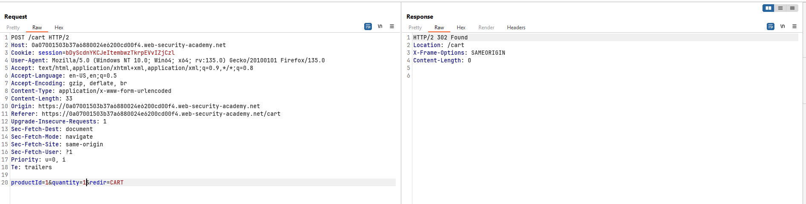

- Thay giá trị âm vào `quantity` xem thay đổi sao.
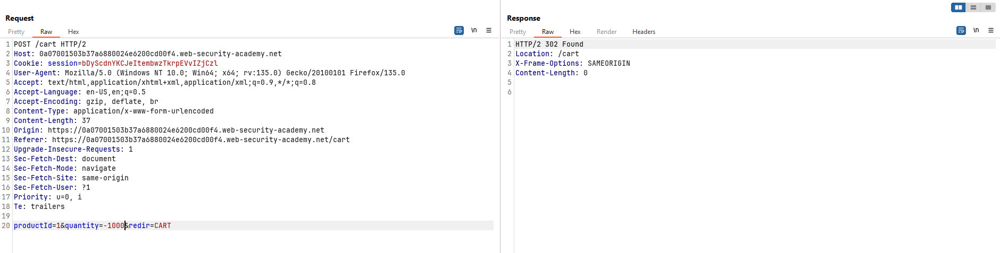
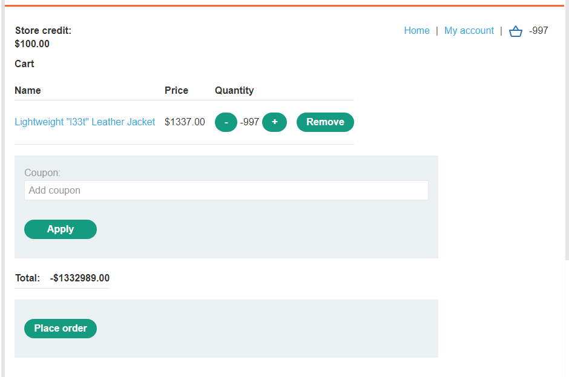

- Tổng tiền thanh toán đã âm, thử thanh toán xem tài khoản có tăng tiền lên không? Nếu có thì đã hoàn thành lab.
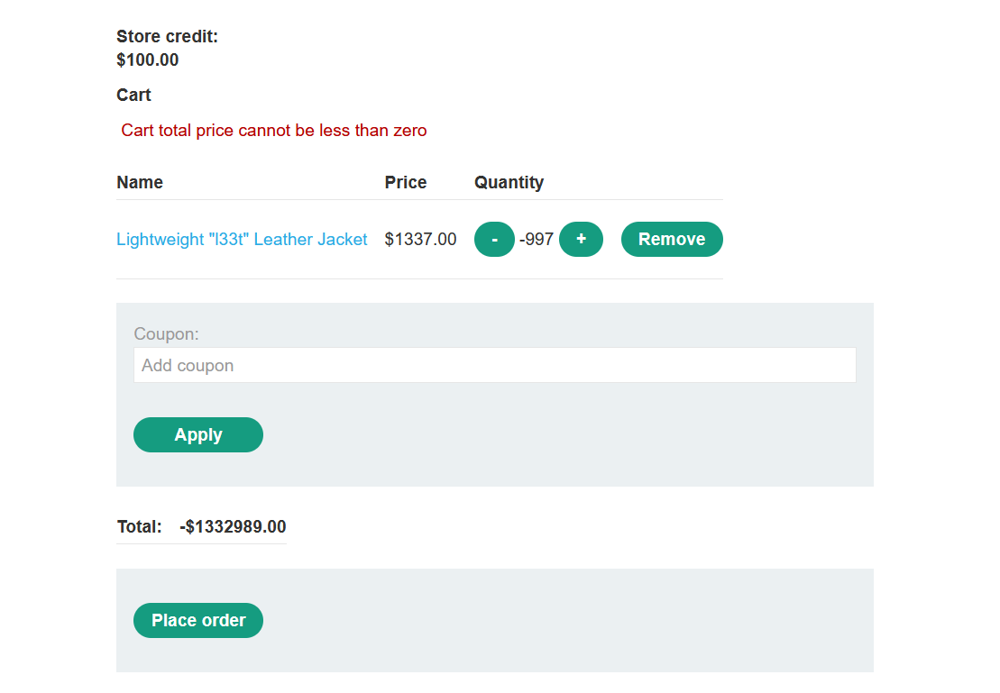

- Chúng ta sẽ cần khéo hơn chút, thêm các sản phẩm khác và tăng giảm phù hợp để có thể mua được đồ. 
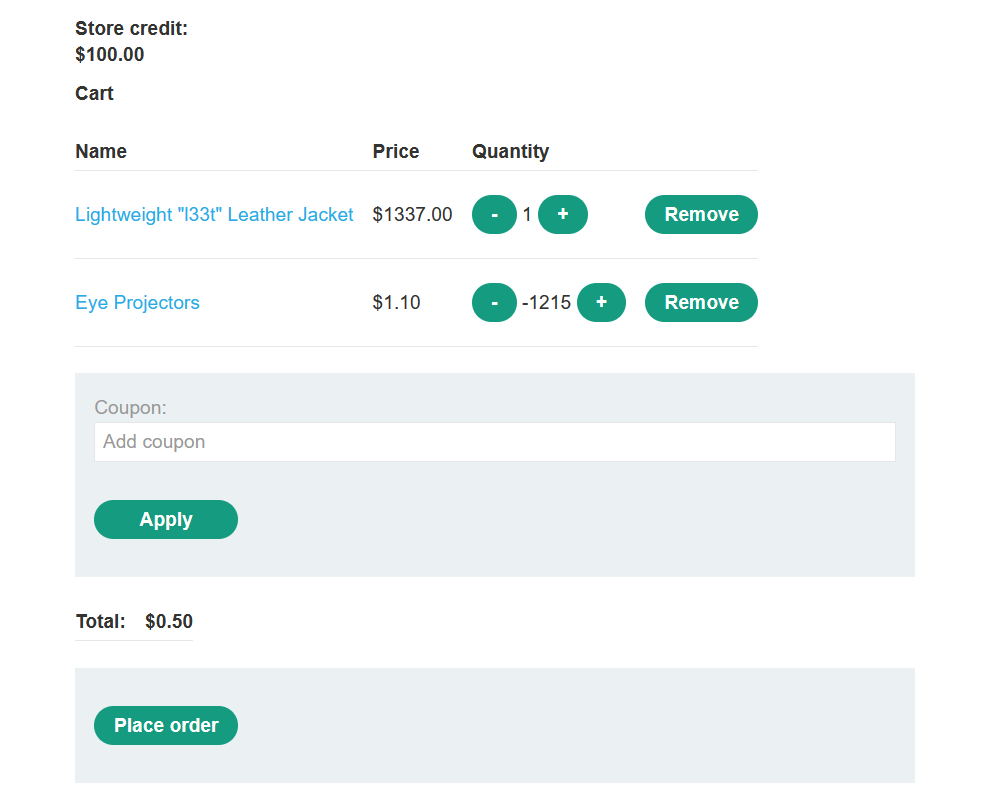

- Thanh toàn và hoàn thành lab
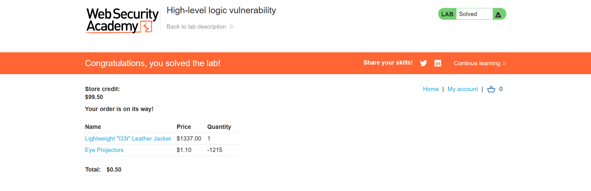

**Notes**
Các cơ chế kiểm soát chưa chặt chẽ, ở chức năng thanh toán đã có kiểm tra rằng tiền không được âm nhưng ở số lượng hàng hóa thì vẫn có thể âm. Dễ dàng khai thác !

___

### Lab: Low-level logic flaw
**Yêu cầu**
This lab doesn't adequately validate user input. You can exploit a logic flaw in its purchasing workflow to buy items for an unintended price. To solve the lab, buy a "Lightweight l33t leather jacket".

You can log in to your own account using the following credentials: `wiener:peter`

**Thực hiện**
- Tương tự lab trên ta kiểm tra chức năng mua hàng. Quan sát các gói tin trên Burp. Ta thấy khác với lab trên nếu kết quả âm thì sẽ luôn bị dừng ở 0 ( sản phẩm sẽ bị xóa)
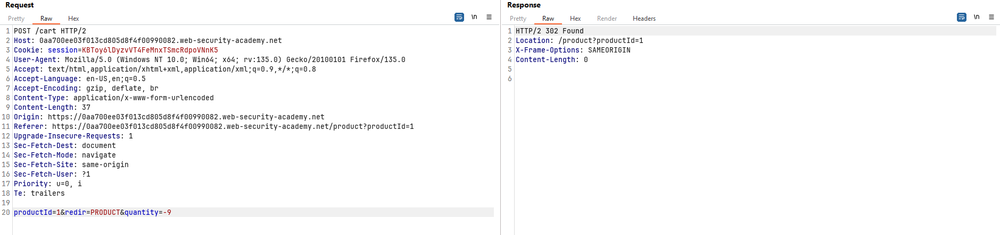
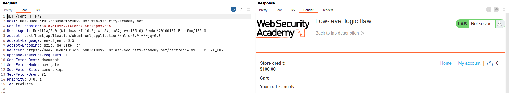

- Một hướng suy nghĩ khác là tăng sản phẩm -> tăng tiền. Tăng đến khi vượt quá biểu diễn số nguyên thì nó sẽ quay về 0 và tiến về phía âm.
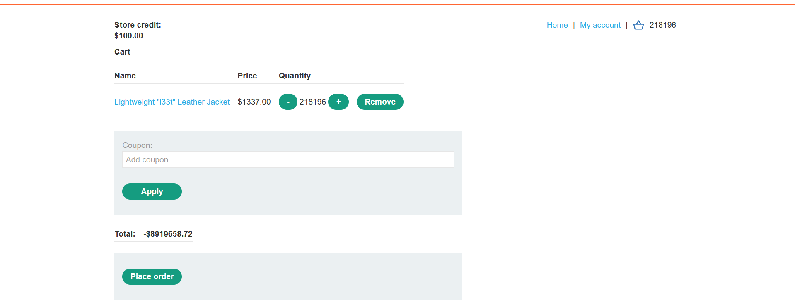

- Giống như bài trên thì ta phải chỉnh làm sao để tiền dương nhưng mà lại nhỏ hơn `100$`.
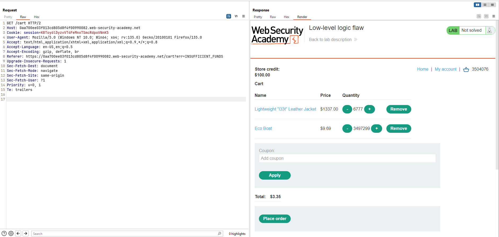
>Chỉ cần dùng Intruder hoặc bất kì cách nào chỉnh ra được số lượng như trong ảnh là được !

- Thanh toán và hoàn thành lab.
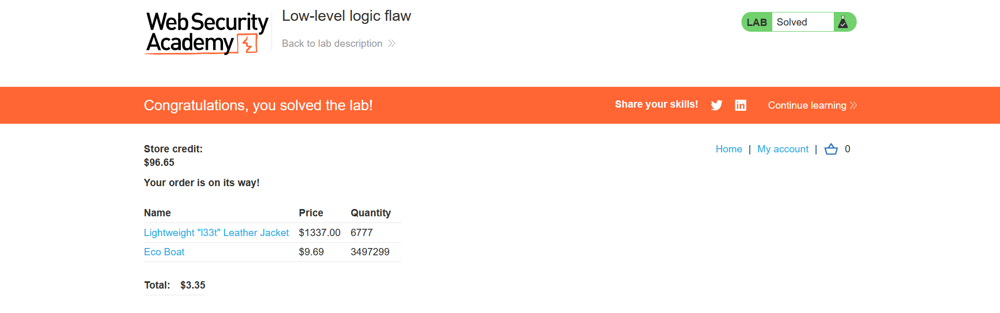

**Notes**
Trong bài này sử dụng lỗi `Interger Overflow` để khai thác. Chúng ta cũng cần ngăn chặn trường hợp này.
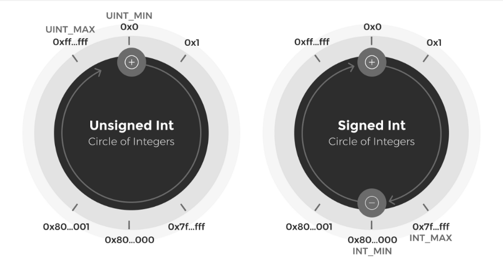

___

### Lab: Inconsistent handling of exceptional input
**Yêu cầu**
This lab doesn't adequately validate user input. You can exploit a logic flaw in its account registration process to gain access to administrative functionality. To solve the lab, access the admin panel and delete the user `carlos`. 

**Thực hiện**
- Thực hiện đăng kí một tài khoản bất kì. Quan sát gói tin trên Burp.
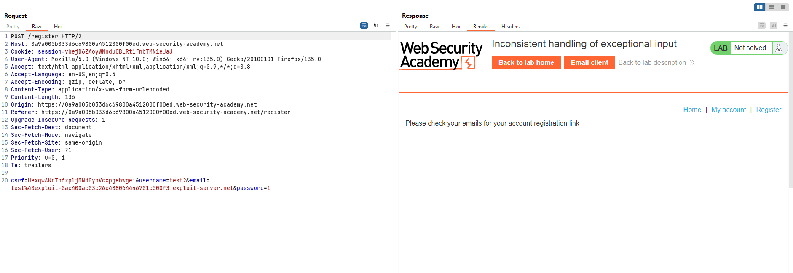

- Mục tiêu là truy cập được `/admin` nhưng với tài khoản này không có quyền đó. Có lẽ mục tiêu chính là làm sao tạo tài khoản với mail là `[name]@dontwannacry.com`. Khi đăng kí thì sẽ có xác thực gửi về mail server @dontwannacry. Mà mình không có server đó nên không xác thực được.
- Để bypass ta sẽ nối dài chuỗi như sau `very-long-string@dontwannacry.com.YOUR-EMAIL-ID.web-security-academy.net`. Sử dụng python để gen ra chuỗi này
```
s1 = "@dontwannacry.com"
while len(s1)<255:
    s1="a"+s1
print(s1+".exploit-0a00008904daedb68102d853019400aa.exploit-server.net")
```

- Sừ dụng chuỗi vừa sinh ra để đăng ký tài khoản. Ta thấy email đã bị cắt ngắn thành mail của `dontwannacry` -> Truy cập được admin panel và hoàn thành lab.
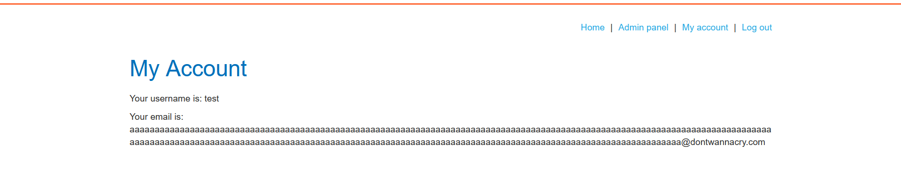
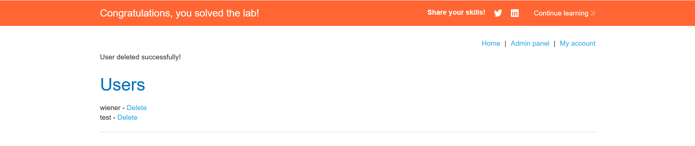

**Notes**
Lỗ hổng `Truncation String` xảy ra khi dữ liệu đầu vào có độ dài vượt quá giới hạn của hệ thống, dẫn đến việc bị cắt bớt (truncate) một cách không kiểm soát. Điều này có thể gây ra các lỗ hổng bảo mật nghiêm trọng, đặc biệt trong xác thực người dùng và xử lý dữ liệu quan trọng.  

Trong trường hợp email, nếu server cho phép kiểm tra email dài hơn 255 ký tự nhưng chỉ lưu trữ tối đa 255 ký tự, kẻ tấn công có thể khai thác bằng cách gửi một email dài có phần đầu giống với email hợp lệ, nhưng thêm một phần đệm phía sau để đánh lừa hệ thống. Khi server xác thực, nó đọc toàn bộ email, nhưng khi lưu vào database, chỉ giữ lại phần đầu, dẫn đến sự sai lệch trong kiểm tra danh tính.  

Lỗ hổng này có thể ảnh hưởng đến nhiều hệ thống như:
- Tài khoản người dùng: Dẫn đến chiếm quyền kiểm soát tài khoản hợp lệ.
- Mật khẩu hoặc token xác thực: Khi lưu trữ bị cắt ngắn, có thể khiến xác thực hoạt động sai lệch.
- Cơ chế kiểm tra quyền truy cập: Nếu chuỗi bị cắt bỏ không đúng cách, kẻ tấn công có thể lợi dụng để vượt qua kiểm tra quyền.  

___

## Incorrect Assumptions About User Behavior
>Lỗ hổng logic thường xuất phát từ các giả định sai lầm về hành vi người dùng, dẫn đến những lỗ hổng bảo mật nghiêm trọng.  
>
>1. Người dùng có thể không luôn đáng tin. Một số hệ thống kiểm tra nghiêm ngặt ban đầu nhưng sau đó lại lỏng lẻo, tạo cơ hội cho kẻ tấn công lợi dụng.  
>2. Không phải lúc nào người dùng cũng nhập đầy đủ dữ liệu. Kẻ tấn công có thể xóa hoặc chỉnh sửa tham số bắt buộc, gây ra hành vi không mong muốn trên server.  
>3. Cách khai thác lỗ hổng
>       + Thử xóa từng tham số và quan sát phản hồi của server.
>       + Kiểm tra cả khi xóa giá trị tham số và khi xóa tên tham số.
>       + Kiểm tra tác động của thao tác này trong các bước khác nhau của quy trình.
>       + Kiểm tra các tham số trong URL, POST request và cookie.

___

### Lab: Inconsistent security controls
**Yêu cầu**
This lab's flawed logic allows arbitrary users to access administrative functionality that should only be available to company employees. To solve the lab, access the admin panel and delete the user `carlos`.

**Thực hiện**
- Đăng kí tài khoản và quan sát gói tin Burp.
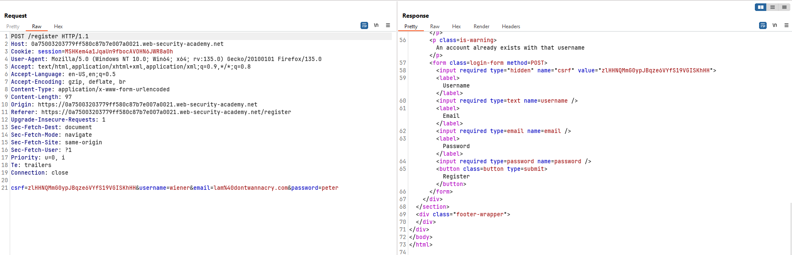

- Phía email server không thể nhận được mail xác thực của gói tin này. Thử đăng kí bằng mail exploit-server và đăng nhập.
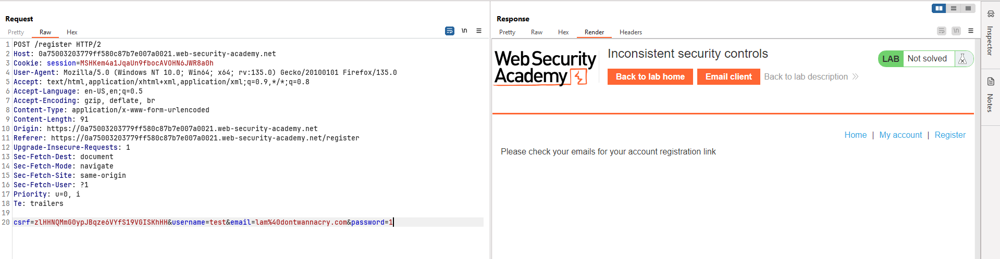
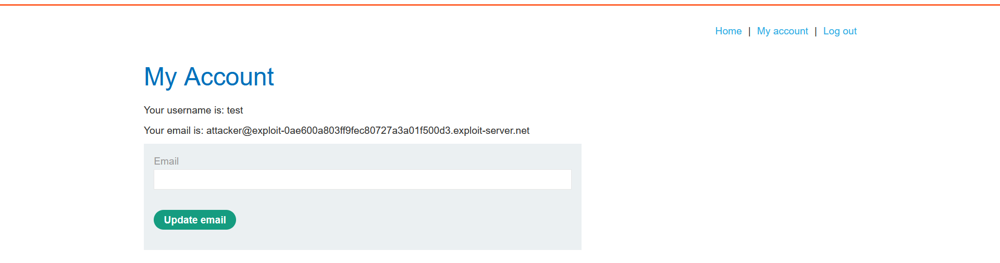

- Thay đổi email về email nội bộ công ty `dontwannacry`
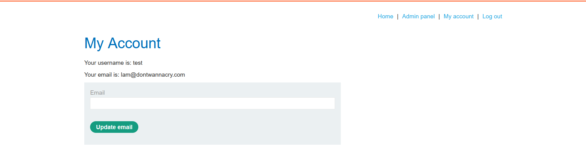

- Thành công ! vào admin pannel và xóa `carlos`
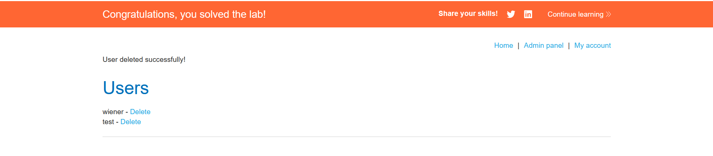

**Notes**

Server chỉ kiểm soát thông tin khi đăng ký mà quên mất quản lí truy cập ở tính năng đổi email. Điều này thường là do bỏ xót của dev.

___

### Lab: Weak isolation on dual-use endpoint
**Yêu cầu**
This lab makes a flawed assumption about the user's privilege level based on their input. As a result, you can exploit the logic of its account management features to gain access to arbitrary users' accounts. To solve the lab, access the `administrator` account and delete the user `carlos`.

You can log in to your own account using the following credentials: `wiener:peter`

**Thực hiện**
- Đăng nhập bằng tài khoản được cấp và quan sát các gói tin.
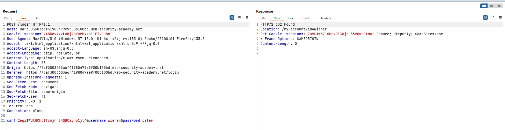

- Nhiệm vụ là làm sao để có thể truy cập tài khoản `administrator`. Kiểm tra `POST /my-account/change-password` và thử xóa `current-password=peter` đi thì server trả về đổi mật khẩu thành công.
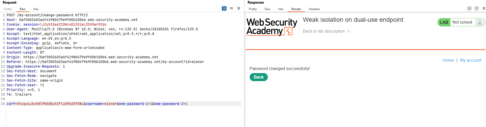

- Điều này có nghĩa server đã quên mất việc kiểm tra trường hợp khi current password không tồn tại. Có lẽ đây là endpoint sử dụng cho việc quản lí (các chức năng của admin) chỉ khác ở số lượng tham số. Ta thay `administrator` vào `username` và gửi.
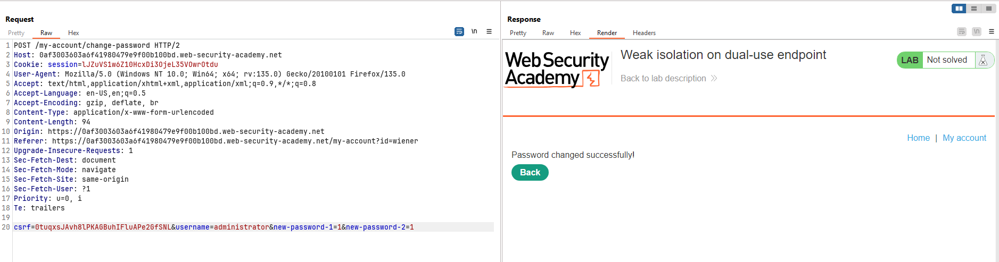

- Đăng nhập tài khoản `administrator` thành công và hoàn thành lab.
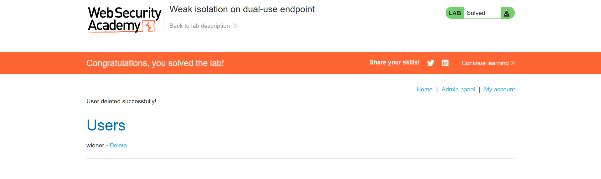

**Notes**
Bài lab này minh họa lỗ hổng do kiểm soát quyền hạn không chặt chẽ trên một endpoint có thể phục vụ nhiều mục đích (dual-use endpoint). Ở đây endpoint `/my-account/change-password` hệ thống cũng sử dụng để thay đổi mật khẩu của bất kỳ tài khoản nào, chỉ dựa vào tham số username.
___

### Lab: Insufficient workflow validation
**Yêu cầu**
This lab makes flawed assumptions about the sequence of events in the purchasing workflow. To solve the lab, exploit this flaw to buy a "Lightweight l33t leather jacket".

You can log in to your own account using the following credentials: `wiener:peter`

**Thực hiện**
- Đăng nhập vào tài khoản được cấp và thực hiện chức năng mua hàng + thanh toán. Quan sát gói tin trên Burp
- Logic thông thường:

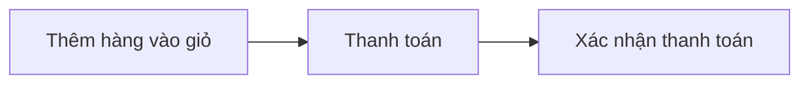
```mermaid
graph LR
    A[Thêm hàng vào giỏ] --> B[Thanh toán]
    B --> C[Xác nhận thanh toán]
```


- Ta có thể mua hàng bằng việc `Thêm hàng vào giỏ` -> `Xác nhận thanh toán`. Do có gói tin xác nhận thanh toán rồi việc còn lại là thêm món đồ vào giỏ.
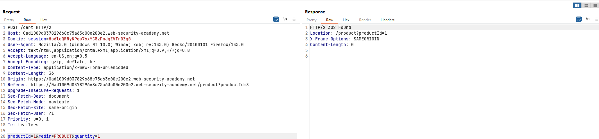
Và xác nhận thanh toán ( bỏ qua bước thanh toán)
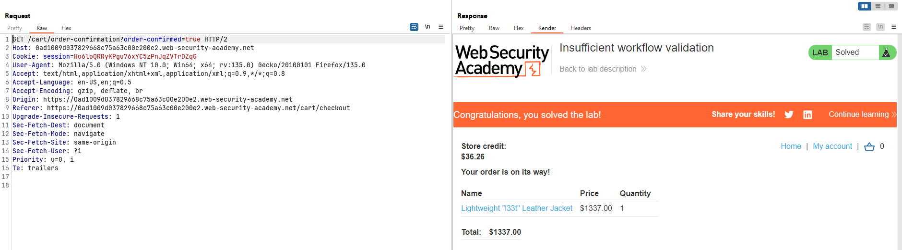

**Notes**
Giải thích về lỗ hổng: Giả định sai về trình tự thực hiện (Sequence of Events Assumption Flaw)

Lỗ hổng này xuất hiện khi ứng dụng giả định rằng người dùng sẽ tuân thủ trình tự các bước trong một quy trình nhất định. Tuy nhiên, kẻ tấn công có thể lợi dụng điều này để thực hiện các hành động ngoài dự kiến, dẫn đến những lỗi logic nghiêm trọng.

Thực hiện giao dịch mà không qua bước xác thực hoặc thanh toán.
Khai thác dữ liệu nhạy cảm bằng cách truy cập những bước không được bảo vệ đúng cách.

___

### Lab: Authentication bypass via flawed state machine
**Yêu cầu**
This lab makes flawed assumptions about the sequence of events in the login process. To solve the lab, exploit this flaw to bypass the lab's authentication, access the admin interface, and delete the user carlos.

You can log in to your own account using the following credentials: `wiener:peter`

**Thực hiện**
- Đăng nhập tài khoản và thử chức năng api `/role-selector`.
- Khi đăng nhập thành công server sẽ chuyển hướng ta tới `/role-selector`. Chọn xong role thì chúng ta quay qua home page.
- Xóa toàn bộ session và đầu tiên chúng ta sẽ `login`.
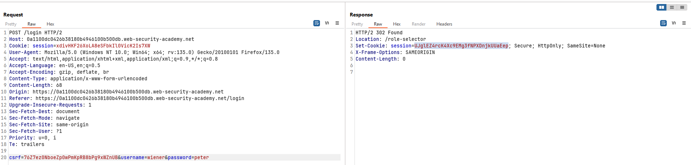

- Gắn session mới được server gán vào trình duyệt và bỏ qua bước `/role-selector`.
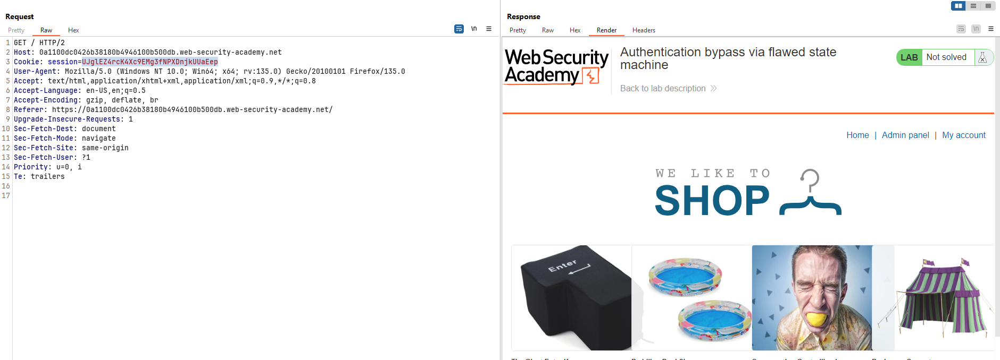

- Đã truy cập được admin panel. Hoàn thành lab.
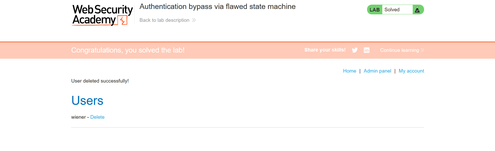

**Notes**
Bài lab này khai thác lỗ hổng trong cơ chế xác thực do state machine hoạt động không chặt chẽ. Hệ thống giả định người dùng sẽ tuân theo trình tự đăng nhập và chọn vai trò trước khi truy cập trang chính.
Ban đầu người dùng sẽ luôn được role mặc định (role này có quyền truy cập admin panel) -> Phá vỡ hệ thống xác thực bằng việc bỏ quả chọn role.

___

## Domain-specific flaws

>Lỗ hổng logic thường liên quan đến quy trình cụ thể của từng ứng dụng. Một ví dụ phổ biến là chức năng giảm giá trên các trang mua sắm trực tuyến.  
Giả sử một cửa hàng giảm 10% cho đơn hàng trên 1000$. Nếu hệ thống không kiểm tra lại điều kiện giảm giá sau khi giỏ hàng thay đổi, kẻ tấn công có thể dựa vào đó và trục lợi.  
Bất kỳ tính năng nào điều chỉnh giá theo hành động người dùng đều có nguy cơ bị khai thác. Kẻ tấn công có thể thao túng trạng thái ứng dụng để hưởng lợi bất hợp pháp.  
Để phát hiện lỗ hổng này, cần tư duy như kẻ tấn công: phân tích cách hệ thống tính giá, xác định thời điểm điều chỉnh giá diễn ra và thử thay đổi dữ liệu.
Hiểu rõ lĩnh vực hoạt động cũng rất quan trọng, vì lỗ hổng thường xuất hiện khi nhiều chức năng kết hợp không mong muốn.
___

### Lab: Flawed enforcement of business rules
**Yêu cầu**
This lab has a logic flaw in its purchasing workflow. To solve the lab, exploit this flaw to buy a "Lightweight l33t leather jacket".
You can log in to your own account using the following credentials: `wiener:peter`

**Thực hiện**
- Đăng nhập vào tài khoản được cấp. Dự đoán mã kia có thể là mã giảm giá.
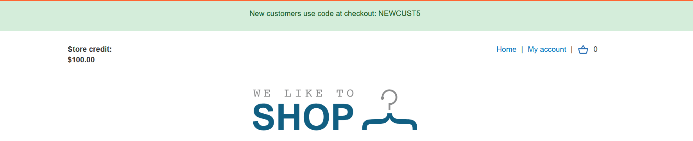

- Thêm đồ, add mã giảm giá, thanh toán.
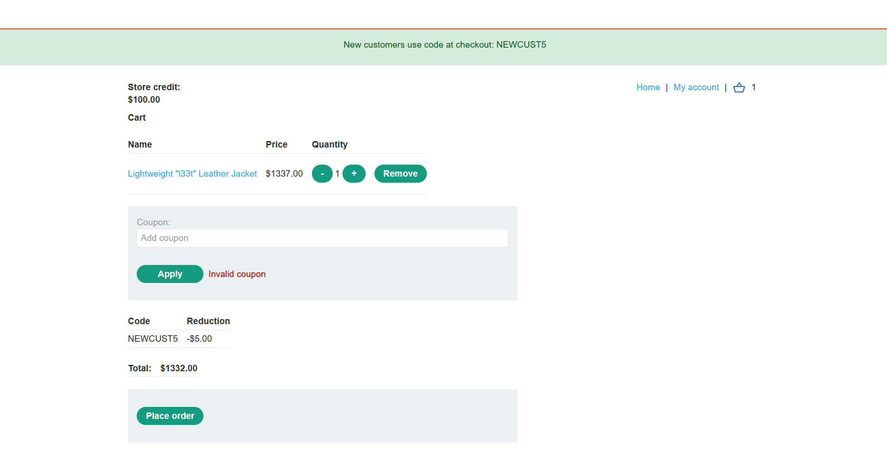
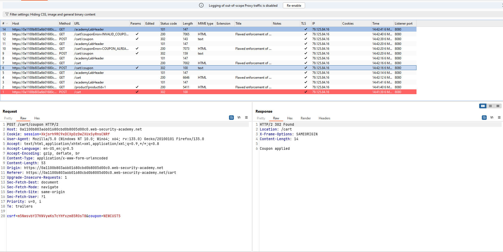

- Tạo mail cho tài khoản và đăng kí nhập mã giảm giá
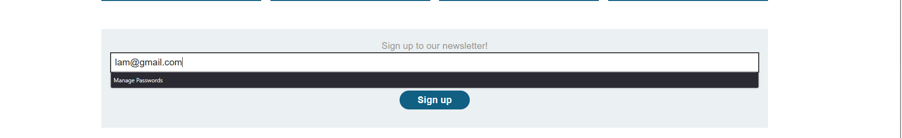
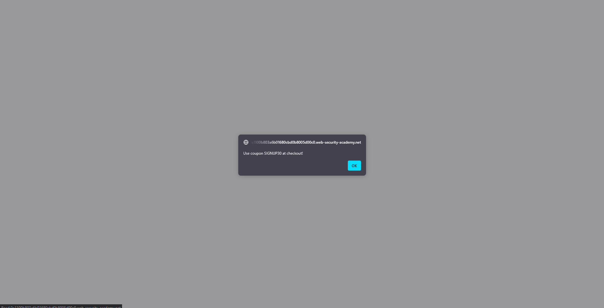

- Add mã giảm giá cho sản phẩm. Add luôn phiên `SIGNUP30` và `NEWCUST5` để bypass cơ chế chống lặp lại của hệ thống. Ta add được rất nhiều mã giảm giá.
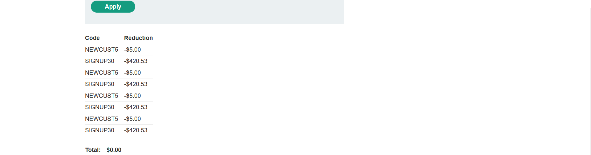

- Thanh toán và hoàn thành bài lab.

**Notes**
Bài lab này chức năng giảm giá được thiết kế không đúng, thay vì kiểm tra tất cả các mã giảm giá có nào trùng không thì hệ thống lại dựa vào mã giảm giá cuối cùng -> xảy ra lỗ hổng nghiêm trọng có thể dễ dàng bypass.
___

### Lab: Infinite money logic flaw
**Yêu cầu**
This lab has a logic flaw in its purchasing workflow. To solve the lab, exploit this flaw to buy a "Lightweight l33t leather jacket".
You can log in to your own account using the following credentials: `wiener:peter`

**Thực hiện**
- Đăng nhập và lướt thử. Ta thấy ở đây có gift card. Chắc hẳn phải có tác dụng gì đó. Mua thử và quan sát gói tin.
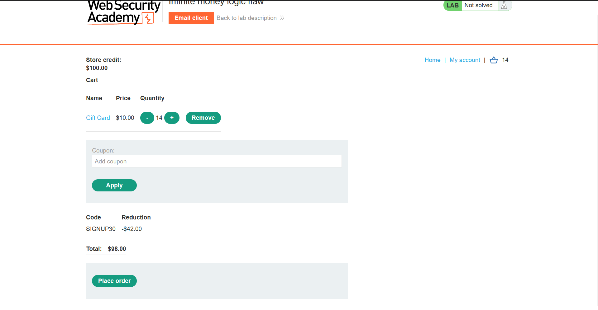

- Giờ sử dụng các đoạn code `GIFTCARD` đó, dùng Intruder cho nhanh.
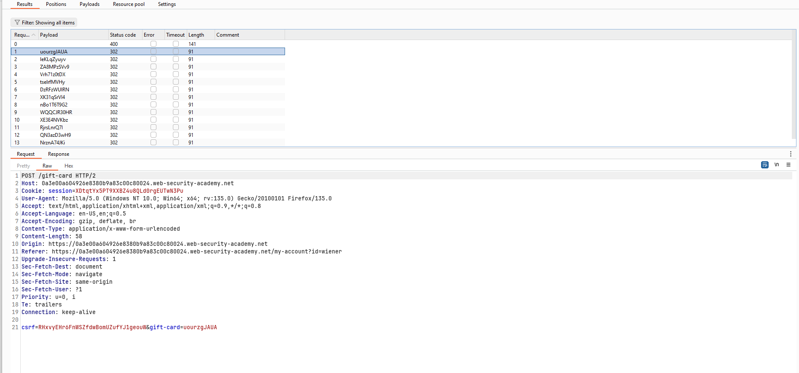

- Mỗi mã code sử dụng là được 10\$ -> Vậy thì ta cứ mua và sử dụng `GIFTCARD` như vậy xem lãi được nhiêu.
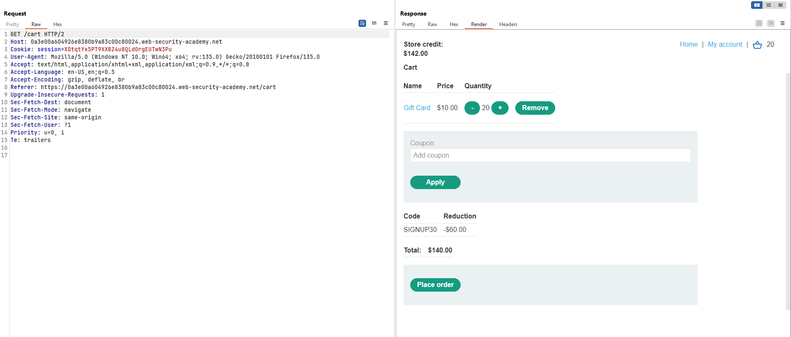
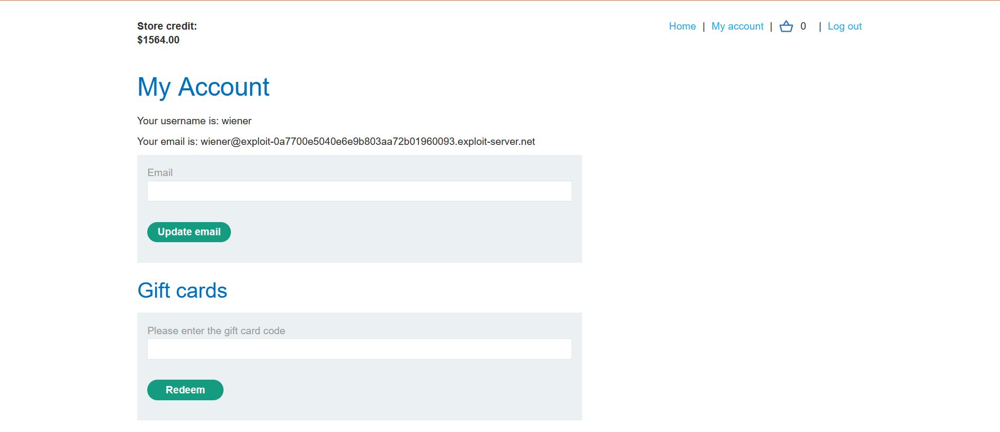

- Sau một hồi mua mã add giảm giá và sử dụng thì ta đã có đủ tiền. Mua áo và hoàn thành lab.
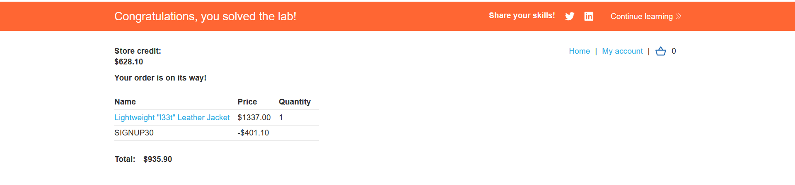

**Notes**
Việc thanh toán mua mã code bằng mã giảm giá khiến kẻ tấn công có thể trục lợi 30\% từ hệ thống.

___

## Providing an encryption oracle
>Encryption Oracle xảy ra khi người dùng có thể mã hóa dữ liệu bằng thuật toán của hệ thống và sử dụng ciphertext này để khai thác các chức năng quan trọng.  
Kẻ tấn công có thể gửi dữ liệu tùy ý để mã hóa, sau đó sử dụng ciphertext hợp lệ để giả mạo thông tin, chiếm quyền truy cập hoặc thao túng hệ thống. Nguy cơ cao hơn nếu hệ thống có chức năng giải mã, giúp kẻ tấn công phân tích và tạo dữ liệu độc hại.  
Lỗ hổng này đặc biệt nguy hiểm với xác thực, quản lý quyền và dữ liệu nhạy cảm. Để phòng tránh, không cho phép người dùng sử dụng trực tiếp hệ thống mã hóa, không dùng chung thuật toán cho nhiều chức năng và cần xác thực dữ liệu mã hóa trước khi xử lý.

___

### Lab: Authentication bypass via encryption oracle
**Yêu cầu**
This lab contains a logic flaw that exposes an encryption oracle to users. To solve the lab, exploit this flaw to gain access to the admin panel and delete the user `carlos`.
You can log in to your own account using the following credentials: `wiener:peter `

**Thực hiện**
- Đăng nhập bằng tài khoản được cấp. Chọn `stayed-login`. Quan sát gói tin Burp
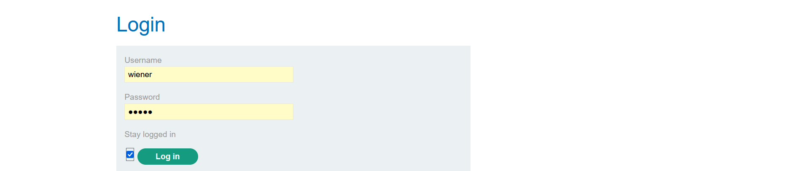
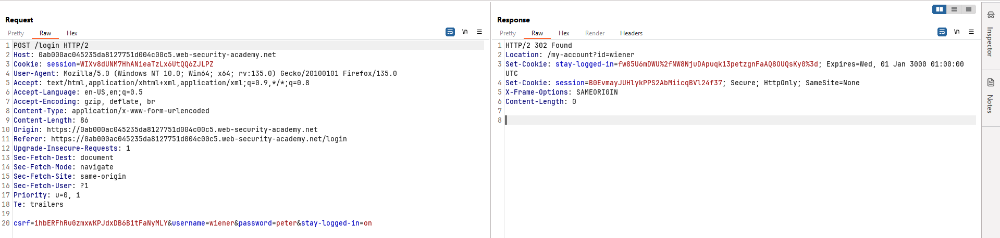

- Tiếp tục thử các chức năng khác. Để ý khi đăng comment gói tin Burp cho thấy thông tin đáng ngờ.
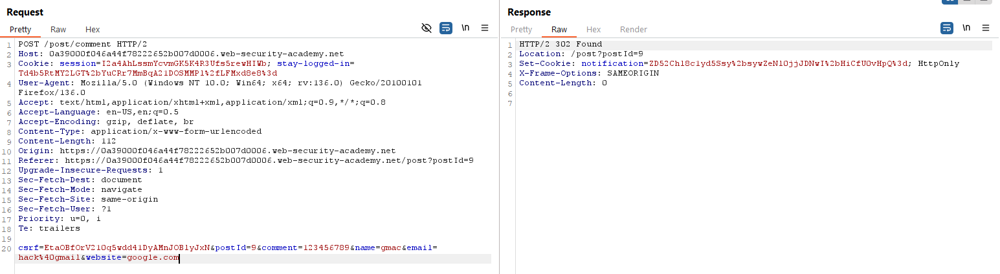

- Chúng ta để ý dòng này :`Set-Cookie: notification=ZD52Chl8c1yd5Ssy%2bsywZeNl0jjJDNwI%2bHiCfU0vHpQ%3d;`. Dựa vào tên tôi đoán cái này có thể dùng để thông báo gì đó . Gắn cookie này vào gói tin và thử follow redirect.
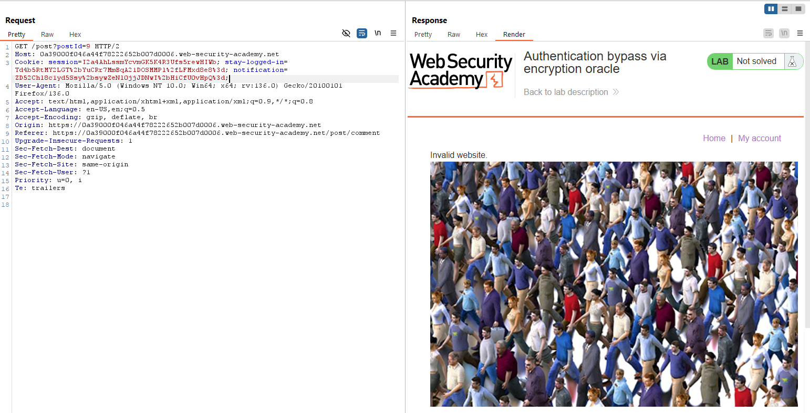

- Có thể `notification` được phía server giải mã -> hiện thị ra nội dung. Để ý ban đầu ta cũng có cookie `stayed-login` cũng có dạng như vậy ( Liệu có thể đây cũng là một encrypt sử dụng cùng 1 thuật toán với notification ????)
- Thay thử cookie giá trị`stayed-login` vào chỗ `notification` xem hiện thị gì
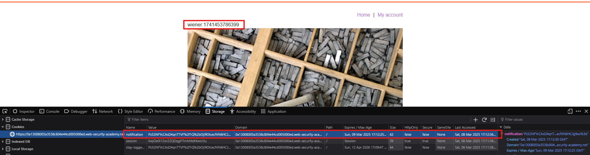

- Giá trị hiện ra gồm name và timestamp ( sử dụng convert timestamp để chứng minh giả thuyết).
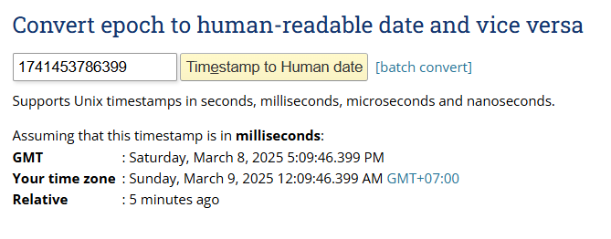

- Mã nguồn HTML này cho ta biết cơ chế của form comment.
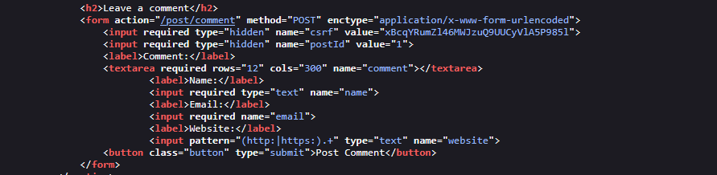

- Ta thay đổi trường `email` sao cho không đúng định dạng nữa
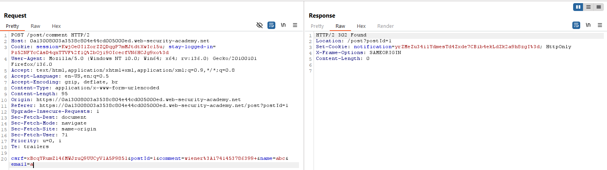
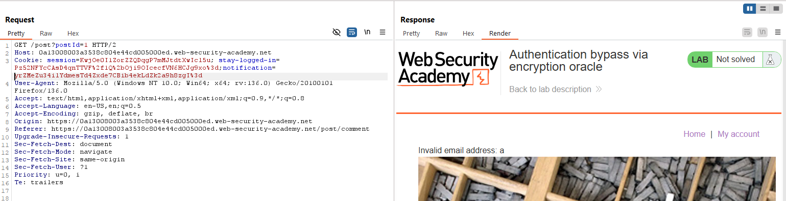

- Việc bây giờ là thay email thành `wiener:1741453786399` để so sánh với `administrator:1741453786399`:

| Text | Encrypted Value |
|------|-----------------|
| `wiener:1741453786399` | `Pz52NFYcCAsD4qnTTVF/1Q+Oji9OIcecfVN6HCJg9xo=` |
| `Invalid email address: wiener:1741453786399` | `yrZMeZu34ilYdmesTd4ZxcxfWLeL90IWTgbpOxZJ/K00cENoMKyhoLhsdU6goFIA` |
| `Invalid email address: administrator:1741453786399` | `yrZMeZu34ilYdmesTd4ZxY47BVe/s5LqmKYq+cY9gZI0cENoMKyhoLhsdU6goFIA` |


- Còn một vấn đề nữa là làm sao để loại bỏ chuỗi `Invailid ...` phía trước payload của ta ? Mã kia là Base64 -> Decode Base64 rồi xóa đi các byte thừa. Chuỗi `Invailid ...` gồm 23 kí tự, vậy thì xóa đi 23 byte đầu.
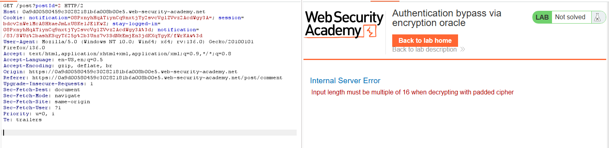

- Có lỗi xảy ra do thiếu phần đệm ( lỗi này ở các chế độ mật mã khối khi input vào phải là 2bytes). Các đoạn mật mã đã được đệm đầy đủ ( số byte chia hết cho 16 ) vậy thì khi ta bỏ đi 23 byte thì xảy ra lỗi như trên. Do đó số byte cần bỏ phải chia hết cho 16 -> chọn 32 byte. Nhưng để không bị mất đi nội dung ta sẽ chèn thêm 9 kí tự vào trước để khi xóa 32 byte ta được đoạn mật mã chuẩn.
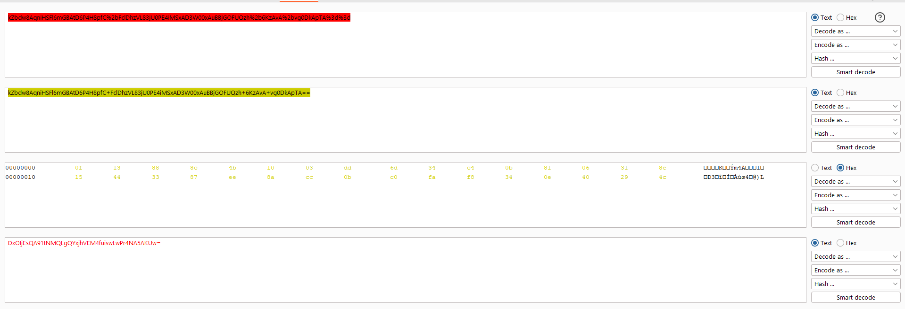
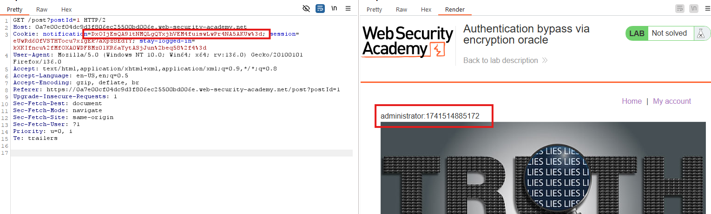

- Thay đoạn mật mã đó vào chỗ stay-login rồi hoàn thành nốt bài lab.


**Notes**
Ở bài lab này chúng ta tấn công vào cơ chế sử dụng mã hóa không an toàn. Việc để lộ thông tin thông qua cookie là vấn đề bảo mật. Và ta cũng phát hiện ra cách để tạo ra mật mã thông qua chức năng `cmt`.

___

## Email address parser discrepancies

___

### Lab: Bypassing access controls using email address parsing discrepancies
**Yêu cầu**
**Thực hiện**
**Notes**


