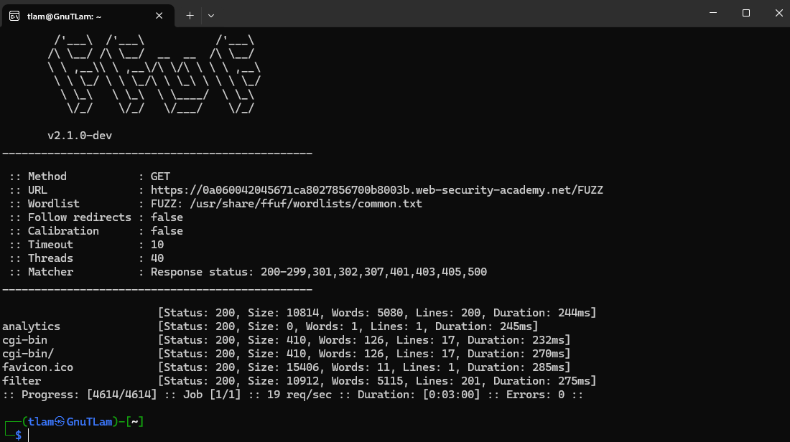
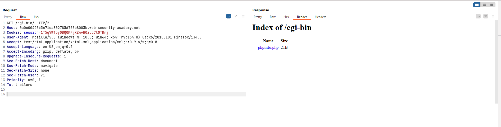
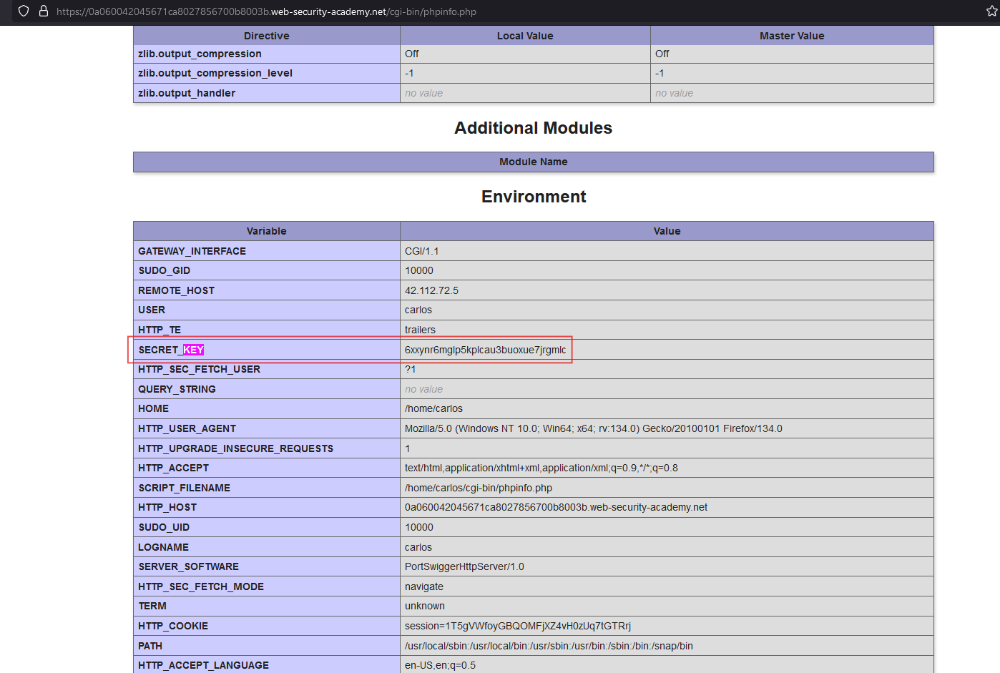
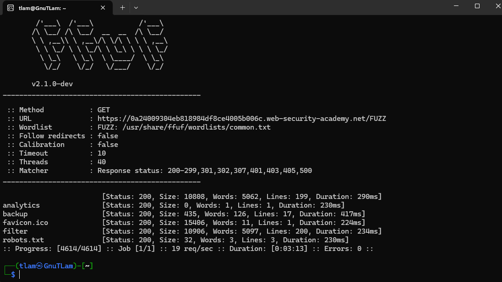
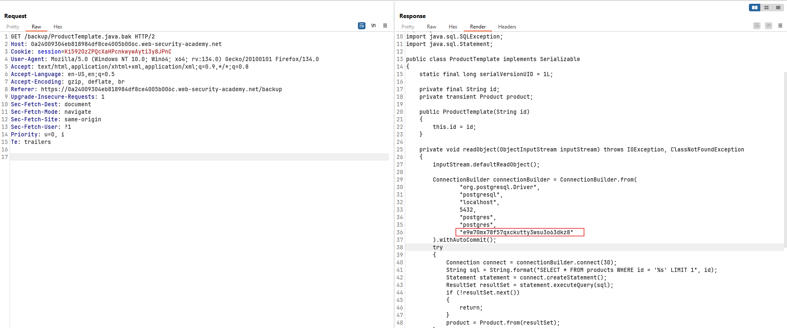
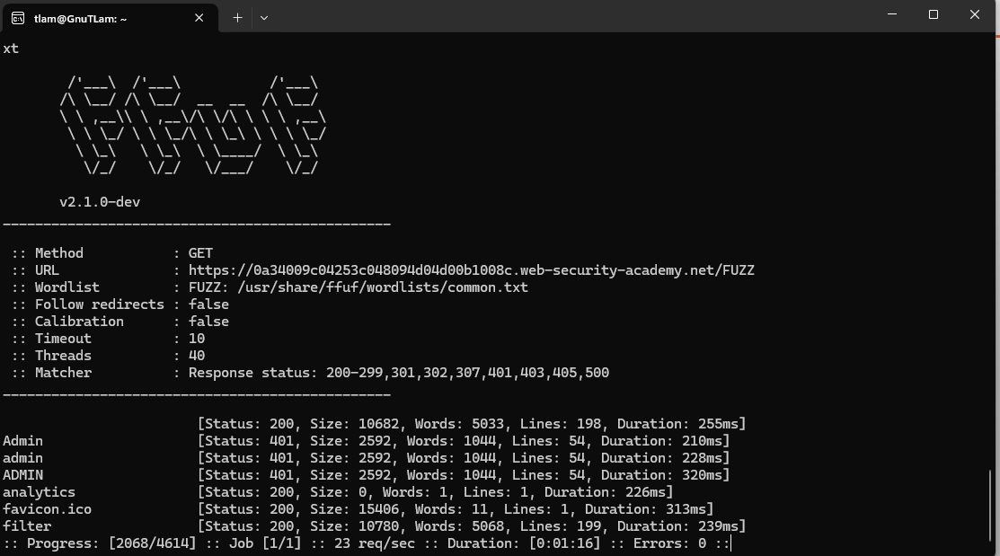
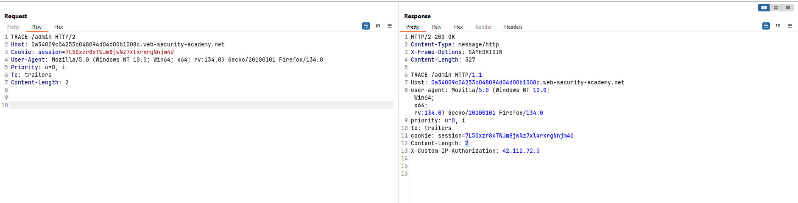
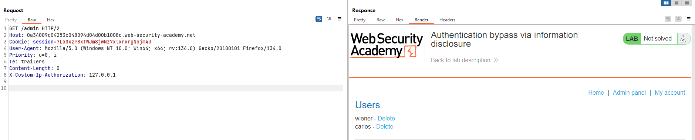

# Information disclosure

## Information Disclosure là gì?
Information Disclosure (hay còn gọi là Information Leakage) là tình trạng một website hoặc ứng dụng vô tình tiết lộ các thông tin nhạy cảm cho người dùng không có quyền truy cập. Những thông tin này có thể bao gồm:
- Dữ liệu người dùng: tên đăng nhập, thông tin tài chính, địa chỉ email, số điện thoại.
- Thông tin nhạy cảm của doanh nghiệp: dữ liệu kinh doanh, chiến lược nội bộ, tài liệu bảo mật.
- Chi tiết kỹ thuật: cấu trúc thư mục, phiên bản phần mềm, mã nguồn, API keys, cấu hình hệ thống.
Việc rò rỉ thông tin kỹ thuật có thể không gây hậu quả trực tiếp ngay lập tức nhưng lại là điểm khởi đầu để kẻ tấn công khai thác các lỗ hổng bảo mật nghiêm trọng hơn.

## Examples
- Tiết lộ cấu trúc thư mục: Qua file robots.txt hoặc liệt kê thư mục không kiểm soát.
- Truy cập mã nguồn: Do để lộ các file backup như index.php~ hoặc backup.zip.
- Thông báo lỗi chi tiết: Hiển thị tên bảng cơ sở dữ liệu, lỗi SQL, stack trace.
- Lộ thông tin nhạy cảm: Lưu API keys, credentials trực tiếp trong mã nguồn.
- Phản hồi ứng dụng khác nhau: Dựa vào phản hồi lỗi để đoán sự tồn tại của tài khoản hoặc tài nguyên.

## Finding & Exploiting Information Disclosure
### Finding
🔍 Kiểm Tra Cấu Hình và Các File Nhạy Cảm
- Tìm kiếm các file cấu hình nhạy cảm: Kiểm tra sự tồn tại của các file như `robots.txt`, `.git/`, `.env`, `backup.zip`, `config.php`. Những file này thường chứa thông tin nội bộ như đường dẫn, thông tin database, hoặc API key.
- Phân tích HTTP Headers: Sử dụng công cụ như Burp Suite hoặc cURL để kiểm tra các header như `Server`, `X-Powered-By`, `Content-Security-Policy` nhằm xác định thông tin về phiên bản phần mềm, framework đang sử dụng.

🚩 Thử Nghiệm Với Các Lỗi (Error-Based Testing)
- Tạo điều kiện gây lỗi: Cố ý nhập dữ liệu không hợp lệ hoặc thiếu thông tin để kích hoạt thông báo lỗi. Ví dụ: gửi yêu cầu SQL sai cú pháp để phát hiện lỗi SQL Injection hoặc lỗi xác thực.
- Phân tích thông báo lỗi chi tiết: Tìm kiếm các thông báo lỗi chứa thông tin nhạy cảm như tên bảng cơ sở dữ liệu, cấu trúc thư mục, hoặc stack trace chi tiết.
- Kiểm tra lỗi HTTP: Dò tìm các trang 404 (Not Found) và 500 (Internal Server Error) để xác định thông tin về cấu trúc hệ thống và dịch vụ đang chạy.

📜 Phân Tích Mã Nguồn và API
- Kiểm tra hard-coded credentials: Tìm kiếm thông tin nhạy cảm như API keys, mật khẩu, hoặc token xác thực trong các file JavaScript, JSON hoặc cấu hình ứng dụng.
- Phân tích API responses: Kiểm tra các API để phát hiện thông tin không cần thiết được trả về, như ID nội bộ, chi tiết về lỗi hoặc dữ liệu nhạy cảm của người dùng khác.

🛠️ Sử Dụng Công Cụ Hỗ Trợ
- Burp Suite: Dùng để phân tích lưu lượng HTTP/HTTPS, kiểm tra lỗi và phát hiện các thông tin rò rỉ.
- Dirbuster/ffuf: Tìm kiếm các thư mục hoặc file ẩn bằng cách brute-force URL.
- Nmap: Quét cổng để xác định các dịch vụ đang chạy, phát hiện cấu hình sai hoặc dịch vụ không cần thiết.

### Exploiting
🎯 Tận Dụng Thông Tin Bị Rò Rỉ Để Tấn Công Sâu Hơn
- Khai thác API Keys: Sử dụng các API key tìm được để truy cập trái phép vào hệ thống, lấy thông tin nhạy cảm hoặc thực hiện các hành động không được phép.
- Tấn công SQL Injection: Dựa vào thông tin lỗi cơ sở dữ liệu để xác định cấu trúc bảng, sau đó thực hiện các cuộc tấn công SQL Injection nhằm truy xuất dữ liệu bí mật.
- Tấn công dựa trên thông tin hệ thống: Sử dụng các thông tin như phiên bản phần mềm hoặc framework để tìm các lỗ hổng đã biết (CVE) và khai thác chúng.
- Privilege Escalation: Khi có thông tin về cấu trúc hệ thống, hacker có thể tìm cách leo thang đặc quyền để kiểm soát nhiều hơn hệ thống mục tiêu.

🚀 Ví Dụ Thực Tế
- Rò rỉ thông tin qua header HTTP: Nếu header `Server: Apache/2.4.49` xuất hiện, hacker có thể kiểm tra xem phiên bản này có lỗ hổng nào không và khai thác bằng các CVE tương ứng.
- Truy cập file backup: Hacker tìm thấy file `backup.zip` chứa mã nguồn, từ đó tìm ra lỗ hổng logic trong ứng dụng để tấn công.
- Tiết lộ lỗi chi tiết trong API: API trả về lỗi "Invalid SQL Syntax near 'SELECT * FROM users'", đây là thông tin giá trị để tấn công SQL Injection.

## 💻 Labs

### Lab: Information disclosure in error messages
**ERROR MESSAGE**
>GET /product?productId=1 HTTP/2

Thử thay đổi payload như sau
>GET /product?productId=abcxyz HTTP/2

Third party: `Apache Struts 2 2.3.31` 

✅ Key `2 2.3.31`

### Lab: Information disclosure on debug page
**Debugging Data**

- **Thông tin nhạy cảm thường bị rò rỉ qua log/debug:**
  - Giá trị của **biến session** có thể bị thao túng.
  - **Tên máy chủ** và **thông tin đăng nhập** của hệ thống back-end.
  - **Tên file/thư mục** trên server giúp kẻ tấn công hiểu cấu trúc hệ thống.
  - **Khóa mã hóa dữ liệu**, dễ bị khai thác để giải mã dữ liệu nhạy cảm.

- **Nguy cơ khi thông tin debug bị lưu trữ sai cách:**
  - File log riêng biệt chứa thông tin chi tiết về trạng thái runtime của ứng dụng.
  - Kẻ tấn công có thể khai thác thông tin này để tạo payload tấn công hiệu quả hơn.

- **Biện pháp phòng ngừa:**
  - **Tắt chế độ debug** trong môi trường production.
  - **Giới hạn quyền truy cập** vào các file log.
  - **Không ghi thông tin nhạy cảm** vào log hoặc thông báo lỗi.

**Solution**
Lướt một vòng trang web không thấy có gì khả nghi. Dùng ffuf để tìm kiếm thêm thông tin.
Ở bài lab này là debugging nên ta sẽ tìm nơi mà có chế độ debug này.
`ffuf -u https://0a060042045671ca8027856700b8003b.web-security-academy.net/FUZZ -w /usr/share/ffuf/wordlists/common.t
xt`

Kiêểm tra cac dương dan moi fuzz dươc

💡Giải thích
Ở đây máy chủ enable `Directory listing` dẫn đến tình trạng như trên.
Chúng ta có thể truy cập vào phpinfo.php để xem thêm thông tin.

✅ Key `2 2.3.31`

### Lab: Source code disclosure via backup files
**Source Code Disclosure via Backup Files**
- **Rủi ro:** Truy cập được mã nguồn giúp kẻ tấn công dễ hiểu hành vi ứng dụng và thực hiện các cuộc tấn công nghiêm trọng hơn (RCE, SQLi,...).
- **Thông tin nhạy cảm:** Mã nguồn thường chứa **API keys**, **thông tin đăng nhập back-end** được hard-code sẵn.
- **Khai thác:**  
  - Tìm các file mã nguồn bị lộ như `index.php~`, `config.bak`, `backup.zip`.  
  - Máy chủ thường thực thi file `.php`, nhưng với file backup, nội dung mã nguồn có thể được trả về dưới dạng text.  
  - **Dấu hiệu nhận biết file backup:**  
    - Ký tự `~` ở cuối tên file (VD: `login.php~`)  
    - Đuôi file lạ như `.bak`, `.old`, `.swp`  

**Solution**
Tiếp tục dùng ffuf để kiểm tra các thư mục hoặc file trên URL mục tiêu.

Thấy ngay thư mục backup -> truy cập và xem như nào.
💡: Ta thấy được source code. Password database được lưu dạng hardcode (rất nguy hiểm).

✅ Key `e9w70mx78f57qxckutty3wsu3o63dkz8`

### Lab: Source code disclosure via backup files
**Source Code Disclosure via Backup Files**
- **Rủi ro:** Truy cập được mã nguồn giúp kẻ tấn công dễ hiểu hành vi ứng dụng và thực hiện các cuộc tấn công nghiêm trọng hơn (RCE, SQLi,...).
- **Thông tin nhạy cảm:** Mã nguồn thường chứa **API keys**, **thông tin đăng nhập back-end** được hard-code sẵn.
- **Khai thác:**  
  - Tìm các file mã nguồn bị lộ như `index.php~`, `config.bak`, `backup.zip`.  
  - Máy chủ thường thực thi file `.php`, nhưng với file backup, nội dung mã nguồn có thể được trả về dưới dạng text.  
  - **Dấu hiệu nhận biết file backup:**  
    - Ký tự `~` ở cuối tên file (VD: `login.php~`)  
    - Đuôi file lạ như `.bak`, `.old`, `.swp`  

**Solution**
Tiếp tục dùng ffuf để kiểm tra các thư mục hoặc file trên URL mục tiêu.

Thấy ngay thư mục backup -> truy cập và xem như nào.
💡: Ta thấy được source code. Password database được lưu dạng hardcode (rất nguy hiểm).

✅ Key `e9w70mx78f57qxckutty3wsu3o63dkz8`

### Lab: Authentication bypass via information disclosure
**Insecure configuration**
- **Nguyên nhân:** Do cấu hình sai hoặc không an toàn khi triển khai các công nghệ bên thứ ba mà không hiểu rõ các tùy chọn cấu hình.  
- **Lỗi phổ biến:** Quên tắt các tùy chọn debug trong môi trường production.  
- **Ví dụ:**  
  - **HTTP TRACE**: Khi bật, server sẽ phản hồi lại toàn bộ yêu cầu gốc. Điều này có thể vô tình tiết lộ thông tin nhạy cảm như **header xác thực nội bộ** từ proxy ngược (reverse proxy).  
- **Rủi ro:** Lộ thông tin cấu trúc hệ thống, token, hoặc thông tin xác thực.

**Solution**
Đăng nhập với tài khoản được cho sẵn. Tìm kiếm và để ý các header HTTP của gói tin bắt được qua Burp.
Well! chưa có gì hữu ích lắm. Dùng ffuf để tìm kiếm các file hoặc thư mục ẩn khác.

Truy cập admin xem sao. Nó hiện thông báo không truy cập. Bắt gói tin trên Burp thử thay đổi method `TRACE` xem có thông tin gì bị rò rỉ không?

💡: Gói tin HTTP luôn được gắn kèm header `X-Custom-Ip-Authorization`. Có lẽ backend sử dụng header này để kiểm tra IP trước khi quyết định cho truy cập admin panel. Vậy thử đổi giá trị IP đó thành `127.0.0.1`.

=> Giờ thì thay đổi gói tin để xóa carlos là xong. Thay `GET /admin/delete?username=carlos` vào gói tin trên.

✅ Solved!
⚠️ **NOTE**: method `TRACE` thực sự hữu ích trong việc xác định các header ẩn.