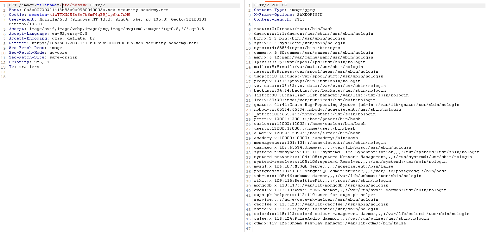
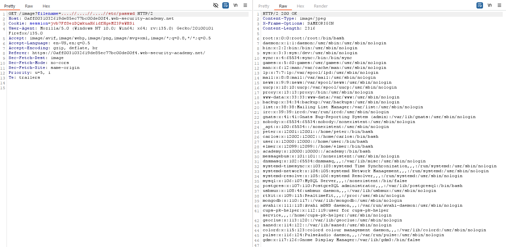
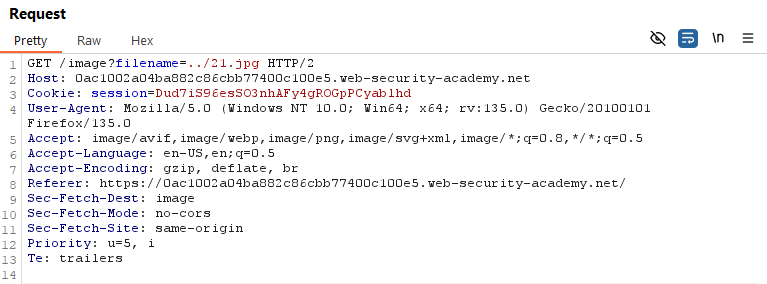
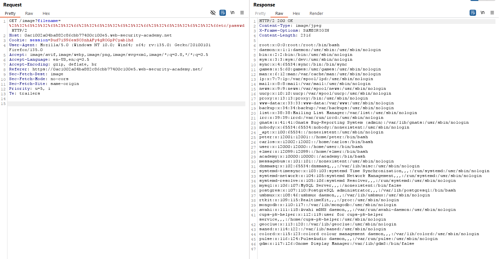
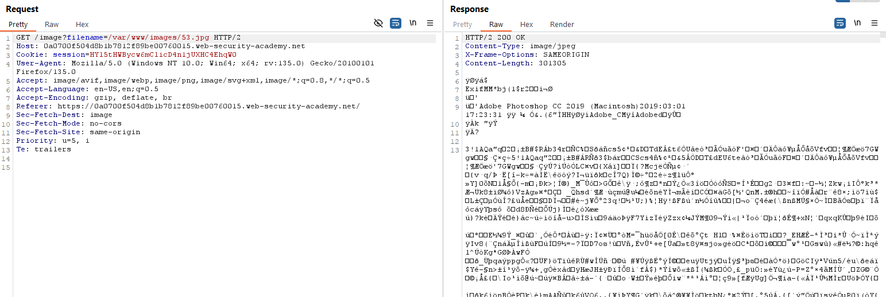
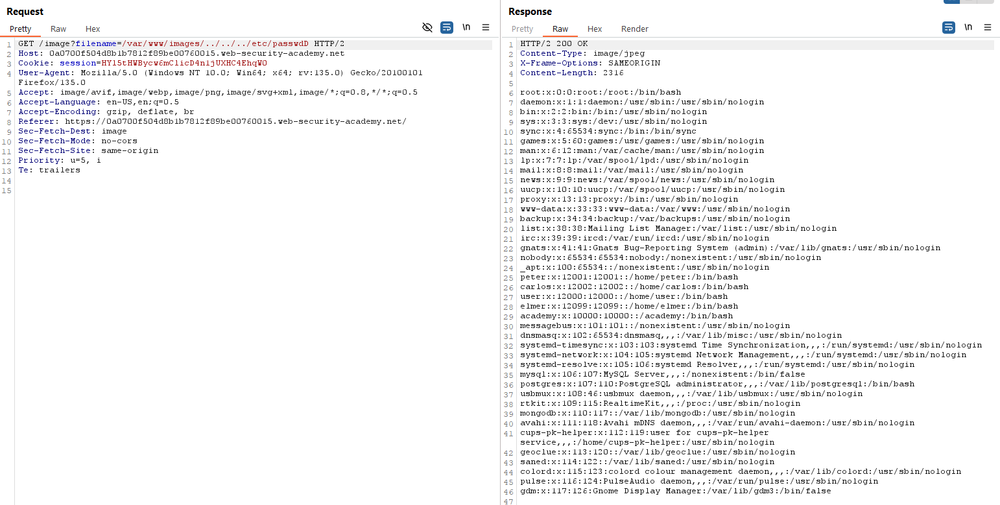
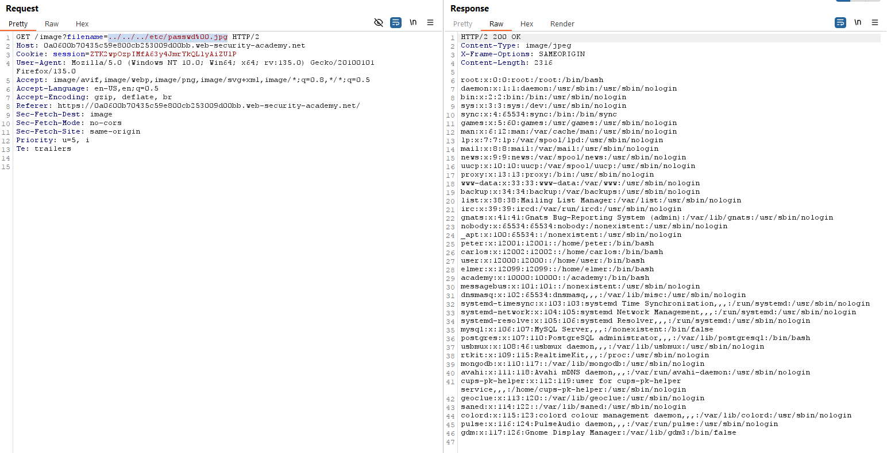

# Path Traversal
## Labs

### Lab: File path traversal, simple case
**Yêu cầu**: Lab có lỗ hổng `path traversal` trong chức năng hiển thị hình ảnh sản phẩm. Nhiệm vụ: khai thác lỗ hổng để đọc nội dung file `/etc/passwd` và hoàn thành lab.

**Khai thác**
- Theo gợi ý đề bài chúng ta cần đọc file `passwd`. Lỗ hổng ở chức năng hiện thị hình ảnh sản phẩm vì thế dùng Burp bắt gói tin hiện thị ảnh sản phẩm và thay đổi tên ảnh. Payload: `GET /image?filename=../../../etc/passwd`

___

### Lab: File path traversal, traversal sequences blocked with absolute path bypass
**Yêu cầu**: Lab có lỗ hổng `path traversal` trong chức năng hiển thị hình ảnh sản phẩm, nhưng ứng dụng chặn chuỗi traversal và xử lý tên file tương đối với thư mục mặc định. Nhiệm vụ: tìm cách bypass hạn chế để đọc nội dung file `/etc/passwd` và hoàn thành lab.

**Khai thác**
- Có lẽ với bài này phía backend đã chặn các kí tự `.` điều này ngăn chặn việc sử dụng đường dẫn tương đối như bày lab ở trên. Thay vào đó ta sẽ sử dụng đường dẫn tuyệt đối `/etc/passwd` như này.
 
___

### Lab: File path traversal, traversal sequences stripped non-recursively
**Yêu cầu**: Lab có lỗ hổng `path traversal` trong chức năng hiển thị hình ảnh sản phẩm, nhưng ứng dụng loại bỏ chuỗi traversal khỏi tên file do người dùng cung cấp. Nhiệm vụ: tìm cách bypass cơ chế lọc để đọc nội dung file `/etc/passwd` và hoàn thành lab.

**Khai thác**
- Payload khai thác `....//....//....//etc/passwd`

**Note**
Backend có cơ chế bảo vệ như này. Chuỗi `../` sẽ bị thay thế hoặc loại bỏ. Trường hợp này là loại bỏ: `....//` -> `../`. 
Ngoài ra chúng ta không sử dụng được absolute path có lẽ là file đầu vào sẽ được nối với 1 đoạn chuỗi trước:`path/to/folder.$filename`
___

### Lab: File path traversal, traversal sequences stripped with superfluous URL-decode
**Yêu cầu**: Lab có lỗ hổng `path traversal` trong chức năng hiển thị hình ảnh sản phẩm, nhưng ứng dụng chặn chuỗi traversal trong đầu vào rồi thực hiện `URL-decode` trước khi sử dụng. Nhiệm vụ: tìm cách bypass cơ chế lọc bằng `double URL encoding` hoặc kỹ thuật tương tự để đọc nội dung file `/etc/passwd` và hoàn thành lab.

**Khai thác**
- Với `filename` là `../21.jpg` hay `./21.jpg` thì kết quả trả về là như nhau. 

- Rõ ràng là có một cơ chế bảo vệ ở đây. Tôi đoán là ở bước kiểm tra `filename` phía BE. Nếu có tồn tại `../` thì sẽ bị loại bỏ. Do đó ta sẽ thử encode nó 2 lần. Lần đầu tiên sẽ bị máy chủ APACHE hoặc NGINX decode. Sau đó phía BE sẽ kiểm tra và nhận thấy trong chuỗi này không có `../` và xử lí. 
- Payload `%25%32%65%25%32%65%25%32%66%25%32%65%25%32%65%25%32%66%25%32%65%25%32%65%25%32%66etc/passwd`

**Note**
Vấn đề để tấn công thành công là sau khi kiểm tra `filename` phía BE có cơ chế decode URL một lần nữa.Tại sao backend có thể tiếp tục decode thêm lần nữa?
>Một số framework web (PHP, Flask, ExpressJS, ASP,...) có cơ chế tự động decode dữ liệu đầu vào.
Nếu backend không kiểm soát tốt, nó có thể vô tình decode thêm một lần nữa, làm lộ chuỗi ../.
Một số thư viện xử lý đường dẫn có thể tự động chuẩn hóa(normalize) đường dẫn sau khi decode, dẫn đến lỗ hổng.

Nếu sử dụng Burp Suite Professional, có thể dùng  *Fuzzing - path traversal* để thử nghiệm các chuỗi path traversal đã được mã hóa.
___

### Lab: File path traversal, validation of start of path
**Yêu cầu**: Lab có lỗ hổng `path traversal` trong chức năng hiển thị hình ảnh sản phẩm, ứng dụng truyền toàn bộ đường dẫn file qua tham số request và chỉ kiểm tra nếu đường dẫn bắt đầu bằng thư mục cho trước. Nhiệm vụ: tìm cách bypass kiểm tra để đọc nội dung file `/etc/passwd` và hoàn thành lab.

**Khai thác**
- Bắt gói tin lại và quan sát

- Dễ nhận thấy `filename` là cả một đường dẫn `/var/www/images/...`. Suy đoán cơ chế kiểm tra sẽ đảm bảo param này phải có chứa chuỗi thì mới hợp lệ. Do đó ta có thể tận dụng và khai thác bằng payload sau `/var/www/images/../../../etc/passwd`

**Note**
Cơ chế kiểm tra ở lab này là cái đường dẫn đầu vào sẽ phải bắt đầu từ một thư mục được cho phép. Ví dụ thư mục được cho phép là `var` thì bắt buộc `filename` sẽ phải là `var/...` nếu không sẽ bị chặn. Tuy nhiên do sự tồn tại của relative path `../` => ta có thể dễ dàng bypass cơ chế này.
___

### Lab: File path traversal, validation of file extension with null byte bypass
**Yêu cầu**: Lab có lỗ hổng `path traversal` trong chức năng hiển thị hình ảnh sản phẩm, ứng dụng chỉ kiểm tra nếu tên file kết thúc bằng một phần mở rộng nhất định. Nhiệm vụ: tìm cách bypass kiểm tra này để đọc nội dung file `/etc/passwd` và hoàn thành lab.

**Khai thác**
- Bài lab kiểm tra extension của `filename`. Nếu không phải `jpg`,`png` thì sẽ chặn. Tuy nhiên chúng ta có thể sử dụng `null byte` để bypass cơ chế kiểm tra này.
- Payload `../../../etc/passwd%00.jpg`

**Note**
Có lẽ cơ chế này sẽ chia thành 2 phần. Phần đầu tiên người ta sẽ kiểm tra dựa trên chuỗi `filename`, nếu chuỗi này có kết thúc hợp lệ thì sẽ được chuyển đến để xử lí đường dẫn. Ở phần xử lí này `%00` là nullbyte thế nên ở phiên bản PHP cũ khi chuẩn hóa và đọc đường dẫn thì trình dịch sẽ đọc lần lượt từng kí tự của đường dẫn và dừng lại ở ký tự null. Chính do điều này mà có cách tấn công `null byte injection`
___