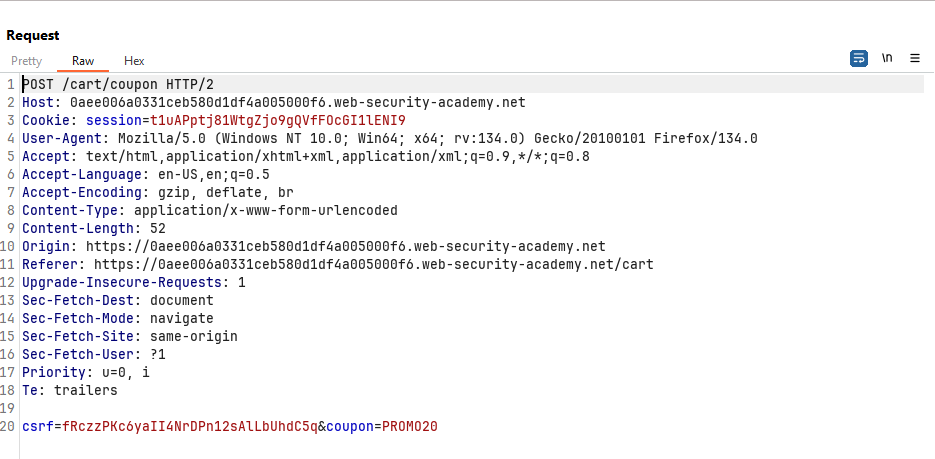
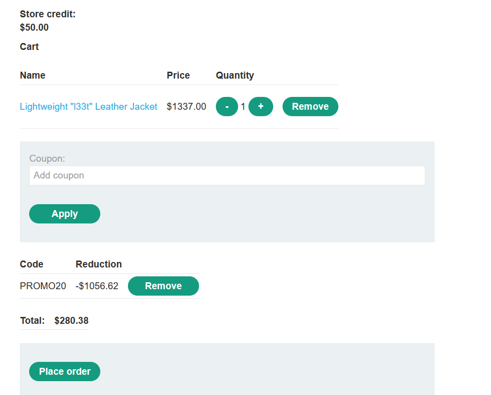
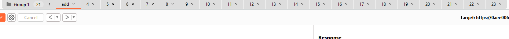
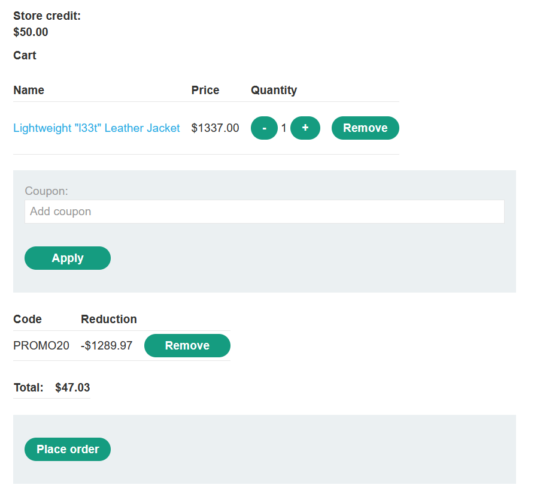
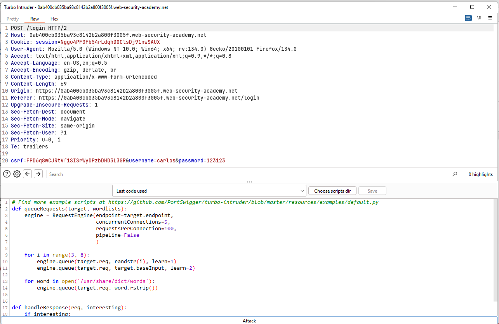
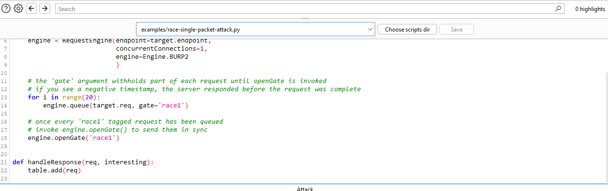
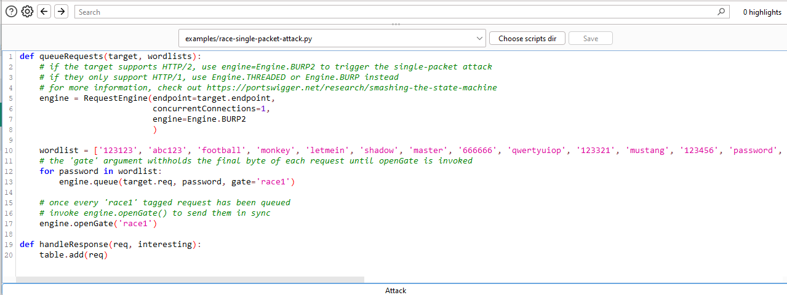
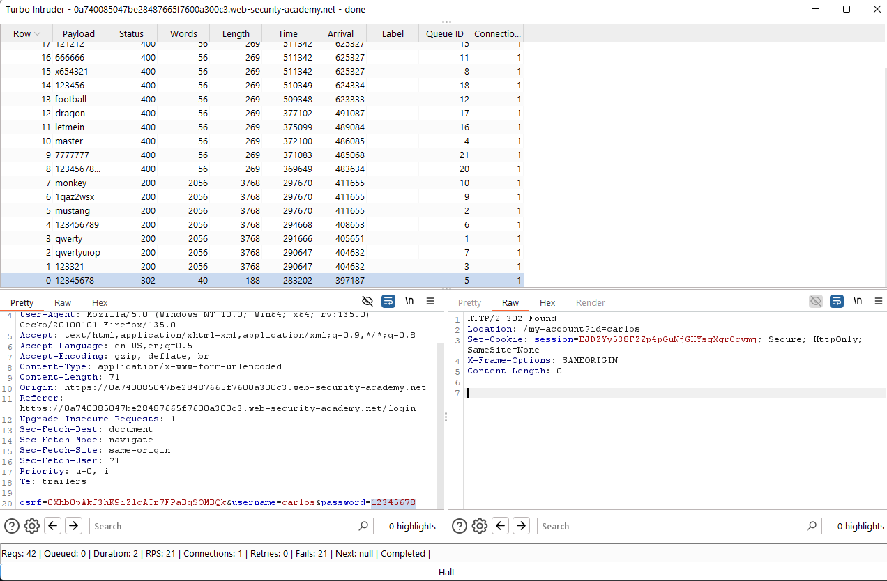

## 💻 Labs
>📃Documents
[Sending requests in parallel with BurpSuite](https://portswigger.net/burp/documentation/desktop/tools/repeater/send-group#sending-requests-in-parallel)
[Smashing the state machine: The true potential of web race conditions](https://portswigger.net/research/smashing-the-state-machine)

### Lab: Limit overrun race conditions
**Limit overrun race conditions**
- **Race Condition:** Xảy ra khi có nhiều yêu cầu (requests) được xử lý gần như đồng thời, khiến hệ thống thực hiện các hành động không như mong đợi.

- **Ví dụ:**
  - **Sử dụng mã giảm giá nhiều lần:**
    1. Kiểm tra xem mã đã dùng chưa.
    2. Áp dụng giảm giá.
    3. Cập nhật cơ sở dữ liệu để đánh dấu mã đã dùng.
  - **Khai thác:** Gửi nhiều yêu cầu cùng lúc trước khi hệ thống kịp cập nhật trạng thái -> Áp dụng mã giảm giá nhiều lần.

- **Các Biến Thể Tấn Công:**
  - Dùng **gift card** nhiều lần.
  - Đánh giá (rating) sản phẩm nhiều lần.
  - **Rút hoặc chuyển tiền** vượt quá số dư tài khoản.
  - Tái sử dụng **CAPTCHA** đã giải.
  - Vượt qua giới hạn **anti-brute-force**.

- **TOCTOU (Time-of-Check to Time-of-Use) Flaw:**
  - Lỗ hổng xảy ra giữa thời điểm kiểm tra điều kiện và thời điểm thực hiện hành động (giới hạn vượt qua do xử lý không đồng bộ).

**Solution**
Đăng nhập bằng tài khoản có sẵn và thử nghiệm.
Mục tiêu là mua được mặt hàng `Lightweight "l33t" Leather Jacket` với chỉ 50\$, vậy nên ta cho mặt hàng này vào giỏ hàng và tiến hành thêm mã giảm giá (promotion).
=> Vấn đề ở lab này là làm sao để gửi thật nhiều request thêm promotion để có thể nhiều request được xử lý cùng thời điểm (race window) -> Chính điều này làm cho việc có thể dùng một mã giảm giá nhiều lần.
 
Tôi tiến hành `Ctrl + SPACE` liên tục để gửi thật nhiều gói tin request để bypass cơ chế xác thực mã này được dùng một lần.

=> Tuy đã giảm được nhiều nhưng vẫn chưa đủ vì tôi chỉ có 50$. Vì thế tôi sẽ tiến hành gửi lại gói tin.
Tôi tạo 1 group gồm các tab chứa gói tin có nhiệm vụ add promotion. Mục đích là để sử dụng tính năng gửi song song nhiều request tới server.

✅ Solved!

### Lab: Bypassing rate limits via race conditions
---

**🛠 Cơ chế của Turbo Intrusder**

- **Vấn đề**: Nếu mỗi yêu cầu tạo ra một kết nối TCP mới, độ trễ kết nối (TCP Handshake) sẽ ảnh hưởng đến tốc độ tấn công.  
  → Turbo Intruder có cơ chế giúp **cải thiện độ trễ này** để gửi request nhanh hơn.

- **Cơ chế tối ưu hóa**:  
  - **HTTP Keep-Alive**: Giữ kết nối mở sau request đầu tiên, giảm thời gian thiết lập lại kết nối.  
  - **HTTP/2 Multiplexing**: Cho phép nhiều request chạy song song trên cùng một kết nối TCP.  

- **Cách kiểm tra**:  
  - Dùng **Burp Suite** để gửi request và kiểm tra response headers.  
  - Nếu server trả về **`Connection: keep-alive`** hoặc hỗ trợ **HTTP/2**, có thể sử dụng Turbo Intruder tối ưu.  

**🛠 Lợi dụng giới hạn tốc độ hoặc tài nguyên để khai thác Race Condition**

- **Vấn đề**: Backend có độ trễ không đồng nhất, làm ảnh hưởng đến tấn công race condition.
- **Cách 1 (Không hiệu quả)**: Thêm độ trễ phía client bằng Turbo Intruder.
- **Lý do**: Điều này làm yêu cầu bị chia nhỏ thành nhiều gói TCP, mất tính đồng bộ.
- **Cách 2 (Hiệu quả hơn)**: Gửi nhiều request rác để làm chậm máy chủ.
- **Cơ chế**: Máy chủ có thể tự động trì hoãn xử lý nếu nhận quá nhiều yêu cầu.
- **Bước 1**: Gửi 10+ request rác để kích hoạt cơ chế giới hạn tài nguyên.
- **Bước 2**: Ngay sau đó, gửi các request tấn công quan trọng.
- **Kết quả**: Máy chủ trì hoãn tất cả request, giúp chúng được xử lý đồng thời.
- **Ưu điểm**: Cách này giúp căn chỉnh thời gian tốt hơn so với client-side delay.
- **Tóm lại**: Lợi dụng giới hạn tài nguyên là cách hiệu quả để khai thác race condition.

---
**Solution**
Ở bài này chúng ta phải brute force tài khoản của `carlos`. Tuy nhiên vấn đề xảy ra là server giới hạn thời gian nếu nhập sai quá nhiều thì sẽ bị chặn và đợi 15'. Dùng cách như ở bài 1 thì không được do trong bài này race window có lẽ nhỏ hơn rất rất nhiều cho nên ta phải tìm cách tối ưu hơn.

Ở đây gợi ý dùng extension của Burp: Turbo Intruder để cải thiện hiệu suất.
Dưới đây là các bước:

Bắt đầu tấn công

Các gói tin trả về có và ta tìm thấy gói tin đang nhập thành công có mã 302.
=> `carlos : 12345678`

✅ Solved!

### Lab: Multi-endpoint race conditions
---
- **Multi-endpoint race conditions** xảy ra khi gửi nhiều yêu cầu đến các endpoint khác nhau cùng lúc để khai thác lỗi logic.  
- **Vấn đề**: Độ trễ khác nhau giữa các endpoint do kiến trúc mạng và thời gian xử lý nội bộ.  
- **Connection Warming**: Gửi yêu cầu không quan trọng trước để giảm độ trễ backend.  
- **Cách làm**: Dùng Burp Repeater gửi yêu cầu GET trước khi chạy tấn công chính.  
- **Turbo Intruder**: Hữu ích nếu backend vẫn có độ trễ không ổn định, giúp đồng bộ hóa request tốt hơn.  
- **Client-side delay**: Không hiệu quả vì làm chia nhỏ request, mất tính đồng bộ.  
- **Tận dụng giới hạn tốc độ server**: Gửi nhiều request rác để khiến server tự tạo độ trễ xử lý.  
---
**Solution**

