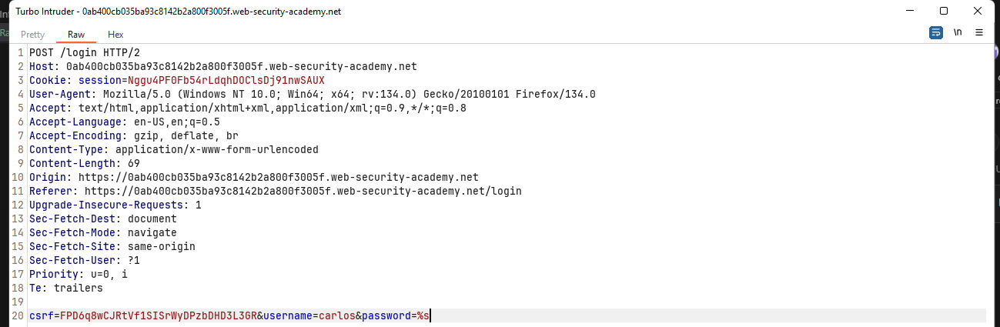

## 💻 Labs
>📃Documents
[Sending requests in parallel with BurpSuite](https://portswigger.net/burp/documentation/desktop/tools/repeater/send-group#sending-requests-in-parallel)
[Smashing the state machine: The true potential of web race conditions](https://portswigger.net/research/smashing-the-state-machine)

### Lab: Limit overrun race conditions
**Limit overrun race conditions**
- **Race Condition:** Xảy ra khi có nhiều yêu cầu (requests) được xử lý gần như đồng thời, khiến hệ thống thực hiện các hành động không như mong đợi.

- **Ví dụ:**
  - **Sử dụng mã giảm giá nhiều lần:**
    1. Kiểm tra xem mã đã dùng chưa.
    2. Áp dụng giảm giá.
    3. Cập nhật cơ sở dữ liệu để đánh dấu mã đã dùng.
  - **Khai thác:** Gửi nhiều yêu cầu cùng lúc trước khi hệ thống kịp cập nhật trạng thái -> Áp dụng mã giảm giá nhiều lần.

- **Các Biến Thể Tấn Công:**
  - Dùng **gift card** nhiều lần.
  - Đánh giá (rating) sản phẩm nhiều lần.
  - **Rút hoặc chuyển tiền** vượt quá số dư tài khoản.
  - Tái sử dụng **CAPTCHA** đã giải.
  - Vượt qua giới hạn **anti-brute-force**.

- **TOCTOU (Time-of-Check to Time-of-Use) Flaw:**
  - Lỗ hổng xảy ra giữa thời điểm kiểm tra điều kiện và thời điểm thực hiện hành động (giới hạn vượt qua do xử lý không đồng bộ).

**Solution**
Đăng nhập bằng tài khoản có sẵn và thử nghiệm.
Mục tiêu là mua được mặt hàng `Lightweight "l33t" Leather Jacket` với chỉ 50$, vậy nên ta cho mặt hàng này vào giỏ hàng và tiến hành thêm mã giảm giá (promotion).
=> Vấn đề ở lab này là làm sao để gửi thật nhiều request thêm promotion để có thể nhiều request được xử lý cùng thời điểm (race window) -> Chính điều này làm cho việc có thể dùng một mã giảm giá nhiều lần.
 
Tôi tiến hành `Ctrl + SPACE` liên tục để gửi thật nhiều gói tin request để bypass cơ chế xác thực mã này được dùng một lần.

=> Tuy đã giảm được nhiều nhưng vẫn chưa đủ vì tôi chỉ có 50$. Vì thế tôi sẽ tiến hành gửi lại gói tin.
Tôi tạo 1 group gồm các tab chứa gói tin có nhiệm vụ add promotion. Mục đích là để sử dụng tính năng gửi song song nhiều request tới server.

✅ Solved!

### Lab: Bypassing rate limits via race conditions
**Solution**
Ở bài này chúng ta phải brute force tài khoản của `carlos`. Tuy nhiên vấn đề xảy ra là server giới hạn thời gian nếu nhập sai quá nhiều thì sẽ bị chặn và đợi 15'. Dùng cách như ở bài 1 thì không được do trong bài này race window có lẽ nhỏ hơn rất rất nhiều cho nên ta phải tìm cách tối ưu hơn.

Ở đây gơi ý dung extension cuủ Burp: Turbo Insturder dê cải thiêệ hieệ hieệ suââsuaa
Duướ đay là steps by steps

Bawts ddau tan cong