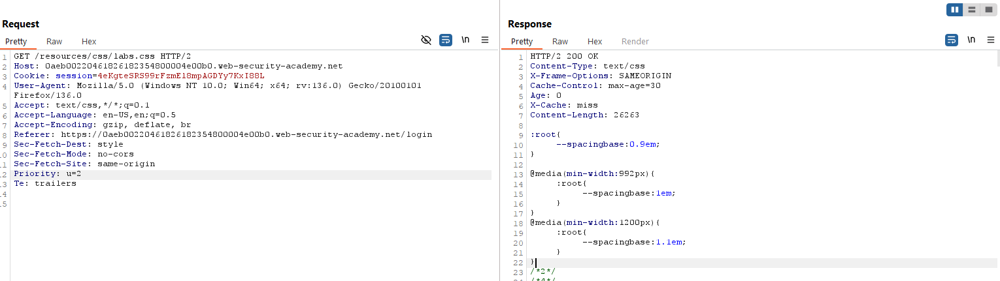

# WEB CACHE DECEPTION

## Exploiting static extension cache rules

### Exploiting path mapping discrepancies
#### 1. Lab: Exploiting path mapping for web cache deception
**Yêu cầu**
To solve the lab, find the API key for the user `carlos`. You can log in to your own account using the following credentials: `wiener:peter`.

>Required Knowlegde
To solve this lab, you'll need to know:
- How regex endpoints map URL paths to resources.
- How to detect and exploit discrepancies in the way the cache and origin server map URL paths.

**Thực hiện**
dang nhap 


thu thay doi


them tệp tĩnh để kích hoạt cơ chế lưu cache

thu truy cap lai


```
Cache-Control: max-age=30
Age: 13
X-Cache: hit
```
=> Phát hiện được cơ chế lưu cache

craft an exploit
`<script>document.location="https://id.web-security-academy.net/my-account/tmp.js"</script>`

store lại và gửi đến nạn nhân.

Kiểm tra nạn nhân nhận được chưa ?

Thực hiện truy vấn tới cache trên burp `GET /my-account/tmp.js`


**Note**
Dựa vào quan sát thời gian phản hồi mà ta có được những suy đoán về cơ chế lưu cache. Ở bài lab này các đường dẫn tới tệp tĩnh đưa server cache lưu lại (không phải cache trình duyệt). Song cơ chế chuẩn hóa đường dẫn của phía Server lại chuẩn hóa những đường dẫn sai đó về đường dẫn đúng. Sự không ăn khớp giữa 2 bên đã tạo ra lỗ hổng giúp kẻ tấn công truy xuất được thông tin nhạy cảm thông qua lỗ hổng CSRF.


### Exploiting delimiter discrepancies
#### 2. Lab: Exploiting path delimiters for web cache deception
**Yêu cầu**
To solve the lab, find the API key for the user `carlos`. You can log in to your own account using the following credentials: `wiener:peter`.
We have provided a list of possible delimiter characters to help you solve the lab: Web cache deception lab delimiter list.

**Thực hiện**
quan sat goi tin


Kiểm tra delimiters có thể được sử dụng để tạo lỗ hổng trong bài lab này.

tắt url encode để được kết quả chính xác.


Có thể hệ thống này sử JAVA SPRING BOOT. Thử nghiệm lưu lỗ hổng lưu cache.


Craft payload tấn công:
`<script>document.location="https://id.web-security-academy.net/my-account;blablo.js"</script>`

Gui cho nan nhan va quan sat log.


Trich xuat thong tin qua `GET /my-account;blablo.js`


Nan nhan da an vao link -> Truy van de lay thong tin api

**Note**
Mỗi frame work có cách xử lí các kí tự ngắt khác nhau ví dụ trong Java Spring Boot thì sử dụng `;` nhưng cache thì lại không hiểu kí tự này và dựa vào tập lưu nên lưu trữ và xử lí với các tệp tin.
|server| request URL|Normalization|
|----|---|---|
|Origin|/my-account;abc.js|/my-account|
|Cache|/my-account;abc.js/|/my-account;abc.js|


## Exploiting static directory cache rules

### Exploiting normalization by the origin server
#### 3. Lab: Exploiting origin server normalization for web cache deception
**Yêu cầu**
To solve the lab, find the API key for the user `carlos`. You can log in to your own account using the following credentials: `wiener:peter`.

**Thực hiện**
Viec dau tien la xac dinh lo hong.
Dau tien xac dinh sự khác biệt của phân cách. Điều này làm như bài lab số 2.


Tiep theo quan sat goi tin va xac dinh co che chuan hoa duong dan cua server

De y cac goi tin tu duong dan `/resources` đểu được cache xử lí. Dấu hiệu là thông qua header `Cache-Control` và `Age` bên gói tin phản hồi. 
Thay doi goi tin 


Dieu nay chung to rang thong tin nay da duoc luu vao trong cache

Tao payload
`<script>document.location="https://0a0c0065030081db8035128c001d00ca.web-security-academy.net/resources/..%2fmy-account"</script>`


Nhu ta thay thi file da duoc luu vao trong cache.

**Note**
Ở bài lab này việc chuẩn hóa đường dẫn là chìa khóa để có thể khai thác. Một số Cache server không phân biệt được đường dẫn chưa chuẩn hóa hoặc chuẩn hóa chưa hoàn toàn thành đường dẫn đến file. Và lưu trữ nó, tuy nhiên phía bên server thì luôn có bước chuẩn hóa đường dẫn rồi mới truy cập. 

### Exploiting normalization by the cache server
#### 4. Lab: Exploiting cache server normalization for web cache deception
**Yêu cầu**
To solve the lab, find the API key for the user `carlos`. You can log in to your own account using the following credentials: `wiener:peter`.

**Thực hiện**
Theo de bai thi bai nay web cache server se tu dong chuan hoa con phia server thi khong.
Day la goi tin ban dau

Thay doi thanh `GET /resources/css/..%2fcss/labs.css`

Quay lai voi payload dau

=> Dieu nay chung to `/resources/css/..%2fcss/labs.css` duojc web cache hieu la `/resources/css/labs.css` va luu vao cache -> Do do khi truy van nhu ban dau thi lai tra ve nhu anh thu 3. va sau khi het tgian cache thi lai truy cap binh thuong

Trigger Cache. Cache luu thong tin o thu muc `resources`

Tim kiem delimiters phu hop de loi dung co che khac nhau giu server và web cache server


Thử với cả 4 trường hợp thì `%23` hiện thị lưu trữ cache


Craft a response.
`<script>document.location="https://0aeb00220461826182354800004e00b0.web-security-academy.net/my-account%23%2f%2e%2e%2fresources?vcl"</script>`
Gửi cho nạn nhân và theo doi log

Truy cap de lay thong tin của cache nan nhan


**Note**


