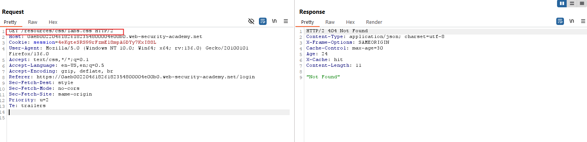

# WEB CACHE DECEPTION

## Exploiting static extension cache rules

### Exploiting path mapping discrepancies
#### 1. Lab: Exploiting path mapping for web cache deception
**Yêu cầu**
To solve the lab, find the API key for the user `carlos`. You can log in to your own account using the following credentials: `wiener:peter`.

>Required Knowlegde
To solve this lab, you'll need to know:
- How regex endpoints map URL paths to resources.
- How to detect and exploit discrepancies in the way the cache and origin server map URL paths.

**Thực hiện**
Đăng nhập  


Thử thay đổi  


Thêm tệp tĩnh để kích hoạt cơ chế lưu cache  


Thử truy cập lại  


```
Cache-Control: max-age=30
Age: 13
X-Cache: hit
```
=> Nhận thấy có cơ chế lưu cache đang hoạt động.

Tạo đoạn mã khai thác (exploit)  
`<script>document.location="https://id.web-security-academy.net/my-account/tmp.js"</script>`

Lưu lại và gửi tới nạn nhân.  


Kiểm tra xem nạn nhân đã nhận được chưa  


Thực hiện truy vấn tới cache bằng Burp: `GET /my-account/tmp.js`  


**Note**
Dựa vào quan sát thời gian phản hồi mà ta có được những suy đoán về cơ chế lưu cache. Ở bài lab này các đường dẫn tới tệp tĩnh đưa server cache lưu lại (không phải cache trình duyệt). Song cơ chế chuẩn hóa đường dẫn của phía Server lại chuẩn hóa những đường dẫn sai đó về đường dẫn đúng. Sự không ăn khớp giữa 2 bên đã tạo ra lỗ hổng giúp kẻ tấn công truy xuất được thông tin nhạy cảm thông qua lỗ hổng CSRF.


### Exploiting delimiter discrepancies
#### 2. Lab: Exploiting path delimiters for web cache deception
**Yêu cầu**
To solve the lab, find the API key for the user `carlos`. You can log in to your own account using the following credentials: `wiener:peter`.
We have provided a list of possible delimiter characters to help you solve the lab: Web cache deception lab delimiter list.

**Thực hiện**
Quan sát gói tin  


Kiểm tra các ký tự phân cách (delimiters) có thể được dùng để tạo lỗ hổng trong bài lab này  


Tắt URL encode để có kết quả chính xác hơn  


Có thể hệ thống đang sử dụng JAVA SPRING BOOT. Thử nghiệm lưu lỗ hổng vào cache  


Tạo payload tấn công:  
`<script>document.location="https://id.web-security-academy.net/my-account;blablo.js"</script>`

Gửi cho nạn nhân và quan sát log  


Trích xuất thông tin qua truy vấn: `GET /my-account;blablo.js`  


Nạn nhân đã click vào link → Truy vấn để lấy thông tin API


**Note**
Mỗi frame work có cách xử lí các kí tự ngắt khác nhau ví dụ trong Java Spring Boot thì sử dụng `;` nhưng cache thì lại không hiểu kí tự này và dựa vào tập lưu nên lưu trữ và xử lí với các tệp tin.
|server| request URL|Normalization|
|----|---|---|
|Origin|/my-account;abc.js|/my-account|
|Cache|/my-account;abc.js/|/my-account;abc.js|


## Exploiting static directory cache rules

### Exploiting normalization by the origin server
#### 3. Lab: Exploiting origin server normalization for web cache deception
**Yêu cầu**
To solve the lab, find the API key for the user `carlos`. You can log in to your own account using the following credentials: `wiener:peter`.

**Thực hiện**
Việc đầu tiên là xác định lỗ hổng.  
Bắt đầu bằng cách xác định sự khác biệt khi sử dụng các ký tự phân cách trong URL.  
Điều này tương tự với cách làm trong bài lab số 2.  
  


Tiếp theo, quan sát gói tin và xác định cơ chế chuẩn hóa đường dẫn (path normalization) trên server  


Chú ý: Các gói tin có đường dẫn `/resources` đều được xử lý qua cơ chế cache.  
Dấu hiệu nhận biết là qua các header trong phản hồi như:  
- `Cache-Control`: chỉ ra thời gian lưu cache  
- `Age`: cho biết nội dung đã được cache bao lâu  

Thay đổi gói tin để thử nghiệm  
  


Điều này cho thấy rằng thông tin (response) đã được lưu vào cache thành công.

Tạo payload để khai thác:  
`<script>document.location="https://0a0c0065030081db8035128c001d00ca.web-security-academy.net/resources/..%2fmy-account"</script>`

Gửi đến nạn nhân và kiểm tra lại  


Như ta thấy, file đã được lưu vào cache thông qua payload, có thể dẫn đến việc thông tin bị tiết lộ khi nạn nhân truy cập.


**Note**
Ở bài lab này việc chuẩn hóa đường dẫn là chìa khóa để có thể khai thác. Một số Cache server không phân biệt được đường dẫn chưa chuẩn hóa hoặc chuẩn hóa chưa hoàn toàn thành đường dẫn đến file. Và lưu trữ nó, tuy nhiên phía bên server thì luôn có bước chuẩn hóa đường dẫn rồi mới truy cập. 

### Exploiting normalization by the cache server
#### 4. Lab: Exploiting cache server normalization for web cache deception
**Yêu cầu**
To solve the lab, find the API key for the user `carlos`. You can log in to your own account using the following credentials: `wiener:peter`.

**Thực hiện**
Theo đề bài, web cache server sẽ tự động chuẩn hóa đường dẫn, trong khi phía server thì không.

Đây là gói tin ban đầu  


Thay đổi truy vấn thành:  
`GET /resources/css/..%2fcss/labs.css`  


Quay lại với payload ban đầu  


=> Điều này chứng tỏ rằng `/resources/css/..%2fcss/labs.css` đã được web cache hiểu là `/resources/css/labs.css` và lưu vào cache.  
→ Do đó, khi truy vấn lại như ban đầu, server sẽ trả về nội dung đã được cache (như ảnh thứ 3).  
→ Sau khi cache hết hạn, truy cập sẽ trở lại bình thường.

*Kích hoạt cache (Trigger Cache)*
Cache sẽ lưu thông tin tại thư mục `/resources`  


Tìm kiếm các ký tự phân cách (delimiters) phù hợp để khai thác sự khác biệt trong cách xử lý giữa web cache server và ứng dụng phía server  
  


Sau khi thử nghiệm với 4 trường hợp, nhận thấy rằng `%23` (ký tự `#` – ký hiệu bắt đầu fragment trong URL) là lựa chọn có hiệu quả khi lưu vào cache.  


Tạo phản hồi độc hại (malicious response):  
`<script>document.location="https://0aeb00220461826182354800004e00b0.web-security-academy.net/my-account%23%2f%2e%2e%2fresources?vcl"</script>`

Gửi payload cho nạn nhân và theo dõi log  


Truy cập để lấy thông tin từ cache của nạn nhân  


**Note**


### Exploiting normalization by the cache server
#### 5. Lab: Exploiting exact-match cache rules for web cache deception
**Yêu cầu**
To solve the lab, change the email address for the user `administrator`. You can log in to your own account using the following credentials: `wiener:peter`.

**Thực hiện**
Bài này, cache chỉ lưu các file tĩnh như `favicon.ico`.  
→ Để khai thác được lỗ hổng Web Cache, trước tiên ta cần **phát hiện việc chuẩn hóa URL bởi cache server** (Detecting Normalization By the Cache Server)

  
  


→ Truy vấn với URL: `abc%2f%2e%2e%2ffavicon.ico`  
Kết quả:
- Phía **server không chuẩn hóa** URL này
- Nhưng **cache server đã chuẩn hóa** và hiểu đúng đường dẫn `/favicon.ico`  
→ Điều này chứng tỏ nội dung tương ứng đã được lưu vào cache.

Tiếp theo, thử truy vấn:  
`GET my-account%2f%2e%2e%2ffavicon`  
→ Mục tiêu: truy cập vào `/my-account` nhưng dưới dạng mà **server xử lý đúng**, còn **cache server thì lại lưu vào cache như là một file favicon**

Tìm kiếm ký tự delimiter phù hợp → chọn được `;`  


**Tạo payload để lấy thông tin admin:**  
`<script>document.location="https://0a6400de030e97768593d28100420015.web-security-academy.net/my-account;%2f%2e%2e%2ffavicon.ico"</script>`

Gửi payload cho nạn nhân, và nếu truy cập đúng thời điểm **cache vẫn còn hiệu lực**, sẽ thu được thông tin admin  


---

**Khai thác sâu hơn – thay đổi email nạn nhân**  
Tạo một payload dạng HTML form giả mạo để tự động gửi yêu cầu thay đổi email:

```
<form class="testForm" name="change-email-form" action="https://0aae002f0480e270c92ee04100ba0094.web-security-academy.net/my-account/change-email" method="POST">
    <input  type="email" name="email" value="hacker@gmail.com">
    <input  type="hidden" name="csrf" value="YbnCi4v5rgT6emKpFjhhwGr7ygWfWNCv">
</form>
<script>
  document.querySelector('.testForm').submit();
</script>
```
Mã CSRF (csrf) ở trên được thu thập từ phần phản hồi đã bị lưu cache của `administrator`
→ Đây chính là điểm mấu chốt cho phép tấn công CSRF thành công.

**Note**